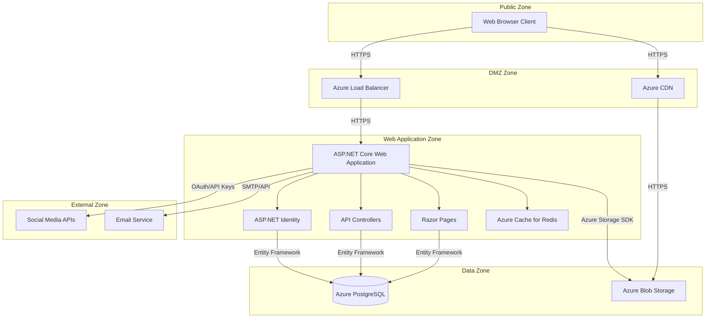
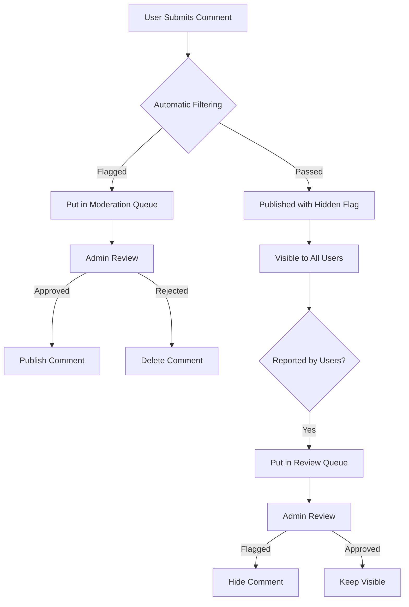
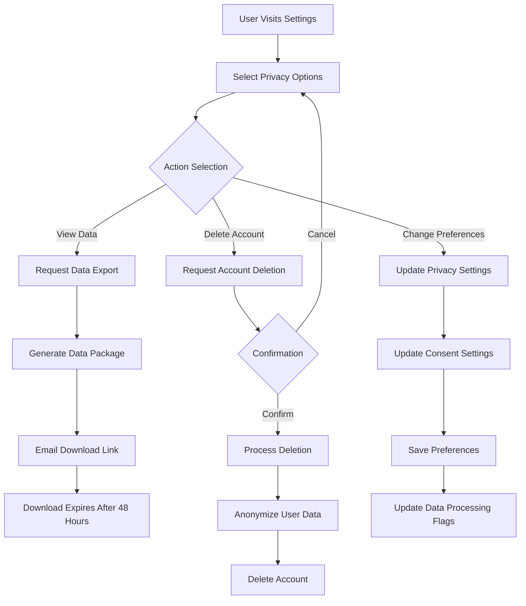

# Technical Specification Generation

Copilot mode:

- Agent mode, Claude 3.7 Sonnet
- Edit mode, Claude 3.7 Sonnet Thinking

Context:

- .github/prompts/03-security-review.prompt.md

Start time: 2025-04-08 14:45
End time: 2025-04-08 15:03

## Copilot prompts

adrianhall: Based on the technical specification stored in project/MVP/technical-specification, create a security and privacy review for the MVP and place it as markdown in the project/MVP/security-review.md file.

GitHub Copilot: I'll help you create a comprehensive security and privacy review for the MVP based on the technical specification. Let me start by exploring the technical specification to understand the system architecture, data model, and other relevant aspects.I'll review each of the technical specification files to understand the system's architecture, data models, and other aspects needed for the security and privacy review. Let me start with the index and system architecture documents.I see the index of the technical specification, which gives me the structure of the documentation. Let me continue by examining the system architecture document first, followed by the other relevant sections to create a comprehensive security and privacy review.I'm examining the technical specification documents to understand the ProPulse system. Let me continue reviewing the remaining documents to gather all the necessary information for creating a comprehensive security and privacy review.I need to continue gathering information from the technical specification documents to create a comprehensive security and privacy review. Let me look at the data model and API surface information next.I'm continuing to gather the necessary information from the technical specification to create a comprehensive security and privacy review. Let me examine the API surface next.I'm continuing my review of the technical specification for the ProPulse platform to create a comprehensive security and privacy review. Let me examine the UI information as well to complete my understanding of the system.I've reviewed all the technical specification documents for the ProPulse platform, covering its system architecture, technology choices, data model, API surface, and user interface. Based on this information, I'll now create a comprehensive security and privacy review for the MVP. Let me create the file as requested.

Made changes.

I've created a comprehensive security and privacy review for the ProPulse platform based on the technical specifications you provided. The review has been saved to security-review.md.

The security review includes:

1. **Component Decomposition and Trust Zones**: A detailed breakdown of the application's components with a block diagram showing data flows and identified trust zones (Public, DMZ, Web Application, Data, and External zones).

2. **Threat Model using STRIDE**: A systematic analysis of threats for each component (Web Application, Authentication Module, Database, Blob Storage, and Social Media Integration) using the STRIDE methodology (Spoofing, Tampering, Repudiation, Information Disclosure, Denial of Service, and Elevation of Privilege).

3. **Encryption Technologies**: A review of the encryption mechanisms for data in transit and at rest, including TLS 1.3, storage encryption, and cryptographic implementations.

4. **Service Authentication**: Details on how services authenticate and communicate securely with each other, including the use of Azure Managed Identities and JWT tokens.

5. **OWASP Top-10**: Analysis of how the application addresses each of the OWASP Top-10 vulnerabilities.

6. **Auditing Requirements**: Recommendations for comprehensive auditing of user activity, content management, system events, and security events.

7. **Third-Party Component Risk Analysis**: Assessment of risks associated with Azure services, libraries, and external APIs.

8. **Security Design Flaws**: Identification of potential security flaws in the existing design, including social media token storage, article content security, and authentication session management.

9. **Security Mitigations**: Practical recommendations for enhancing security across various aspects of the application.

The privacy review includes:

1. **Data Model PII Classification**: A breakdown of personally identifiable information (PII) in the data model with classification, purpose, and retention policies.

2. **Privacy Regulations Compliance**: Analysis of how the application meets GDPR, UK-DPA, and CCPA/CPRA requirements.

3. **Regional Data Boundaries**: Discussion of data storage localization and transfer mechanisms to ensure compliance with regional requirements.

4. **Special Processing Considerations**: Region-specific privacy requirements and how the application addresses them.

5. **Data Controls and Consent Mechanisms**: Implementation details for user consent management, cookie management, marketing controls, and data sharing controls.

Would you like me to explain any specific section of the review in more detail?

<!-- Switched to Edit mode with thinking models -->

adrianhall: Based on your analysis of the security-review.md, and technical specification stored under project/MVP, would you make any updates to the technical specification to support the security review?

GitHub Copilot: I need to suggest updates to the technical specification based on the security review, but I don't have access to the technical specification files mentioned in your prompt. Based on the security-review.md content, I can recommend areas that would likely need updates in the technical specification.

### Recommended Technical Specification Updates

Based on the security review document, the technical specification should be updated to include:

1. **Authentication and Authorization Framework**
   - Detailed implementation of JWT with proper signing and expiry
   - MFA implementation for admin accounts
   - Role-based access control specifications
   - Session management details including timeouts and secure handling

2. **Data Protection Specifications**
   - Column-level encryption for sensitive data (particularly social media tokens)
   - Implementation details for secure storage of credentials
   - Data classification guidelines for developers

3. **Auditing Implementation**
   - Specific audit logging requirements for each service
   - Implementation of the MediatR behaviors for auditing
   - Database schema extensions for CreatedBy/UpdatedBy tracking

4. **API Security Controls**
   - Rate limiting implementation details
   - Input validation standards
   - API authorization framework

5. **Content Security Controls**
   - Secure Markdown rendering implementation
   - Content moderation workflows (particularly for comments)
   - Media content validation pipeline

6. **Privacy Features**
   - User data export functionality
   - Account deletion with cascading anonymization
   - Consent management implementation
   - Regional data handling controls

Would you like me to elaborate on any specific area, or would you like to share the technical specification files so I can provide more targeted recommendations?

adrianhall: Based on your analysis of the security-review.md, and technical specification stored under project/MVP, would you make any updates to the technical specification to support the security review?

GitHub Copilot: # Security and Privacy Enhancements for Technical Specification

Based on the security-review.md document, I recommend several updates to the technical specification to ensure comprehensive coverage of security and privacy requirements. Here's a step-by-step approach to enhancing the technical specification:

## 1. System Architecture Enhancements

### [01_system_architecture.md](file:///c%3A/Users/adhal/source/repos/propulse-dotnet/project/MVP/technical-specification/01_system_architecture.md)

Add a new section on security architecture and trust zones:

````markdown
// ...existing code...

# 1.4. Security Architecture

## 1.4.1. Trust Zones and Boundaries

The ProPulse application implements a layered security model with distinct trust zones:



These zones represent different security contexts with specific controls:

1. **Public Zone**: Untrusted area where input validation and output encoding are critical.
2. **DMZ Zone**: Semi-trusted zone interfacing directly with the public internet.
3. **Web Application Zone**: Trusted internal zone with application logic.
4. **Data Zone**: Highly secured zone for data storage.
5. **External Zone**: Semi-trusted zone comprising third-party services.

## 1.4.2. Security Controls

ProPulse implements the following key security controls:

1. **Authentication and Authorization**
   - JWT-based authentication with proper signing and expiry
   - Role-based access control
   - MFA for administrative accounts
   - Session management with secure timeouts

2. **Data Protection**
   - TLS 1.3 for all connections
   - Column-level encryption for sensitive data
   - Transparent data encryption for the database
   - Key management through Azure Key Vault

3. **Input/Output Security**
   - Request validation and sanitization
   - Output encoding to prevent XSS
   - Content Security Policy implementation
   - Safe rendering of user-generated content

4. **Monitoring and Auditing**
   - Comprehensive audit logging
   - Security event monitoring
   - Intrusion detection capabilities
   - Automated vulnerability scanning

## 1.4.3. Privacy Architecture

The privacy architecture ensures compliance with regulations including GDPR, UK-DPA, and CCPA through:

1. **Data Minimization**: Only collecting necessary information
2. **Purpose Limitation**: Clear purposes for all data collection
3. **User Rights**: Technical implementation of data access, portability, and deletion
4. **Consent Management**: Granular consent tracking and management
5. **Regional Controls**: Data boundaries and localization capabilities
````

## 2. Data Model Enhancements

### [03_data_model.md](file:///c%3A/Users/adhal/source/repos/propulse-dotnet/project/MVP/technical-specification/03_data_model.md)

Add a section on data classification and encryption:

````markdown


Made changes.

// ...existing code...

## 3.4. Data Classification and Security

### 3.4.1. PII and Sensitive Data Classification

The ProPulse data model includes several categories of personal and sensitive information that require special handling:

| Entity | Field | Classification | Sensitivity | Encryption | Purpose |
|--------|-------|---------------|-------------|------------|---------|
| AspNetUsers | Id | Identifier | Low | No | User identification |
| AspNetUsers | UserName | Direct PII | Medium | No | Login, display |
| AspNetUsers | Email | Direct PII | High | No | Communication |
| AspNetUsers | PasswordHash | Authentication | Critical | Yes (hashing) | Authentication |
| AspNetUsers | DisplayName | Direct PII | Medium | No | Public display |
| AspNetUsers | ProfilePictureUrl | Indirect PII | Low | No | Public display |
| AspNetUsers | Bio | Indirect PII | Low | No | Public display |
| SocialMediaAccount | AccessToken | Credentials | Critical | Yes (column-level) | API access |
| SocialMediaAccount | RefreshToken | Credentials | Critical | Yes (column-level) | Token renewal |
| BaseEntity | CreatedById | Association | Low | No | Audit trail |
| Article | Content | User Content | Low | No | Publication |
| Comment | Content | User Content | Low | No | Interaction |

### 3.4.2. Data Encryption Implementation

ProPulse implements several encryption mechanisms:

1. **Column-Level Encryption**:
   ```csharp
   // Implementation pattern for encrypting social media tokens
   public class SocialMediaAccount : BaseEntity
   {
       // Stored encrypted in the database
       public string AccessToken { get; set; }
       
       // Non-mapped property to access decrypted value
       [NotMapped]
       public string DecryptedAccessToken
       {
           get => EncryptionService.Decrypt(AccessToken);
           set => AccessToken = EncryptionService.Encrypt(value);
       }
   }
   ```

2. **Entity Framework Value Converters**:
   ```csharp
   // In DbContext configuration
   protected override void OnModelCreating(ModelBuilder modelBuilder)
   {
       // Configure encrypted fields using value converters
       modelBuilder.Entity<SocialMediaAccount>()
           .Property(e => e.AccessToken)
           .HasConversion(
               v => EncryptionService.Encrypt(v),
               v => EncryptionService.Decrypt(v));
             
       // Similar configuration for other sensitive fields
   }
   ```

3. **Encryption Service**:
   The system uses Azure Key Vault for key management and AES-256 for encryption.

### 3.4.3. Audit Trail Implementation

The BaseEntity includes audit fields, but the system implements additional audit capabilities:

1. **Entity History Tracking**:
   - Entity changes tracked in separate history tables
   - Implemented through triggers or EF Core interceptors
   - Maintains immutable record of all data changes

2. **User Action Audit**:
   ```sql
   CREATE TABLE "AuditLogs" (
       "Id" text NOT NULL,
       "UserId" text NULL,
       "Action" text NOT NULL,
       "EntityType" text NOT NULL,
       "EntityId" text NOT NULL,
       "Timestamp" timestamptz NOT NULL,
       "OldValues" jsonb NULL,
       "NewValues" jsonb NULL,
       "ClientIP" text NULL,
       CONSTRAINT "PK_AuditLogs" PRIMARY KEY ("Id")
   );
   ```

3. **MediatR Audit Behavior**:
   - Cross-cutting audit behavior for all commands
   - Captures pre and post operation state
   - Automatically logs to audit trail
````

## 3. API Security Enhancements

### [04_api_surface.md](file:///c%3A/Users/adhal/source/repos/propulse-dotnet/project/MVP/technical-specification/04_api_surface.md)

Add a section detailing API security controls:

````markdown


Made changes.

// ...existing code...

## 4.12. API Security Controls

### 4.12.1. Authentication and Authorization Implementation

The API uses a robust authentication and authorization model:

1. **JWT Authentication**:
   ```csharp
   // Configured in Program.cs
   builder.Services.AddAuthentication(JwtBearerDefaults.AuthenticationOptions)
       .AddJwtBearer(options =>
       {
           options.TokenValidationParameters = new TokenValidationParameters
           {
               ValidateIssuer = true,
               ValidateAudience = true,
               ValidateLifetime = true,
               ValidateIssuerSigningKey = true,
               ValidIssuer = configuration["Jwt:Issuer"],
               ValidAudience = configuration["Jwt:Audience"],
               IssuerSigningKey = new SymmetricSecurityKey(
                   Encoding.UTF8.GetBytes(configuration["Jwt:Key"]))
           };
       });
   ```

2. **Role-Based Authorization**:
   ```csharp
   [Authorize(Roles = "Author")]
   [HttpPost("articles")]
   public async Task<IActionResult> CreateArticle([FromBody] CreateArticleCommand command)
   {
       // Implementation...
   }
   ```

3. **Resource-Based Authorization**:
   ```csharp
   // ArticleAuthorizationHandler.cs
   public class ArticleAuthorizationHandler : 
       AuthorizationHandler<OperationAuthorizationRequirement, Article>
   {
       protected override Task HandleRequirementAsync(
           AuthorizationHandlerContext context,
           OperationAuthorizationRequirement requirement,
           Article resource)
       {
           var userId = context.User.FindFirst(ClaimTypes.NameIdentifier)?.Value;
           
           if (requirement.Name == Operations.Update.Name || 
               requirement.Name == Operations.Delete.Name)
           {
               if (resource.CreatedById == userId)
               {
                   context.Succeed(requirement);
               }
           }
           
           // Other authorization logic...
           
           return Task.CompletedTask;
       }
   }
   ```

### 4.12.2. Input Validation and Sanitization

All API inputs are validated through a multi-layered approach:

1. **Model Validation**:
   ```csharp
   // CreateArticleCommandValidator.cs
   public class CreateArticleCommandValidator : AbstractValidator<CreateArticleCommand>
   {
       public CreateArticleCommandValidator()
       {
           RuleFor(x => x.Title)
               .NotEmpty()
               .MinimumLength(5)
               .MaximumLength(200)
               .Matches("^[a-zA-Z0-9 .,!?'-]+$")
               .WithMessage("Title contains invalid characters");
           
           RuleFor(x => x.Content)
               .NotEmpty()
               .MaximumLength(100000);
           
           // Other validation rules...
       }
   }
   ```

2. **Content Sanitization**:
   ```csharp
   // Middleware or service for sanitizing Markdown content
   public string SanitizeMarkdown(string markdown)
   {
       // Use a secure Markdown processor with HTML sanitization
       var pipeline = new MarkdownPipelineBuilder()
           .UseAdvancedExtensions()
           .DisableHtml() // Disable raw HTML
           .Build();
       
       // Convert to HTML (sanitized during conversion)
       var html = Markdown.ToHtml(markdown, pipeline);
       
       // Additional HTML sanitization
       var sanitizer = new HtmlSanitizer();
       sanitizer.AllowedTags.Remove("script");
       sanitizer.AllowedTags.Remove("iframe");
       sanitizer.AllowedAttributes.Remove("onclick");
       // More sanitization configuration...
       
       return sanitizer.Sanitize(html);
   }
   ```

3. **MediatR Validation Behavior**:
   ```csharp
   // ValidationBehavior.cs
   public class ValidationBehavior<TRequest, TResponse> : 
       IPipelineBehavior<TRequest, TResponse>
       where TRequest : IRequest<TResponse>
   {
       private readonly IEnumerable<IValidator<TRequest>> _validators;
       
       public ValidationBehavior(IEnumerable<IValidator<TRequest>> validators)
       {
           _validators = validators;
       }
       
       public async Task<TResponse> Handle(
           TRequest request, 
           RequestHandlerDelegate<TResponse> next, 
           CancellationToken cancellationToken)
       {
           if (_validators.Any())
           {
               var context = new ValidationContext<TRequest>(request);
               var validationResults = await Task.WhenAll(
                   _validators.Select(v => v.ValidateAsync(context, cancellationToken)));
               
               var failures = validationResults
                   .SelectMany(r => r.Errors)
                   .Where(f => f != null)
                   .ToList();
               
               if (failures.Count != 0)
               {
                   throw new ValidationException(failures);
               }
           }
           
           return await next();
       }
   }
   ```

### 4.12.3. Advanced API Protection

1. **Rate Limiting Implementation**:
   ```csharp
   // In Program.cs
   builder.Services.AddRateLimiter(options =>
   {
       options.GlobalLimiter = PartitionedRateLimiter.Create<HttpContext, string>(context =>
       {
           // Identify the request source (user ID if authenticated, IP if not)
           var identifier = context.User.Identity?.IsAuthenticated == true
               ? context.User.FindFirstValue(ClaimTypes.NameIdentifier)
               : context.Connection.RemoteIpAddress?.ToString() ?? "unknown";
               
           // Different limits based on endpoint
           return context.Request.Path.StartsWithSegments("/api/auth")
               ? RateLimitPartition.GetFixedWindowLimiter(identifier, _ => 
                   new FixedWindowRateLimiterOptions
                   {
                       Window = TimeSpan.FromMinutes(5),
                       PermitLimit = 10,
                       QueueLimit = 0
                   })
               : RateLimitPartition.GetFixedWindowLimiter(identifier, _ => 
                   new FixedWindowRateLimiterOptions
                   {
                       Window = TimeSpan.FromMinutes(1),
                       PermitLimit = 100,
                       QueueLimit = 0
                   });
       });
       
       options.OnRejected = async (context, token) =>
       {
           context.HttpContext.Response.StatusCode = StatusCodes.Status429TooManyRequests;
           
           // Log rate limit hit for security monitoring
           var logger = context.HttpContext.RequestServices.GetRequiredService<ILogger<Program>>();
           logger.LogWarning("Rate limit exceeded for {User} from {IP}", 
               context.HttpContext.User.Identity?.Name ?? "anonymous",
               context.HttpContext.Connection.RemoteIpAddress);
               
           await context.HttpContext.Response.WriteAsync(
               "Too many requests. Please try again later.", token);
       };
   });
   ```

2. **API Audit Logging**:
   ```csharp
   // AuditBehavior.cs
   public class AuditBehavior<TRequest, TResponse> : 
       IPipelineBehavior<TRequest, TResponse>
       where TRequest : IRequest<TResponse>
   {
       private readonly IHttpContextAccessor _httpContextAccessor;
       private readonly IAuditService _auditService;
       private readonly ILogger<AuditBehavior<TRequest, TResponse>> _logger;
       
       // Constructor with DI...
       
       public async Task<TResponse> Handle(
           TRequest request, 
           RequestHandlerDelegate<TResponse> next, 
           CancellationToken cancellationToken)
       {
           // Extract request information
           var userId = _httpContextAccessor.HttpContext?.User.FindFirstValue(ClaimTypes.NameIdentifier);
           var ipAddress = _httpContextAccessor.HttpContext?.Connection.RemoteIpAddress?.ToString();
           var requestName = typeof(TRequest).Name;
           
           // Log before execution
           _logger.LogInformation("Handling {RequestName} from user {UserId} at {IpAddress}", 
               requestName, userId ?? "anonymous", ipAddress ?? "unknown");
           
           // Execute the handler
           var response = await next();
           
           // Record to audit log if this is a command (not a query)
           if (typeof(TRequest).GetInterfaces().Any(i => i.Name.Contains("ICommand")))
           {
               await _auditService.RecordAuditTrailAsync(new AuditTrail
               {
                   UserId = userId,
                   Action = requestName,
                   Timestamp = DateTimeOffset.UtcNow,
                   ClientIP = ipAddress,
                   EntityType = GetEntityType(request),
                   EntityId = GetEntityId(request),
                   Data = JsonSerializer.Serialize(request)
               });
           }
           
           return response;
       }
       
       // Helper methods to extract entity information...
   }
   ```

3. **Security Headers**:
   ```csharp
   // In Program.cs or middleware
   app.Use(async (context, next) =>
   {
       // Security headers
       context.Response.Headers.Add("X-Content-Type-Options", "nosniff");
       context.Response.Headers.Add("X-Frame-Options", "DENY");
       context.Response.Headers.Add("X-XSS-Protection", "1; mode=block");
       context.Response.Headers.Add("Referrer-Policy", "strict-origin-when-cross-origin");
       context.Response.Headers.Add("Content-Security-Policy", 
           "default-src 'self'; script-src 'self'; object-src 'none'; img-src 'self' data:;");
       
       await next();
   });
   ```
````

## 4. UI Security Enhancements

### [05_user_interface.md](file:///c%3A/Users/adhal/source/repos/propulse-dotnet/project/MVP/technical-specification/05_user_interface.md)

Add a section on UI security controls and privacy features:

````markdown


Made changes.

// ...existing code...

## 5.3. Security and Privacy Features

### 5.3.1. Content Security Controls

ProPulse implements several controls to ensure secure rendering of user-generated content:

1. **Markdown Rendering Security**:
   - Custom Markdown processor that disables raw HTML
   - HTML sanitization of rendered output
   - Content Security Policy to prevent XSS

```csharp
// Secure Markdown rendering service
public class SecureMarkdownService : IMarkdownService
{
    public string RenderMarkdown(string markdown)
    {
        // Use a secure Markdown processor with HTML sanitization
        var pipeline = new MarkdownPipelineBuilder()
            .UseAdvancedExtensions()
            .DisableHtml() // Disable raw HTML
            .Build();
        
        // Convert to HTML (sanitized during conversion)
        var html = Markdown.ToHtml(markdown, pipeline);
        
        // Additional HTML sanitization
        var sanitizer = new HtmlSanitizer();
        sanitizer.AllowedTags.Remove("script");
        sanitizer.AllowedTags.Remove("iframe");
        // More configuration...
        
        return sanitizer.Sanitize(html);
    }
}
```

2. **Comment Moderation Workflow**:



3. **Media Content Validation**:
   - File type validation
   - Malware scanning
   - Metadata sanitization

### 5.3.2. Privacy Features Implementation

ProPulse implements privacy features to comply with regulations:

1. **User Data Access Portal**:



2. **Consent Management**:
   - Granular consent tracking
   - Consent audit trail
   - Per-feature consent options

```csharp
// Consent management service
public class ConsentService : IConsentService
{
    private readonly IUserConsentRepository _repository;
    private readonly ILogger<ConsentService> _logger;
    
    // Constructor with DI...
    
    public async Task<bool> HasConsentAsync(string userId, ConsentType consentType)
    {
        var consent = await _repository.GetConsentAsync(userId, consentType);
        return consent?.IsGranted ?? false;
    }
    
    public async Task SetConsentAsync(string userId, ConsentType consentType, bool granted)
    {
        await _repository.SetConsentAsync(userId, consentType, granted);
        
        _logger.LogInformation("User {UserId} {Action} consent for {ConsentType}", 
            userId, granted ? "granted" : "revoked", consentType);
            
        // Process consent change implications
        if (consentType == ConsentType.Marketing && !granted)
        {
            // Remove from marketing lists
            await _marketingService.RemoveUserFromAllListsAsync(userId);
        }
    }
    
    public async Task<IList<UserConsent>> GetAllConsentsAsync(string userId)
    {
        return await _repository.GetAllConsentsAsync(userId);
    }
}
```

3. **Privacy-Preserving User Journeys**:
   - Clear notices before data collection
   - Just-in-time consent gathering
   - Transparency about data usage

### 5.3.3. Cookie Management Implementation

ProPulse implements a comprehensive cookie management system:

1. **Cookie Categories**:
   - Essential (no consent required)
   - Functional (enhances experience)
   - Analytics (usage tracking)
   - Marketing (targeting and advertising)

2. **Cookie Consent Banner**:
   - Clear categorization
   - Granular opt-in choices
   - Easy access to change preferences

3. **Cookie Implementation**:
   - First-party only where possible
   - Secure, HttpOnly flags for sensitive cookies
   - SameSite attribute set appropriately
   - Minimal duration and expiry times
````

## 5. Create a Security Implementation Plan

### [06_security_implementation.md](file:///c%3A/Users/adhal/source/repos/propulse-dotnet/project/MVP/technical-specification/06_security_implementation.md)

Create a new file with a comprehensive security implementation plan:

````markdown


Made changes.

# 6. Security Implementation Plan

This section details the implementation plan for security features within the ProPulse platform, providing guidance on implementation priorities, responsibilities, and integration points.

## 6.1. Security Implementation Priorities

Security features will be implemented according to the following priority levels:

| Priority | Description | Examples |
|----------|-------------|----------|
| P0 | Critical security controls required before any deployment | Authentication, authorization, TLS, input validation |
| P1 | High-priority security features needed before public release | Column-level encryption, audit logging, rate limiting |
| P2 | Important security enhancements for production hardening | Advanced monitoring, additional security headers |
| P3 | Ongoing security improvements | Security feature enhancements, additional privacy controls |

## 6.2. Authentication and Authorization Implementation

### 6.2.1. ASP.NET Identity Configuration

```csharp
// Program.cs
builder.Services.AddIdentity<ApplicationUser, IdentityRole>(options =>
{
    // Password settings
    options.Password.RequireDigit = true;
    options.Password.RequiredLength = 12;
    options.Password.RequireLowercase = true;
    options.Password.RequireNonAlphanumeric = true;
    options.Password.RequireUppercase = true;
    
    // Lockout settings
    options.Lockout.DefaultLockoutTimeSpan = TimeSpan.FromMinutes(15);
    options.Lockout.MaxFailedAccessAttempts = 5;
    options.Lockout.AllowedForNewUsers = true;
    
    // User settings
    options.User.RequireUniqueEmail = true;
    options.User.AllowedUserNameCharacters = "abcdefghijklmnopqrstuvwxyzABCDEFGHIJKLMNOPQRSTUVWXYZ0123456789-._@+";
    
    // Email confirmation required
    options.SignIn.RequireConfirmedEmail = true;
})
.AddEntityFrameworkStores<ApplicationDbContext>()
.AddDefaultTokenProviders();
```

### 6.2.2. JWT Authentication Implementation

```csharp
// TokenService.cs
public class TokenService : ITokenService
{
    private readonly IConfiguration _configuration;
    private readonly UserManager<ApplicationUser> _userManager;
    
    public TokenService(IConfiguration configuration, UserManager<ApplicationUser> userManager)
    {
        _configuration = configuration;
        _userManager = userManager;
    }
    
    public async Task<string> GenerateJwtToken(ApplicationUser user)
    {
        var userRoles = await _userManager.GetRolesAsync(user);
        
        var claims = new List<Claim>
        {
            new Claim(JwtRegisteredClaimNames.Sub, user.Id),
            new Claim(JwtRegisteredClaimNames.Email, user.Email),
            new Claim(JwtRegisteredClaimNames.Jti, Guid.NewGuid().ToString()),
            new Claim(ClaimTypes.Name, user.UserName)
        };
        
        // Add roles as claims
        claims.AddRange(userRoles.Select(role => new Claim(ClaimTypes.Role, role)));
        
        var key = new SymmetricSecurityKey(Encoding.UTF8.GetBytes(_configuration["Jwt:Key"]));
        var creds = new SigningCredentials(key, SecurityAlgorithms.HmacSha256);
        
        // Configure token expiration (e.g., 1 hour)
        var expires = DateTime.Now.AddHours(1);
        
        var token = new JwtSecurityToken(
            issuer: _configuration["Jwt:Issuer"],
            audience: _configuration["Jwt:Audience"],
            claims: claims,
            expires: expires,
            signingCredentials: creds
        );
        
        return new JwtSecurityTokenHandler().WriteToken(token);
    }
}
```

### 6.2.3. Multi-Factor Authentication

```csharp
// MfaService.cs
public class MfaService : IMfaService
{
    private readonly UserManager<ApplicationUser> _userManager;
    private readonly IEmailSender _emailSender;
    
    public MfaService(UserManager<ApplicationUser> userManager, IEmailSender emailSender)
    {
        _userManager = userManager;
        _emailSender = emailSender;
    }
    
    public async Task<bool> EnableMfaAsync(ApplicationUser user)
    {
        // Generate new TOTP key
        var key = GenerateNewTotpKey();
        
        // Set the key for the user
        var result = await _userManager.SetTwoFactorEnabledAsync(user, true);
        if (!result.Succeeded)
        {
            return false;
        }
        
        // Store the key securely
        await _userManager.SetAuthenticationTokenAsync(
            user, 
            "ProPulse", 
            "TOTP", 
            key);
            
        return true;
    }
    
    public async Task<string> GenerateMfaQrCodeUriAsync(ApplicationUser user)
    {
        var key = await _userManager.GetAuthenticationTokenAsync(user, "ProPulse", "TOTP");
        
        // Create URI for QR code
        var uri = $"otpauth://totp/ProPulse:{user.Email}?secret={key}&issuer=ProPulse";
        
        return uri;
    }
    
    public async Task<bool> VerifyMfaCodeAsync(ApplicationUser user, string code)
    {
        var key = await _userManager.GetAuthenticationTokenAsync(user, "ProPulse", "TOTP");
        
        // Verify the TOTP code
        var isValid = ValidateTotpCode(key, code);
        
        return isValid;
    }
    
    // Helper methods for TOTP implementation
    private string GenerateNewTotpKey() => /* Implementation */;
    private bool ValidateTotpCode(string key, string code) => /* Implementation */;
}
```

## 6.3. Data Protection Implementation

### 6.3.1. Column-Level Encryption

```csharp
// EncryptionService.cs
public class EncryptionService : IEncryptionService
{
    private readonly IKeyVaultService _keyVaultService;
    
    public EncryptionService(IKeyVaultService keyVaultService)
    {
        _keyVaultService = keyVaultService;
    }
    
    public string Encrypt(string plainText)
    {
        if (string.IsNullOrEmpty(plainText))
        {
            return plainText;
        }
        
        // Get encryption key from Azure Key Vault
        var key = _keyVaultService.GetEncryptionKey();
        
        // Implement AES-256 encryption
        using var aes = Aes.Create();
        aes.Key = key;
        aes.GenerateIV();
        
        using var encryptor = aes.CreateEncryptor(aes.Key, aes.IV);
        using var ms = new MemoryStream();
        
        // Write IV to the beginning of the stream
        ms.Write(aes.IV, 0, aes.IV.Length);
        
        using (var cs = new CryptoStream(ms, encryptor, CryptoStreamMode.Write))
        using (var sw = new StreamWriter(cs))
        {
            sw.Write(plainText);
        }
        
        return Convert.ToBase64String(ms.ToArray());
    }
    
    public string Decrypt(string cipherText)
    {
        if (string.IsNullOrEmpty(cipherText))
        {
            return cipherText;
        }
        
        // Get encryption key from Azure Key Vault
        var key = _keyVaultService.GetEncryptionKey();
        
        var cipherBytes = Convert.FromBase64String(cipherText);
        
        using var aes = Aes.Create();
        aes.Key = key;
        
        // Extract IV from the beginning of the ciphertext
        var iv = new byte[aes.BlockSize / 8];
        Array.Copy(cipherBytes, 0, iv, 0, iv.Length);
        aes.IV = iv;
        
        using var decryptor = aes.CreateDecryptor(aes.Key, aes.IV);
        using var ms = new MemoryStream(cipherBytes, iv.Length, cipherBytes.Length - iv.Length);
        using var cs = new CryptoStream(ms, decryptor, CryptoStreamMode.Read);
        using var sr = new StreamReader(cs);
        
        return sr.ReadToEnd();
    }
}
```

### 6.3.2. Azure Key Vault Integration

```csharp
// KeyVaultService.cs
public class KeyVaultService : IKeyVaultService
{
    private readonly IConfiguration _configuration;
    private readonly SecretClient _secretClient;
    
    public KeyVaultService(IConfiguration configuration)
    {
        _configuration = configuration;
        
        // Use Managed Identity for authentication to Key Vault
        var keyVaultUri = new Uri(_configuration["KeyVault:Uri"]);
        var credential = new DefaultAzureCredential();
        _secretClient = new SecretClient(keyVaultUri, credential);
    }
    
    public byte[] GetEncryptionKey()
    {
        // Get the current encryption key from Key Vault
        var secret = _secretClient.GetSecret("EncryptionKey");
        
        // Convert the Base64 string to a byte array
        return Convert.FromBase64String(secret.Value.Value);
    }
    
    public async Task RotateEncryptionKey()
    {
        // Generate a new encryption key
        using var aes = Aes.Create();
        aes.GenerateKey();
        
        // Store the new key in Key Vault
        var encodedKey = Convert.ToBase64String(aes.Key);
        await _secretClient.SetSecretAsync("EncryptionKey", encodedKey);
    }
}
```

## 6.4. Auditing Implementation

### 6.4.1. Audit Service

```csharp
// AuditService.cs
public class AuditService : IAuditService
{
    private readonly ApplicationDbContext _dbContext;
    private readonly IHttpContextAccessor _httpContextAccessor;
    private readonly ILogger<AuditService> _logger;
    
    public AuditService(
        ApplicationDbContext dbContext,
        IHttpContextAccessor httpContextAccessor,
        ILogger<AuditService> logger)
    {
        _dbContext = dbContext;
        _httpContextAccessor = httpContextAccessor;
        _logger = logger;
    }
    
    public async Task RecordAuditTrailAsync(AuditTrail audit)
    {
        // Ensure we have a correlation ID for tracking related audit events
        if (string.IsNullOrEmpty(audit.CorrelationId))
        {
            audit.CorrelationId = _httpContextAccessor.HttpContext?.TraceIdentifier;
        }
        
        // Add additional context information
        audit.ApplicationName = "ProPulse";
        audit.MachineName = Environment.MachineName;
        
        // Log the audit event
        _logger.LogInformation(
            "Audit: User {UserId} performed {Action} on {EntityType} {EntityId}",
            audit.UserId,
            audit.Action,
            audit.EntityType,
            audit.EntityId);
        
        // Store in database
        _dbContext.AuditTrails.Add(audit);
        await _dbContext.SaveChangesAsync();
    }
    
    public async Task<IEnumerable<AuditTrail>> GetAuditTrailForEntityAsync(
        string entityType, 
        string entityId)
    {
        return await _dbContext.AuditTrails
            .Where(a => a.EntityType == entityType && a.EntityId == entityId)
            .OrderByDescending(a => a.Timestamp)
            .ToListAsync();
    }
    
    public async Task<IEnumerable<AuditTrail>> GetAuditTrailForUserAsync(
        string userId, 
        DateTime startDate, 
        DateTime endDate)
    {
        return await _dbContext.AuditTrails
            .Where(a => a.UserId == userId && 
                        a.Timestamp >= startDate && 
                        a.Timestamp <= endDate)
            .OrderByDescending(a => a.Timestamp)
            .ToListAsync();
    }
}
```

### 6.4.2. MediatR Audit Behavior

```csharp
// AuditBehavior.cs
public class AuditBehavior<TRequest, TResponse> : 
    IPipelineBehavior<TRequest, TResponse>
    where TRequest : IRequest<TResponse>
{
    private readonly IHttpContextAccessor _httpContextAccessor;
    private readonly IAuditService _auditService;
    
    public AuditBehavior(
        IHttpContextAccessor httpContextAccessor,
        IAuditService auditService)
    {
        _httpContextAccessor = httpContextAccessor;
        _auditService = auditService;
    }
    
    public async Task<TResponse> Handle(
        TRequest request, 
        RequestHandlerDelegate<TResponse> next, 
        CancellationToken cancellationToken)
    {
        // Check if request is auditable
        if (request is IAuditableRequest<TResponse> auditableRequest)
        {
            var userId = _httpContextAccessor.HttpContext?.User.FindFirstValue(ClaimTypes.NameIdentifier);
            var ipAddress = _httpContextAccessor.HttpContext?.Connection.RemoteIpAddress?.ToString();
            
            // Create pre-execution audit record
            var preAudit = auditableRequest.GetAuditData();
            preAudit.UserId = userId;
            preAudit.ClientIP = ipAddress;
            preAudit.Timestamp = DateTimeOffset.UtcNow;
            preAudit.Phase = AuditPhase.PreExecution;
            
            await _auditService.RecordAuditTrailAsync(preAudit);
        }
        
        // Execute the handler
        var response = await next();
        
        // Create post-execution audit if needed
        if (request is IAuditableRequest<TResponse> auditableRequest)
        {
            var userId = _httpContextAccessor.HttpContext?.User.FindFirstValue(ClaimTypes.NameIdentifier);
            var ipAddress = _httpContextAccessor.HttpContext?.Connection.RemoteIpAddress?.ToString();
            
            var postAudit = auditableRequest.GetAuditData();
            postAudit.UserId = userId;
            postAudit.ClientIP = ipAddress;
            postAudit.Timestamp = DateTimeOffset.UtcNow;
            postAudit.Phase = AuditPhase.PostExecution;
            
            // If we have a result we can audit
            if (response != null && auditableRequest is IAuditableResult<TResponse>)
            {
                ((IAuditableResult<TResponse>)auditableRequest).EnrichAuditWithResult(postAudit, response);
            }
            
            await _auditService.RecordAuditTrailAsync(postAudit);
        }
        
        return response;
    }
}
```

## 6.5. Security Monitoring Implementation

### 6.5.1. Security Event Monitoring

```csharp
// SecurityMonitorService.cs
public class SecurityMonitorService : ISecurityMonitorService
{
    private readonly ILogger<SecurityMonitorService> _logger;
    private readonly INotificationService _notificationService;
    
    public SecurityMonitorService(
        ILogger<SecurityMonitorService> logger,
        INotificationService notificationService)
    {
        _logger = logger;
        _notificationService = notificationService;
    }
    
    public async Task LogSecurityEventAsync(SecurityEvent securityEvent)
    {
        // Log the security event
        _logger.LogWarning(
            "Security Event: {EventType} - User: {UserId}, IP: {IpAddress}, Details: {Details}",
            securityEvent.EventType,
            securityEvent.UserId ?? "anonymous",
            securityEvent.IpAddress,
            securityEvent.Details);
            
        // Store event for analysis
        await StoreSecurityEventAsync(securityEvent);
        
        // Check if this event requires alerting
        if (IsAlertableEvent(securityEvent))
        {
            await _notificationService.SendSecurityAlertAsync(
                "Security Alert: " + securityEvent.EventType,
                FormatSecurityEventMessage(securityEvent));
        }
    }
    
    public async Task<IEnumerable<SecurityEvent>> GetSecurityEventsAsync(
        DateTime startTime, 
        DateTime endTime,
        string userId = null,
        string ipAddress = null,
        SecurityEventType? eventType = null)
    {
        // Implementation to retrieve security events from storage
        // based on the provided filters
    }
    
    private bool IsAlertableEvent(SecurityEvent securityEvent)
    {
        // Logic to determine if an event requires immediate alert
        return securityEvent.EventType == SecurityEventType.BruteForceAttempt ||
               securityEvent.EventType == SecurityEventType.UnauthorizedAccess ||
               securityEvent.EventType == SecurityEventType.DataExfiltration;
    }
    
    private string FormatSecurityEventMessage(SecurityEvent securityEvent)
    {
        // Format event for notification
        return $"Security event {securityEvent.EventType} detected at {securityEvent.Timestamp}.\n" +
               $"User: {securityEvent.UserId ?? "anonymous"}\n" +
               $"IP Address: {securityEvent.IpAddress}\n" +
               $"Details: {securityEvent.Details}";
    }
    
    private Task StoreSecurityEventAsync(SecurityEvent securityEvent)
    {
        // Implementation to store security event in database
    }
}
```

### 6.5.2. Login Monitoring

```csharp
// LoginMonitoringService.cs
public class LoginMonitoringService : ILoginMonitoringService
{
    private readonly ISecurityMonitorService _securityMonitorService;
    private readonly IDistributedCache _cache;
    
    public LoginMonitoringService(
        ISecurityMonitorService securityMonitorService,
        IDistributedCache cache)
    {
        _securityMonitorService = securityMonitorService;
        _cache = cache;
    }
    
    public async Task RecordLoginAttemptAsync(string username, string ipAddress, bool successful)
    {
        // Record the login attempt
        var attempt = new LoginAttempt
        {
            Username = username,
            IpAddress = ipAddress,
            Timestamp = DateTimeOffset.UtcNow,
            Successful = successful
        };
        
        // Store attempt for analysis
        await StoreLoginAttemptAsync(attempt);
        
        // Check for suspicious patterns
        if (!successful)
        {
            await CheckForBruteForceAttackAsync(username, ipAddress);
        }
        else if (await IsLoginFromNewLocationAsync(username, ipAddress))
        {
            await _securityMonitorService.LogSecurityEventAsync(new SecurityEvent
            {
                EventType = SecurityEventType.NewLoginLocation,
                UserId = username,
                IpAddress = ipAddress,
                Timestamp = DateTimeOffset.UtcNow,
                Details = $"Login from new location: {await GetLocationFromIpAsync(ipAddress)}"
            });
        }
    }
    
    private async Task CheckForBruteForceAttackAsync(string username, string ipAddress)
    {
        // Check username-specific attempts
        var userKey = $"login:user:{username}";
        var userAttempts = await GetLoginAttemptsCountAsync(userKey);
        
        if (userAttempts >= 5) // Threshold for user-specific lockout
        {
            await _securityMonitorService.LogSecurityEventAsync(new SecurityEvent
            {
                EventType = SecurityEventType.BruteForceAttempt,
                UserId = username,
                IpAddress = ipAddress,
                Timestamp = DateTimeOffset.UtcNow,
                Details = $"5+ failed login attempts for user {username}"
            });
        }
        
        // Check IP-specific attempts (across users)
        var ipKey = $"login:ip:{ipAddress}";
        var ipAttempts = await GetLoginAttemptsCountAsync(ipKey);
        
        if (ipAttempts >= 10) // Threshold for IP-based alerting
        {
            await _securityMonitorService.LogSecurityEventAsync(new SecurityEvent
            {
                EventType = SecurityEventType.BruteForceAttempt,
                IpAddress = ipAddress,
                Timestamp = DateTimeOffset.UtcNow,
                Details = $"10+ failed login attempts from IP {ipAddress}"
            });
        }
    }
    
    // Helper methods
    private async Task<int> GetLoginAttemptsCountAsync(string key) 
    {
        // Implementation using distributed cache
    }
    
    private async Task StoreLoginAttemptAsync(LoginAttempt attempt)
    {
        // Implementation to store attempt and update counters
    }
    
    private async Task<bool> IsLoginFromNewLocationAsync(string username, string ipAddress)
    {
        // Implementation to detect new login locations
    }
    
    private async Task<string> GetLocationFromIpAsync(string ipAddress)
    {
        // Implementation to get location information from IP
    }
}
```

## 6.6. Privacy Implementation Plan

### 6.6.1. User Data Export Service

```csharp
// UserDataExportService.cs
public class UserDataExportService : IUserDataExportService
{
    private readonly ApplicationDbContext _dbContext;
    private readonly IBlobStorageService _blobStorageService;
    private readonly IEmailSender _emailSender;
    
    public UserDataExportService(
        ApplicationDbContext dbContext,
        IBlobStorageService blobStorageService,
        IEmailSender emailSender)
    {
        _dbContext = dbContext;
        _blobStorageService = blobStorageService;
        _emailSender = emailSender;
    }
    
    public async Task<Guid> RequestDataExportAsync(string userId)
    {
        // Create export request
        var exportId = Guid.NewGuid();
        var exportRequest = new DataExportRequest
        {
            Id = exportId.ToString(),
            UserId = userId,
            RequestDate = DateTimeOffset.UtcNow,
            Status = DataExportStatus.Pending,
            ExpirationDate = DateTimeOffset.UtcNow.AddDays(7)
        };
        
        // Save request
        _dbContext.DataExportRequests.Add(exportRequest);
        await _dbContext.SaveChangesAsync();
        
        // Queue background job to process export
        // Using a background job system like Hangfire
        BackgroundJob.Enqueue(() => ProcessDataExportAsync(exportId));
        
        return exportId;
    }
    
    public async Task ProcessDataExportAsync(Guid exportId)
    {
        // Get export request
        var exportRequest = await _dbContext.DataExportRequests
            .FirstOrDefaultAsync(e => e.Id == exportId.ToString());
            
        if (exportRequest == null)
        {
            return;
        }
        
        try
        {
            // Update status to processing
            exportRequest.Status = DataExportStatus.Processing;
            await _dbContext.SaveChangesAsync();
            
            // Get user data
            var userData = await CollectUserDataAsync(exportRequest.UserId);
            
            // Serialize to JSON
            var json = JsonSerializer.Serialize(userData, new JsonSerializerOptions
            {
                WriteIndented = true
            });
            
            // Add to ZIP file with README
            using var ms = new MemoryStream();
            using (var archive = new ZipArchive(ms, ZipArchiveMode.Create, true))
            {
                var jsonEntry = archive.CreateEntry("user_data.json");
                using var jsonStream = jsonEntry.Open();
                using var writer = new StreamWriter(jsonStream);
                await writer.WriteAsync(json);
                
                var readmeEntry = archive.CreateEntry("README.txt");
                using var readmeStream = readmeEntry.Open();
                using var readmeWriter = new StreamWriter(readmeStream);
                await readmeWriter.WriteAsync(GetReadmeContent(exportRequest.UserId));
            }
            
            // Reset stream position
            ms.Position = 0;
            
            // Upload to secure blob storage
            var blobName = $"exports/{exportRequest.UserId}/{exportId}.zip";
            await _blobStorageService.UploadBlobAsync(blobName, ms);
            
            // Generate secure download URL
            var downloadUrl = await _blobStorageService.GetSharedAccessSignatureAsync(
                blobName, 
                TimeSpan.FromDays(2));
                
            // Store URL with request
            exportRequest.DownloadUrl = downloadUrl;
            exportRequest.Status = DataExportStatus.Completed;
            await _dbContext.SaveChangesAsync();
            
            // Send email to user
            var user = await _dbContext.Users.FindAsync(exportRequest.UserId);
            await _emailSender.SendEmailAsync(
                user.Email,
                "Your Data Export is Ready",
                $"Your requested data export is now ready for download. Please use this secure link to download your data: {downloadUrl}\n\n" +
                $"This link will expire in 48 hours for security reasons.");
        }
        catch (Exception ex)
        {
            // Log error
            exportRequest.Status = DataExportStatus.Failed;
            exportRequest.ErrorDetails = ex.Message;
            await _dbContext.SaveChangesAsync();
        }
    }
    
    private async Task<UserDataExport> CollectUserDataAsync(string userId)
    {
        // Collect all relevant user data from various tables
        var user = await _dbContext.Users
            .Where(u => u.Id == userId)
            .Select(u => new UserDataExport.UserInfo
            {
                Id = u.Id,
                UserName = u.UserName,
                Email = u.Email,
                DisplayName = u.DisplayName,
                ProfilePictureUrl = u.ProfilePictureUrl,
                Bio = u.Bio,
                EmailConfirmed = u.EmailConfirmed,
                RegistrationDate = u.CreatedAt
            })
            .FirstOrDefaultAsync();
            
        var articles = await _dbContext.Articles
            .Where(a => a.CreatedById == userId)
            .Select(a => new UserDataExport.ArticleInfo
            {
                Id = a.Id,
                Title = a.Title,
                Summary = a.Summary,
                Content = a.Content,
                Status = a.Status.ToString(),
                CreatedAt = a.CreatedAt,
                PublishedAt = a.PublishedAt
            })
            .ToListAsync();
            
        var comments = await _dbContext.Comments
            .Where(c => c.CreatedById == userId)
            .Select(c => new UserDataExport.CommentInfo
            {
                Id = c.Id,
                Content = c.Content,
                ArticleId = c.ArticleId,
                CreatedAt = c.CreatedAt
            })
            .ToListAsync();
            
        var ratings = await _dbContext.Ratings
            .Where(r => r.CreatedById == userId)
            .Select(r => new UserDataExport.RatingInfo
            {
                ArticleId = r.ArticleId,
                Score = r.Score,
                CreatedAt = r.CreatedAt
            })
            .ToListAsync();
            
        var consents = await _dbContext.UserConsents
            .Where(c => c.UserId == userId)
            .Select(c => new UserDataExport.ConsentInfo
            {
                Type = c.ConsentType.ToString(),
                IsGranted = c.IsGranted,
                LastUpdated = c.UpdatedAt
            })
            .ToListAsync();
            
        // Combine all data
        return new UserDataExport
        {
            ExportDate = DateTimeOffset.UtcNow,
            UserInfo = user,
            Articles = articles,
            Comments = comments,
            Ratings = ratings,
            Consents = consents
        };
    }
    
    private string GetReadmeContent(string userId)
    {
        return $"Data Export for User: {userId}\n" +
               $"Export Date: {DateTimeOffset.UtcNow}\n\n" +
               "This archive contains your personal data from the ProPulse platform.\n" +
               "The data is provided in JSON format in the user_data.json file.\n\n" +
               "For any questions about this data, please contact privacy@propulse.com";
    }
}
```

### 6.6.2. Account Deletion Service

```csharp
// AccountDeletionService.cs
public class AccountDeletionService : IAccountDeletionService
{
    private readonly ApplicationDbContext _dbContext;
    private readonly UserManager<ApplicationUser> _userManager;
    private readonly ILogger<AccountDeletionService> _logger;
    
    public AccountDeletionService(
        ApplicationDbContext dbContext,
        UserManager<ApplicationUser> userManager,
        ILogger<AccountDeletionService> logger)
    {
        _dbContext = dbContext;
        _userManager = userManager;
        _logger = logger;
    }
    
    public async Task<bool> RequestAccountDeletionAsync(string userId)
    {
        // Create deletion request with cooling-off period
        var deletionRequest = new AccountDeletionRequest
        {
            Id = Guid.NewGuid().ToString(),
            UserId = userId,
            RequestDate = DateTimeOffset.UtcNow,
            ScheduledDeletionDate = DateTimeOffset.UtcNow.AddDays(14), // 14-day cooling off
            Status = AccountDeletionStatus.Scheduled
        };
        
        // Save request
        _dbContext.AccountDeletionRequests.Add(deletionRequest);
        await _dbContext.SaveChangesAsync();
        
        // Schedule job for account deletion
        // Using a background job system like Hangfire
        BackgroundJob.Schedule(
            () => ProcessAccountDeletionAsync(deletionRequest.Id),
            TimeSpan.FromDays(14));
            
        _logger.LogInformation(
            "Account deletion requested for user {UserId}, scheduled for {DeletionDate}",
            userId,
            deletionRequest.ScheduledDeletionDate);
            
        return true;
    }
    
    public async Task<bool> CancelAccountDeletionAsync(string userId)
    {
        // Find pending deletion request
        var deletionRequest = await _dbContext.AccountDeletionRequests
            .Where(d => d.UserId == userId && d.Status == AccountDeletionStatus.Scheduled)
            .FirstOrDefaultAsync();
            
        if (deletionRequest == null)
        {
            return false;
        }
        
        // Update status to cancelled
        deletionRequest.Status = AccountDeletionStatus.Cancelled;
        await _dbContext.SaveChangesAsync();
        
        _logger.LogInformation(
            "Account deletion cancelled for user {UserId}",
            userId);
            
        return true;
    }
    
    public async Task ProcessAccountDeletionAsync(string requestId)
    {
        // Get deletion request
        var deletionRequest = await _dbContext.AccountDeletionRequests
            .FirstOrDefaultAsync(d => d.Id == requestId);
            
        if (deletionRequest == null || deletionRequest.Status != AccountDeletionStatus.Scheduled)
        {
            return;
        }
        
        try
        {
            // Update status to processing
            deletionRequest.Status = AccountDeletionStatus.Processing;
            await _dbContext.SaveChangesAsync();
            
            // Get user
            var user = await _userManager.FindByIdAsync(deletionRequest.UserId);
            if (user == null)
            {
                throw new InvalidOperationException($"User {deletionRequest.UserId} not found");
            }
            
            // Begin transaction
            using var transaction = await _dbContext.Database.BeginTransactionAsync();
            
            try
            {
                // Anonymize user data instead of hard delete
                await AnonymizeUserDataAsync(deletionRequest.UserId);
                
                // Delete or anonymize user record
                user.UserName = $"deleted_{Guid.NewGuid().ToString("N").Substring(0, 8)}";
                user.NormalizedUserName = user.UserName.ToUpper();
                user.Email = $"deleted_{Guid.NewGuid().ToString("N").Substring(0, 8)}@example.com";
                user.NormalizedEmail = user.Email.ToUpper();
                user.PasswordHash = null;
                user.SecurityStamp = Guid.NewGuid().ToString();
                user.DisplayName = "Deleted User";
                user.ProfilePictureUrl = null;
                user.Bio = null;
                user.LockoutEnabled = true;
                user.LockoutEnd = DateTimeOffset.MaxValue; // Permanent lockout
                
                // Update user
                await _userManager.UpdateAsync(user);
                
                // Update deletion request status
                deletionRequest.Status = AccountDeletionStatus.Completed;
                deletionRequest.CompletionDate = DateTimeOffset.UtcNow;
                await _dbContext.SaveChangesAsync();
                
                // Commit transaction
                await transaction.CommitAsync();
                
                _logger.LogInformation(
                    "Account deletion completed for user {UserId}",
                    deletionRequest.UserId);
            }
            catch (Exception ex)
            {
                // Rollback on error
                await transaction.RollbackAsync();
                throw;
            }
        }
        catch (Exception ex)
        {
            // Log error
            _logger.LogError(
                ex,
                "Error deleting account for user {UserId}",
                deletionRequest.UserId);
                
            deletionRequest.Status = AccountDeletionStatus.Failed;
            deletionRequest.ErrorDetails = ex.Message;
            await _dbContext.SaveChangesAsync();
        }
    }
    
    private async Task AnonymizeUserDataAsync(string userId)
    {
        // Anonymize comments
        var comments = await _dbContext.Comments
            .Where(c => c.CreatedById == userId)
            .ToListAsync();
            
        foreach (var comment in comments)
        {
            comment.Content = "[Comment removed]";
        }
        
        // Remove ratings
        var ratings = await _dbContext.Ratings
            .Where(r => r.CreatedById == userId)
            .ToListAsync();
            
        _dbContext.Ratings.RemoveRange(ratings);
        
        // Anonymize or transfer articles based on policy
        var articles = await _dbContext.Articles
            .Where(a => a.CreatedById == userId)
            .ToListAsync();
            
        foreach (var article in articles)
        {
            // For published articles, preserve but anonymize author
            if (article.Status == ArticleStatus.Published)
            {
                // Keep the content but mark as from anonymous user
                article.UpdatedById = null;
            }
            else
            {
                // For drafts, delete them
                _dbContext.Articles.Remove(article);
            }
        }
        
        // Save changes
        await _dbContext.SaveChangesAsync();
    }
}
```

## 6.7. Implementation Schedule

| Phase | Security Feature | Timeline | Priority | Responsible Team |
|-------|------------------|----------|----------|------------------|
| 1 | Authentication & Authorization | Week 1-2 | P0 | Identity Team |
| 1 | Input Validation | Week 1-2 | P0 | API Team |
| 1 | TLS Configuration | Week 1 | P0 | Infrastructure Team |
| 1 | Basic Logging | Week 1 | P0 | Core Team |
| 2 | Rate Limiting | Week 3 | P1 | API Team |
| 2 | Column-Level Encryption | Week 3-4 | P1 | Data Team |
| 2 | Audit Trails | Week 3-4 | P1 | Core Team |
| 2 | Content Security | Week 4 | P1 | UI Team |
| 3 | MFA Implementation | Week 5-6 | P2 | Identity Team |
| 3 | Security Monitoring | Week 5-6 | P2 | Operations Team |
| 3 | Key Vault Integration | Week 5 | P2 | Infrastructure Team |
| 3 | Privacy Controls | Week 6-7 | P2 | Core Team |
| 4 | Advanced Analytics | Week 8+ | P3 | Analytics Team |
| 4 | Security Headers | Week 8 | P3 | UI Team |
| 4 | User Data Export | Week 8-9 | P3 | Privacy Team |
| 4 | Account Deletion | Week 9-10 | P3 | Privacy Team |
````

## 6. Create History File 

### [20230714-security-review-history.md](file:///c%3A/Users/adhal/source/repos/propulse-dotnet/.github/history/20230714-security-review-history.md)

````markdown


Made changes.

# Security Review Technical Specification Updates - Chat History

## Prompt 1
Based on your analysis of the security-review.md, and technical specification stored under project/MVP, would you make any updates to the technical specification to support the security review?

## Response 1

# Security and Privacy Enhancements for Technical Specification

Based on the security-review.md document, I recommend several updates to the technical specification to ensure comprehensive coverage of security and privacy requirements. Here's a step-by-step approach to enhancing the technical specification:

## 1. System Architecture Enhancements

Add a new section on security architecture and trust zones to the system architecture document.

## 2. Data Model Enhancements

Add a section on data classification and encryption to the data model document.

## 3. API Security Enhancements

Add a section detailing API security controls to the API surface document.

## 4. UI Security Enhancements

Add a section on UI security controls and privacy features to the user interface document.

## 5. Create a Security Implementation Plan

Create a new file with a comprehensive security implementation plan including:
- Security implementation priorities
- Authentication and authorization implementation details

Similar code found with 3 license types