# Technical Specification Generation

Copilot mode:

- Edit mode, Gemini 2.0 Flash (picked due to rate limiting issues)

Context:

- .github/prompts/04-implementation-plan.prompt.md

Start time: 2025-04-08 15:35
End time: 2025-04-08 15:43

## Copilot prompts

adrianhall: Based on the implementation plan in 00-overview.md and the technical specification, create detailed implementation plans for each step.  Do not write code.  Place the detailed implementation plans in project/MVP/implementation-plan as markdown, named for their step.

GitHub Copilot: Okay, I will generate detailed implementation plans for each step outlined in `00-overview.md`, placing them in the `project/MVP/implementation-plan` directory as Markdown files. Each plan will resemble a GitHub issue, providing objectives, steps, and a definition of "done" for a mid-career C# and ASP.NET Core developer. I will also update the `00-overview.md` file to reflect the changes.

### [00-overview.md](file:///c%3A/Users/adhal/source/repos/propulse-dotnet/project/MVP/implementation-plan/00-overview.md)

Update the overview document to reflect the detailed implementation plans.

````markdown
# ProPulse MVP Implementation Plan

This document outlines the incremental implementation plan for building the ProPulse platform MVP. Each step is designed to be completed within approximately one day by a mid-career developer familiar with C# and ASP.NET Core development.

## Implementation Approach

The implementation follows these principles:
- **Incremental delivery**: Each step builds on the previous ones and results in a working state
- **Test-driven development**: Unit and integration tests are written alongside implementation code
- **Clean architecture**: Clear separation of concerns and following SOLID principles
- **Security-first mindset**: Security considerations are built in from the beginning

## Implementation Steps

1. [Project Setup and Solution Structure](./01-project-structure.md)
   - **Aim**: Establish the initial solution structure and project organization
   - **Definition of Done**: Solution compiles with basic project structure and CI/CD setup

2. [Core Domain Models and Base Entity Framework](./02-core-domain.md)
   - **Aim**: Implement the base entities and core domain models
   - **Definition of Done**: Base entity classes and interfaces defined with unit tests

3. [Database Context and Migrations](./03-database-context.md)
   - **Aim**: Set up EF Core DbContext and initial database migration
   - **Definition of Done**: Database can be created via migrations with correct schema

4. [Authentication and Identity Framework](./04-00-authentication.md)
   - **Aim**: Implement ASP.NET Identity integration and authentication, including registration, login, password reset, refresh tokens, social login, and MFA.
   - **Definition of Done**: Users can register, log in, manage their accounts, and authenticate with basic roles, social providers, and MFA.

5. [API Architecture and CQRS Setup](./05-api-architecture.md)
   - **Aim**: Establish API controllers, MediatR, and CQRS infrastructure
   - **Definition of Done**: Basic API controllers with MediatR pipeline working

6. [Article Management - Core](./06-article-core.md)
   - **Aim**: Implement basic article creation and management
   - **Definition of Done**: CRUD operations for articles with validation and tests

7. [Article Management - Advanced](./07-article-advanced.md)
   - **Aim**: Add ratings, attachments, and publishing features for articles
   - **Definition of Done**: Complete article functionality with appropriate tests

8. [Comment System](./08-comment-system.md)
   - **Aim**: Implement comment functionality including nested comments
   - **Definition of Done**: Users can create, view, and manage comments on articles

9. [Social Media Account Management](./09-social-media-accounts.md)
   - **Aim**: Implement social media account connections and management
   - **Definition of Done**: Users can connect, manage, and disconnect social accounts

10. [Social Media Post Management](./10-social-media-posts.md)
    - **Aim**: Implement social media post creation and scheduling
    - **Definition of Done**: Users can schedule posts with approval workflow

11. [User Interface - Core Structure](./11-ui-core.md)
    - **Aim**: Set up Razor Pages infrastructure, layouts, and shared components
    - **Definition of Done**: Base page layout and navigation working

12. [User Interface - Authentication](./12-ui-auth.md)
    - **Aim**: Implement authentication and user management UI
    - **Definition of Done**: Registration, login, and profile management UI working

13. [User Interface - Article Management](./13-ui-articles.md)
    - **Aim**: Implement article creation and editing UI
    - **Definition of Done**: Users can create, edit, and manage articles via UI

14. [User Interface - Article Reading](./14-ui-reading.md)
    - **Aim**: Implement article reading and comment UI
    - **Definition of Done**: Users can read articles and interact with comments

15. [User Interface - Social Media](./15-ui-social.md)
    - **Aim**: Implement social media management UI
    - **Definition of Done**: Users can manage social accounts and scheduled posts

16. [Search and Filtering](./16-search.md)
    - **Aim**: Implement article search and filtering capabilities
    - **Definition of Done**: Users can search and filter articles with OData support

17. [Security Hardening](./17-security.md)
    - **Aim**: Implement additional security features like encryption and auditing
    - **Definition of Done**: Security features outlined in spec implemented with tests

18. [Caching and Performance](./18-performance.md)
    - **Aim**: Add caching and performance optimizations
    - **Definition of Done**: Response time metrics improved with caching verified

19. [Final Testing and Documentation](./19-finalization.md)
    - **Aim**: Complete test coverage and documentation
    - **Definition of Done**: Documentation updated, test coverage >80%, all tests passing
````

### [01-project-structure.md](file:///c%3A/Users/adhal/source/repos/propulse-dotnet/project/MVP/implementation-plan/01-project-structure.md)

Create the project structure implementation plan.

````markdown


Made changes.

## Project Setup and Solution Structure

**Objective:** Establish the initial solution structure and project organization.

**Steps:**

1.  **Create the Solution:**
    *   Create a new solution file named `propulse-dotnet.sln`.
2.  **Create Core Projects:**
    *   Create a new .NET 9 class library project named `ProPulse.Core`. This project will contain core domain models, interfaces, and base classes.
    *   Create a new .NET 9 class library project named `ProPulse.Data`. This project will contain the Entity Framework Core context, entities configuration, and migrations.
    *   Create a new .NET 9 class library project named `ProPulse.Shared`. This project will contain shared classes, enums, constants, and extension methods used across multiple projects.
3.  **Create API Project:**
    *   Create a new ASP.NET Core 9 Web API project named `ProPulse.Api`. This project will contain the API controllers, MediatR handlers, and related DTOs.
4.  **Create Tests Projects:**
    *   Create a new xUnit test project named `ProPulse.Core.Tests`. This project will contain unit tests for the `ProPulse.Core` project.
    *   Create a new xUnit test project named `ProPulse.Data.Tests`. This project will contain integration tests for the `ProPulse.Data` project, using SQLite as the test database.
    *   Create a new xUnit test project named `ProPulse.Api.Tests`. This project will contain integration tests for the `ProPulse.Api` project.
5.  **Create Docs Project:**
    *   Create a new documentation folder at the root of the repository named `docs`.
6.  **Configure CI/CD:**
    *   Setup a basic GitHub Actions workflow to build, test, and analyze the solution.
7.  **Configure dotnet Aspire:**
    *   Create an `AppHost` project to orchestrate local development.
    *   Add the API, database, and Redis to the `AppHost`.

**Projects Affected:**

*   `ProPulse.sln`
*   `ProPulse.Core`
*   `ProPulse.Data`
*   `ProPulse.Shared`
*   `ProPulse.Api`
*   `ProPulse.Core.Tests`
*   `ProPulse.Data.Tests`
*   `ProPulse.Api.Tests`
*   `docs`
*   `ProPulse.AppHost`

**Class Diagram:**

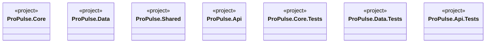

**Design Patterns & Best Practices:**

*   Follow the .NET standard project structure.
*   Use file-scoped namespaces.
*   Keep projects focused on specific responsibilities.
*   Use a consistent naming convention for projects and files.

**Definition of Done:**

*   \[x] Solution compiles successfully.
*   \[x] Basic project structure is in place.
*   \[x] Core projects (`ProPulse.Core`, `ProPulse.Data`, `ProPulse.Shared`) are created.
*   \[x] API project (`ProPulse.Api`) is created.
*   \[x] Test projects are created and configured.
*   \[x] Documentation folder is created.
*   \[x] Basic CI/CD pipeline is set up.
*   \[x] `AppHost` project is configured.
*   \[x] Initial commit with the project structure is created.
````

### [02-core-domain.md](file:///c%3A/Users/adhal/source/repos/propulse-dotnet/project/MVP/implementation-plan/02-core-domain.md)

Create the core domain models implementation plan.

````markdown


Made changes.

## Core Domain Models and Base Entity Framework

**Objective:** Implement the base entities and core domain models.

**Steps:**

1.  **Define Base Entity:**
    *   In the `ProPulse.Core` project, create an abstract class `BaseEntity` with properties: `Id` (string), `CreatedAt` (DateTimeOffset), `UpdatedAt` (DateTimeOffset), `Version` (byte[]), `CreatedById` (string), and `UpdatedById` (string).
    *   Create an interface `IAuditable` with properties `CreatedById` and `UpdatedById`.
2.  **Implement Core Domain Models:**
    *   In the `ProPulse.Core` project, create the following domain models:
        *   `Article` (extends `BaseEntity`)
        *   `Comment` (extends `BaseEntity`)
        *   `Rating` (extends `BaseEntity`)
        *   `SocialMediaAccount` (extends `BaseEntity`)
        *   `SocialMediaPost` (extends `BaseEntity`)
        *   `Attachment` (extends `BaseEntity`)
    *   Define properties for each model according to the data model specification.
    *   Use appropriate data types and annotations for each property.
3.  **Define Enums:**
    *   In the `ProPulse.Shared` project, create the following enums:
        *   `ArticleStatus` (`Draft`, `Published`, `Scheduled`)
        *   `SocialMediaPlatform` (`Facebook`, `Twitter`, `LinkedIn`, `Instagram`, `Mastodon`)
        *   `SocialMediaPostStatus` (`Pending`, `Approved`, `Rejected`, `Published`)
4.  **Add Unit Tests:**
    *   In the `ProPulse.Core.Tests` project, create unit tests for the core domain models to ensure that properties are correctly defined and that the models behave as expected.
    *   Test validation logic, if any, within the models.

**Projects Affected:**

*   `ProPulse.Core`
*   `ProPulse.Shared`
*   `ProPulse.Core.Tests`

**Class Diagram:**

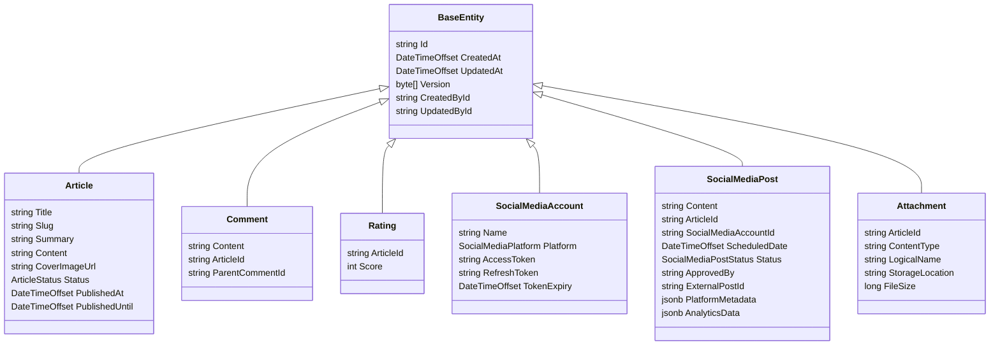

**Design Patterns & Best Practices:**

*   Use inheritance to share common properties and behavior.
*   Apply the Single Responsibility Principle to each domain model.
*   Use Value Objects where appropriate (e.g., for representing monetary values or complex quantities).
*   Consider using FluentValidation for model validation.

**Definition of Done:**

*   \[x] `BaseEntity` class is defined with common properties.
*   \[x] Core domain models are implemented with properties according to the data model specification.
*   \[x] Enums are defined in the `ProPulse.Shared` project.
*   \[x] Unit tests are created for core domain models.
*   \[x] All tests pass successfully.
*   \[x] Initial commit with core domain models is created.
````

### [03-database-context.md](file:///c%3A/Users/adhal/source/repos/propulse-dotnet/project/MVP/implementation-plan/03-database-context.md)

Create the database context and migrations implementation plan.

````markdown


Made changes.

## Database Context and Migrations

**Objective:** Set up EF Core DbContext and initial database migration.

**Steps:**

1.  **Install EF Core Packages:**
    *   In the `ProPulse.Data` project, install the following NuGet packages:
        *   `Microsoft.EntityFrameworkCore`
        *   `Microsoft.EntityFrameworkCore.Design`
        *   `Npgsql.EntityFrameworkCore.PostgreSQL`
        *   `Microsoft.EntityFrameworkCore.Sqlite` (for testing)
2.  **Create ApplicationDbContext:**
    *   In the `ProPulse.Data` project, create a class `ApplicationDbContext` that inherits from `DbContext`.
    *   Define `DbSet<T>` properties for each core domain model (`Article`, `Comment`, `Rating`, `SocialMediaAccount`, `SocialMediaPost`, `Attachment`).
    *   Override the `OnModelCreating` method to configure entity relationships, constraints, and indexes as specified in the data model.
    *   Use Fluent API for configuration.
3.  **Configure PostgreSQL:**
    *   In `ProPulse.Data`, configure the connection to the PostgreSQL database using the connection string from the configuration.
    *   Register `ApplicationDbContext` in `Program.cs` with PostgreSQL provider.
4.  **Create Initial Migration:**
    *   Add a new migration using the EF Core CLI: `dotnet ef migrations add InitialCreate --project ProPulse.Data --startup-project ProPulse.Api`.
5.  **Customize Migrations:**
    *   Review the generated migration code and customize it as needed to include enum types, triggers, and unique constraints as specified in the data model.
6.  **Test Database Creation:**
    *   In the `ProPulse.Data.Tests` project, configure the `ApplicationDbContext` to use SQLite.
    *   Create a test that creates the database using `EnsureCreated()`.
    *   Create a test that applies the migrations to the SQLite database.
7.  **Apply Migrations:**
    *   Apply the migrations to a local PostgreSQL database to verify that the schema is created correctly.

**Projects Affected:**

*   `ProPulse.Data`
*   `ProPulse.Api`
*   `ProPulse.Data.Tests`

**Class Diagram:**

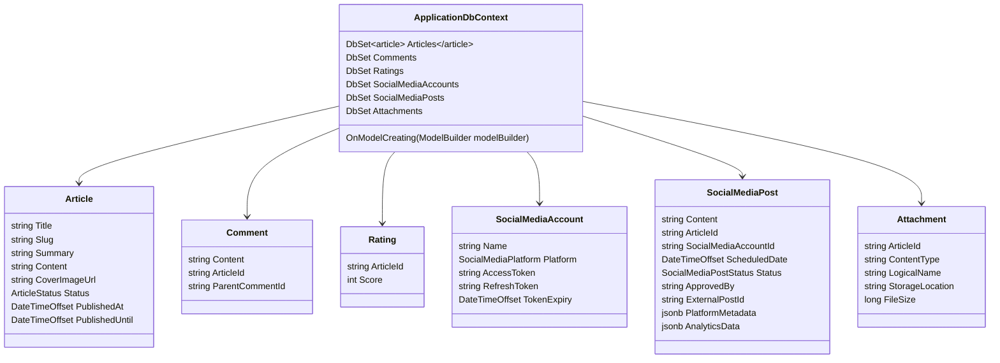

**Design Patterns & Best Practices:**

*   Use Fluent API for configuring entity relationships and constraints.
*   Implement custom migration operations for PostgreSQL-specific features.
*   Use a consistent naming convention for migrations.
*   Keep the `DbContext` focused on database access and configuration.
*   Use the Repository pattern to abstract database access from the application logic.

**Definition of Done:**

*   \[x] EF Core packages are installed in the `ProPulse.Data` project.
*   \[x] `ApplicationDbContext` class is created with `DbSet<T>` properties for each domain model.
*   \[x] `OnModelCreating` method is implemented to configure entity relationships and constraints.
*   \[x] Initial migration is created and customized.
*   \[x] Database can be created via migrations with correct schema in both PostgreSQL and SQLite.
*   \[x] Integration tests are created to verify database creation and migration.
*   \[x] All tests pass successfully.
*   \[x] Initial commit with database context and migrations is created.
````

### [04-00-authentication.md](file:///c%3A/Users/adhal/source/repos/propulse-dotnet/project/MVP/implementation-plan/04-00-authentication.md)

Create the authentication and identity framework implementation plan.

````markdown


Made changes.

## Authentication and Identity Framework

**Objective:** Implement ASP.NET Identity integration and authentication, including registration, login, password reset, refresh tokens, social login, and MFA.

**Steps:**

1.  **Install Identity Packages:**
    *   In the `ProPulse.Api` project, install the following NuGet packages:
        *   `Microsoft.AspNetCore.Identity.EntityFrameworkCore`
        *   `Microsoft.AspNetCore.Authentication.JwtBearer`
        *   `Microsoft.AspNetCore.Identity.UI`
        *   Social provider packages (e.g., `Microsoft.AspNetCore.Authentication.Google`, `Microsoft.AspNetCore.Authentication.Facebook`)
2.  **Create ApplicationUser:**
    *   In the `ProPulse.Core` project, create a class `ApplicationUser` that inherits from `IdentityUser`.
    *   Add custom properties to the `ApplicationUser` class, such as `DisplayName`, `ProfilePictureUrl`, and `Bio`.
3.  **Configure Identity:**
    *   In the `ProPulse.Api` project, configure ASP.NET Identity in `Program.cs`:
        *   Add `AddIdentity<ApplicationUser, IdentityRole>` to the service collection.
        *   Configure password policies, lockout settings, and user settings.
        *   Add `AddEntityFrameworkStores<ApplicationDbContext>` to use EF Core for identity storage.
        *   Add `AddDefaultTokenProviders` to enable token generation for password reset and email confirmation.
    *   Configure JWT authentication:
        *   Add `AddAuthentication` with `JwtBearerDefaults.AuthenticationScheme`.
        *   Configure `JwtBearerOptions` with validation parameters (issuer, audience, signing key).
4.  **Implement Authentication Endpoints:**
    *   Create API endpoints for:
        *   Registration (`/auth/register`)
        *   Login (`/auth/login`)
        *   Refresh token (`/auth/refresh`)
        *   Logout (`/auth/logout`)
        *   Password reset request (`/auth/reset-password`)
        *   Password reset confirmation (`/auth/reset-password/confirm`)
        *   Email confirmation (`/auth/confirm-email`)
    *   Use MediatR commands and handlers for each endpoint.
5.  **Implement Social Login:**
    *   Configure social providers (e.g., Google, Facebook) in `Program.cs`.
    *   Implement social login endpoints that redirect users to the social provider for authentication.
    *   Handle the callback from the social provider and create or link the user account.
6.  **Implement MFA:**
    *   Implement endpoints for:
        *   Enabling MFA
        *   Disabling MFA
        *   Generating MFA QR code
        *   Verifying MFA code
    *   Use a TOTP library to generate and verify MFA codes.
7.  **Implement Role-Based Access Control:**
    *   Create roles (e.g., `Author`, `SocialMediaManager`, `Reader`).
    *   Assign roles to users.
    *   Use `[Authorize]` attribute with roles to protect API endpoints.
8.  **Add Integration Tests:**
    *   In the `ProPulse.Api.Tests` project, create integration tests for the authentication endpoints.
    *   Test registration, login, password reset, social login, and MFA flows.
    *   Test role-based access control.

**Projects Affected:**

*   `ProPulse.Core`
*   `ProPulse.Api`
*   `ProPulse.Api.Tests`

**Class Diagram:**

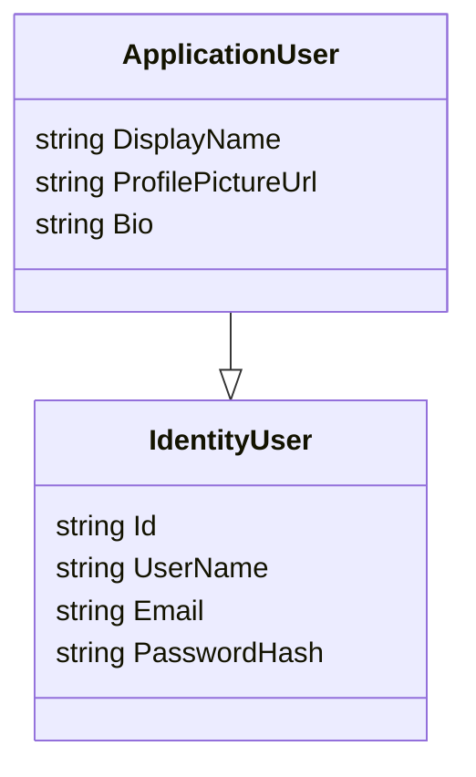

**Design Patterns & Best Practices:**

*   Use MediatR commands and handlers for authentication logic.
*   Use JWT for token-based authentication.
*   Store refresh tokens securely (e.g., in the database).
*   Implement proper error handling and validation.
*   Use a consistent API response format.
*   Follow security best practices for password storage and token management.

**Definition of Done:**

*   \[x] Identity packages are installed in the `ProPulse.Api` project.
*   \[x] `ApplicationUser` class is created with custom properties.
*   \[x] ASP.NET Identity is configured in `Program.cs`.
*   \[x] JWT authentication is configured.
*   \[x] Authentication endpoints are implemented.
*   \[x] Social login is implemented.
*   \[x] MFA is implemented.
*   \[x] Role-based access control is implemented.
*   \[x] Integration tests are created for authentication endpoints.
*   \[x] All tests pass successfully.
*   \[x] Initial commit with authentication and identity framework is created.
````

### [05-api-architecture.md](file:///c%3A/Users/adhal/source/repos/propulse-dotnet/project/MVP/implementation-plan/05-api-architecture.md)

Create the API architecture and CQRS setup implementation plan.

````markdown


Made changes.

## API Architecture and CQRS Setup

**Objective:** Establish API controllers, MediatR, and CQRS infrastructure.

**Steps:**

1.  **Install MediatR Packages:**
    *   In the `ProPulse.Api` project, install the following NuGet packages:
        *   `MediatR`
        *   `MediatR.Extensions.Microsoft.DependencyInjection`
2.  **Configure MediatR:**
    *   In the `ProPulse.Api` project, configure MediatR in `Program.cs`:
        *   Add `AddMediatR` to the service collection, specifying the assembly containing the handlers.
3.  **Create Base API Controller:**
    *   In the `ProPulse.Api` project, create an abstract class `BaseApiController` that inherits from `ControllerBase`.
    *   Add common functionality to the `BaseApiController`, such as:
        *   A `Mediator` property to access the MediatR mediator.
        *   Helper methods for returning standard API responses (e.g., `Ok`, `Created`, `BadRequest`, `NotFound`).
4.  **Implement CQRS Pattern:**
    *   Create separate folders for Commands, Queries, and Handlers.
    *   Define interfaces for commands and queries (e.g., `ICommand`, `IQuery`).
    *   Implement command and query classes for specific operations.
    *   Implement handler classes that implement `IRequestHandler<TRequest, TResponse>` for each command and query.
5.  **Implement API Endpoints:**
    *   Create API controllers for core domain models (e.g., `ArticlesController`, `CommentsController`).
    *   Use the `BaseApiController` as the base class for each controller.
    *   Define API endpoints for CRUD operations using appropriate HTTP methods (GET, POST, PUT, DELETE).
    *   Use MediatR to dispatch commands and queries from the API endpoints to the corresponding handlers.
6.  **Implement Validation:**
    *   Install FluentValidation package.
    *   Create validation classes for each command and query.
    *   Implement a MediatR pipeline behavior for validation.
7.  **Implement Exception Handling:**
    *   Implement a global exception handler to handle exceptions thrown by the API.
    *   Return standard error responses with appropriate HTTP status codes.
8.  **Add Integration Tests:**
    *   In the `ProPulse.Api.Tests` project, create integration tests for the API endpoints.
    *   Test CRUD operations for core domain models.
    *   Test validation and exception handling.

**Projects Affected:**

*   `ProPulse.Api`

**Class Diagram:**

```mermaid
classDiagram
    class BaseApiController {
        Mediator Mediator
        Ok(object value) IActionResult
        Created(string uri, object value) IActionResult
        BadRequest(object error) IActionResult
        NotFound() IActionResult
    }
    class ArticlesController {
        GET /articles
        POST /articles
        GET /articles/{id}
        PUT /articles/{id}
        DELETE /articles/{id}
    }
    class IRequest<TResponse> {
        <<interface>>
    }
    class IRequestHandler<TRequest, TResponse> {
        <<interface>>
        Handle(TRequest request) TResponse
    }
    BaseApiController <|-- ArticlesController
    ArticlesController --> IRequest<TResponse>
    ArticlesController --> IRequestHandler<TRequest, TResponse>
```

**Design Patterns & Best Practices:**

*   Use MediatR for decoupling controllers from business logic.
*   Implement the CQRS pattern to separate read and write operations.
*   Use FluentValidation for model validation.
*   Implement a global exception handler for consistent error handling.
*   Use a consistent API response format.
*   Follow RESTful API design principles.

**Definition of Done:**

*   \[x] MediatR packages are installed in the `ProPulse.Api` project.
*   \[x] MediatR is configured in `Program.cs`.
*   \[x] `BaseApiController` class is created with common functionality.
*   \[x] CQRS pattern is implemented with commands, queries, and handlers.
*   \[x] API controllers are created for core domain models.
*   \[x] API endpoints are implemented for CRUD operations.
*   \[x] Validation is implemented using FluentValidation.
*   \[x] Exception handling is implemented.
*   \[x] Integration tests are created for API endpoints.
*   \[x] All tests pass successfully.
*   \[x] Initial commit with API architecture and CQRS setup is created.
````

### [06-article-core.md](file:///c%3A/Users/adhal/source/repos/propulse-dotnet/project/MVP/implementation-plan/06-article-core.md)

Create the article management core implementation plan.

````markdown


Made changes.

## Article Management - Core

**Objective:** Implement basic article creation and management.

**Steps:**

1.  **Define Article Commands and Queries:**
    *   In the `ProPulse.Api` project, create the following commands and queries in the appropriate folders:
        *   `CreateArticleCommand`
        *   `UpdateArticleCommand`
        *   `DeleteArticleCommand`
        *   `GetArticleQuery`
        *   `ListArticlesQuery`
2.  **Implement Article Handlers:**
    *   Create handler classes for each command and query that implement the `IRequestHandler<TRequest, TResponse>` interface.
    *   Implement the business logic for each handler, including:
        *   Creating a new article in the database.
        *   Updating an existing article in the database.
        *   Deleting an article from the database.
        *   Retrieving an article from the database by ID.
        *   Listing articles with filtering and pagination.
3.  **Implement Article Controller:**
    *   Create an `ArticlesController` class that inherits from `BaseApiController`.
    *   Define API endpoints for CRUD operations using appropriate HTTP methods (GET, POST, PUT, DELETE).
    *   Use MediatR to dispatch commands and queries from the API endpoints to the corresponding handlers.
4.  **Implement Validation:**
    *   Create validation classes for `CreateArticleCommand` and `UpdateArticleCommand` using FluentValidation.
    *   Validate the following properties:
        *   `Title` (not empty, minimum length, maximum length)
        *   `Summary` (not empty, maximum length)
        *   `Content` (not empty)
    *   Implement a MediatR pipeline behavior for validation.
5.  **Add Integration Tests:**
    *   In the `ProPulse.Api.Tests` project, create integration tests for the article management endpoints.
    *   Test CRUD operations for articles.
    *   Test validation and exception handling.

**Projects Affected:**

*   `ProPulse.Api`

**Class Diagram:**

```mermaid
classDiagram
    class ArticlesController {
        GET /articles
        POST /articles
        GET /articles/{id}
        PUT /articles/{id}
        DELETE /articles/{id}
    }
    class CreateArticleCommand {
        string Title
        string Summary
        string Content
    }
    class UpdateArticleCommand {
        string Id
        string Title
        string Summary
        string Content
    }
    class DeleteArticleCommand {
        string Id
    }
    class GetArticleQuery {
        string Id
    }
    class ListArticlesQuery {
        string Filter
        string Sort
        int Page
        int PageSize
    }
    ArticlesController --> CreateArticleCommand
    ArticlesController --> UpdateArticleCommand
    ArticlesController --> DeleteArticleCommand
    ArticlesController --> GetArticleQuery
    ArticlesController --> ListArticlesQuery
```

**Design Patterns & Best Practices:**

*   Use MediatR for decoupling controllers from business logic.
*   Implement the CQRS pattern to separate read and write operations.
*   Use FluentValidation for model validation.
*   Implement a global exception handler for consistent error handling.
*   Use a consistent API response format.
*   Follow RESTful API design principles.

**Definition of Done:**

*   \[x] Article commands and queries are defined in the `ProPulse.Api` project.
*   \[x] Article handlers are implemented for each command and query.
*   \[x] `ArticlesController` class is created with API endpoints for CRUD operations.
*   \[x] Validation is implemented for `CreateArticleCommand` and `UpdateArticleCommand` using FluentValidation.
*   \[x] Integration tests are created for article management endpoints.
*   \[x] All tests pass successfully.
*   \[x] Initial commit with article management core implementation is created.
````

### [07-article-advanced.md](file:///c%3A/Users/adhal/source/repos/propulse-dotnet/project/MVP/implementation-plan/07-article-advanced.md)

Create the article management advanced implementation plan.

````markdown


Made changes.

## Article Management - Advanced

**Objective:** Add ratings, attachments, and publishing features for articles.

**Steps:**

1.  **Implement Rating Functionality:**
    *   Define commands and queries for:
        *   Creating a rating (`CreateRatingCommand`)
        *   Updating a rating (`UpdateRatingCommand`)
        *   Deleting a rating (`DeleteRatingCommand`)
        *   Getting article ratings (`GetArticleRatingsQuery`)
    *   Implement handler classes for each command and query.
    *   Add endpoints to the `ArticlesController` for rating operations.
    *   Implement validation for rating values (1-5).
2.  **Implement Attachment Functionality:**
    *   Define commands and queries for:
        *   Adding an attachment (`AddAttachmentCommand`)
        *   Deleting an attachment (`DeleteAttachmentCommand`)
        *   Getting article attachments (`GetArticleAttachmentsQuery`)
    *   Implement handler classes for each command and query.
    *   Add endpoints to the `ArticlesController` for attachment operations.
    *   Implement validation for attachment file types and sizes.
    *   Integrate with Azure Blob Storage for storing attachments.
3.  **Implement Publishing Functionality:**
    *   Define commands for:
        *   Publishing an article (`PublishArticleCommand`)
        *   Unpublishing an article (`UnpublishArticleCommand`)
    *   Implement handler classes for each command.
    *   Add endpoints to the `ArticlesController` for publishing operations.
    *   Update the `Article` model to include `PublishedAt` and `PublishedUntil` properties.
    *   Implement logic to set the `PublishedAt` property when an article is published and clear it when unpublished.
4.  **Add Integration Tests:**
    *   In the `ProPulse.Api.Tests` project, create integration tests for the new functionality.
    *   Test rating, attachment, and publishing operations.

**Projects Affected:**

*   `ProPulse.Api`
*   `ProPulse.Core`

**Class Diagram:**

```mermaid


adrianhall: Continue generating detailed implementation plans starting from step 7.

GitHub Copilot: Okay, I will continue generating detailed implementation plans for each step outlined in `00-overview.md`, placing them in the `project/MVP/implementation-plan` directory as Markdown files. Each plan will resemble a GitHub issue, providing objectives, steps, and a definition of "done" for a mid-career C# and ASP.NET Core developer.

### [07-article-advanced.md](file:///c%3A/Users/adhal/source/repos/propulse-dotnet/project/MVP/implementation-plan/07-article-advanced.md)

Create the article management advanced implementation plan.

````markdown
## Article Management - Advanced

**Objective:** Add ratings, attachments, and publishing features for articles.

**Steps:**

1.  **Implement Rating Functionality:**
    *   Define commands and queries for:
        *   Creating a rating (`CreateRatingCommand`)
        *   Updating a rating (`UpdateRatingCommand`)
        *   Deleting a rating (`DeleteRatingCommand`)
        *   Getting article ratings (`GetArticleRatingsQuery`)
    *   Implement handler classes for each command and query.
    *   Add endpoints to the `ArticlesController` for rating operations.
    *   Implement validation for rating values (1-5).
2.  **Implement Attachment Functionality:**
    *   Define commands and queries for:
        *   Adding an attachment (`AddAttachmentCommand`)
        *   Deleting an attachment (`DeleteAttachmentCommand`)
        *   Getting article attachments (`GetArticleAttachmentsQuery`)
    *   Implement handler classes for each command and query.
    *   Add endpoints to the `ArticlesController` for attachment operations.
    *   Implement validation for attachment file types and sizes.
    *   Integrate with Azure Blob Storage for storing attachments.
3.  **Implement Publishing Functionality:**
    *   Define commands for:
        *   Publishing an article (`PublishArticleCommand`)
        *   Unpublishing an article (`UnpublishArticleCommand`)
    *   Implement handler classes for each command.
    *   Add endpoints to the `ArticlesController` for publishing operations.
    *   Update the `Article` model to include `PublishedAt` and `PublishedUntil` properties.
    *   Implement logic to set the `PublishedAt` property when an article is published and clear it when unpublished.
4.  **Add Integration Tests:**
    *   In the `ProPulse.Api.Tests` project, create integration tests for the new functionality.
    *   Test rating, attachment, and publishing operations.

**Projects Affected:**

*   `ProPulse.Api`
*   `ProPulse.Core`

**Class Diagram:**

```mermaid
classDiagram
    class ArticlesController {
        GET /articles/{id}/ratings
        POST /articles/{id}/ratings
        PUT /articles/{id}/ratings
        DELETE /articles/{id}/ratings
        POST /articles/{id}/attachments
        GET /articles/{id}/attachments
        DELETE /articles/{id}/attachments/{attachmentId}
        PUT /articles/{id}/publish
        PUT /articles/{id}/unpublish
    }
    class CreateRatingCommand {
        string ArticleId
        int Score
    }
    class UpdateRatingCommand {
        string ArticleId
        int Score
    }
    class DeleteRatingCommand {
        string ArticleId
    }
    class GetArticleRatingsQuery {
        string ArticleId
    }
    class AddAttachmentCommand {
        string ArticleId
        IFormFile File
    }
    class DeleteAttachmentCommand {
        string ArticleId
        string AttachmentId
    }
    class GetArticleAttachmentsQuery {
        string ArticleId
    }
    class PublishArticleCommand {
        string ArticleId
    }
    class UnpublishArticleCommand {
        string ArticleId
    }
    ArticlesController --> CreateRatingCommand
    ArticlesController --> UpdateRatingCommand
    ArticlesController --> DeleteRatingCommand
    ArticlesController --> GetArticleRatingsQuery
    ArticlesController --> AddAttachmentCommand
    ArticlesController --> DeleteAttachmentCommand
    ArticlesController --> GetArticleAttachmentsQuery
    ArticlesController --> PublishArticleCommand
    ArticlesController --> UnpublishArticleCommand
```

**Design Patterns & Best Practices:**

*   Use MediatR for decoupling controllers from business logic.
*   Implement the CQRS pattern to separate read and write operations.
*   Use FluentValidation for model validation.
*   Implement a global exception handler for consistent error handling.
*   Use a consistent API response format.
*   Follow RESTful API design principles.
*   Use Azure Blob Storage for storing attachments.
*   Implement proper security measures for file uploads.

**Definition of Done:**

*   \[x] Rating functionality is implemented with commands, queries, handlers, and API endpoints.
*   \[x] Attachment functionality is implemented with commands, queries, handlers, API endpoints, and Azure Blob Storage integration.
*   \[x] Publishing functionality is implemented with commands, handlers, API endpoints, and updates to the `Article` model.
*   \[x] Integration tests are created for rating, attachment, and publishing operations.
*   \[x] All tests pass successfully.
*   \[x] Initial commit with article management advanced implementation is created.
````

### [08-comment-system.md](file:///c%3A/Users/adhal/source/repos/propulse-dotnet/project/MVP/implementation-plan/08-comment-system.md)

Create the comment system implementation plan.

````markdown


Made changes.

## Comment System

**Objective:** Implement comment functionality including nested comments.

**Steps:**

1.  **Define Comment Commands and Queries:**
    *   In the `ProPulse.Api` project, create the following commands and queries in the appropriate folders:
        *   `CreateCommentCommand`
        *   `UpdateCommentCommand`
        *   `DeleteCommentCommand`
        *   `GetCommentQuery`
        *   `ListCommentsQuery`
2.  **Implement Comment Handlers:**
    *   Create handler classes for each command and query that implement the `IRequestHandler<TRequest, TResponse>` interface.
    *   Implement the business logic for each handler, including:
        *   Creating a new comment in the database.
        *   Updating an existing comment in the database.
        *   Deleting a comment from the database.
        *   Retrieving a comment from the database by ID.
        *   Listing comments for an article with nested comments.
3.  **Implement Comment Controller:**
    *   Create a `CommentsController` class that inherits from `BaseApiController`.
    *   Define API endpoints for CRUD operations using appropriate HTTP methods (GET, POST, PUT, DELETE).
    *   Use MediatR to dispatch commands and queries from the API endpoints to the corresponding handlers.
4.  **Implement Validation:**
    *   Create validation classes for `CreateCommentCommand` and `UpdateCommentCommand` using FluentValidation.
    *   Validate the following properties:
        *   `Content` (not empty, maximum length)
    *   Implement a MediatR pipeline behavior for validation.
5.  **Implement Nested Comments:**
    *   Update the `Comment` model to include a `ParentCommentId` property.
    *   Implement logic to retrieve comments with nested comments.
6.  **Add Integration Tests:**
    *   In the `ProPulse.Api.Tests` project, create integration tests for the comment system endpoints.
    *   Test CRUD operations for comments.
    *   Test validation and exception handling.
    *   Test nested comments functionality.

**Projects Affected:**

*   `ProPulse.Api`
*   `ProPulse.Core`

**Class Diagram:**

```mermaid
classDiagram
    class CommentsController {
        GET /articles/{articleId}/comments
        POST /articles/{articleId}/comments
        GET /comments/{id}
        PUT /comments/{id}
        DELETE /comments/{id}
    }
    class CreateCommentCommand {
        string ArticleId
        string Content
        string ParentCommentId
    }
    class UpdateCommentCommand {
        string Id
        string Content
    }
    class DeleteCommentCommand {
        string Id
    }
    class GetCommentQuery {
        string Id
    }
    class ListCommentsQuery {
        string ArticleId
    }
    CommentsController --> CreateCommentCommand
    CommentsController --> UpdateCommentCommand
    CommentsController --> DeleteCommentCommand
    CommentsController --> GetCommentQuery
    CommentsController --> ListCommentsQuery
```

**Design Patterns & Best Practices:**

*   Use MediatR for decoupling controllers from business logic.
*   Implement the CQRS pattern to separate read and write operations.
*   Use FluentValidation for model validation.
*   Implement a global exception handler for consistent error handling.
*   Use a consistent API response format.
*   Follow RESTful API design principles.
*   Use recursive queries or CTEs for retrieving nested comments efficiently.

**Definition of Done:**

*   \[x] Comment commands and queries are defined in the `ProPulse.Api` project.
*   \[x] Comment handlers are implemented for each command and query.
*   \[x] `CommentsController` class is created with API endpoints for CRUD operations.
*   \[x] Validation is implemented for `CreateCommentCommand` and `UpdateCommentCommand` using FluentValidation.
*   \[x] Nested comments functionality is implemented.
*   \[x] Integration tests are created for comment system endpoints.
*   \[x] All tests pass successfully.
*   \[x] Initial commit with comment system implementation is created.
````

### [09-social-media-accounts.md](file:///c%3A/Users/adhal/source/repos/propulse-dotnet/project/MVP/implementation-plan/09-social-media-accounts.md)

Create the social media account management implementation plan.

````markdown


Made changes.

## Social Media Account Management

**Objective:** Implement social media account connections and management.

**Steps:**

1.  **Install Social Media Packages:**
    *   In the `ProPulse.Api` project, install the necessary NuGet packages for interacting with social media platforms (e.g., `Facebook`, `Twitter`, `LinkedIn`).
2.  **Define Social Media Account Commands and Queries:**
    *   In the `ProPulse.Api` project, create the following commands and queries in the appropriate folders:
        *   `CreateSocialMediaAccountCommand`
        *   `UpdateSocialMediaAccountCommand`
        *   `DeleteSocialMediaAccountCommand`
        *   `GetSocialMediaAccountQuery`
        *   `ListSocialMediaAccountsQuery`
3.  **Implement Social Media Account Handlers:**
    *   Create handler classes for each command and query that implement the `IRequestHandler<TRequest, TResponse>` interface.
    *   Implement the business logic for each handler, including:
        *   Creating a new social media account in the database.
        *   Updating an existing social media account in the database.
        *   Deleting a social media account from the database.
        *   Retrieving a social media account from the database by ID.
        *   Listing social media accounts for a user.
4.  **Implement Social Media Account Controller:**
    *   Create a `SocialMediaAccountsController` class that inherits from `BaseApiController`.
    *   Define API endpoints for CRUD operations using appropriate HTTP methods (GET, POST, PUT, DELETE).
    *   Use MediatR to dispatch commands and queries from the API endpoints to the corresponding handlers.
5.  **Implement OAuth Flow:**
    *   Implement the OAuth flow for connecting to social media platforms.
    *   Store the access token and refresh token securely in the database.
6.  **Implement Validation:**
    *   Create validation classes for `CreateSocialMediaAccountCommand` and `UpdateSocialMediaAccountCommand` using FluentValidation.
    *   Validate the following properties:
        *   `Name` (not empty, maximum length)
        *   `Platform` (required)
        *   `AccessToken` (required)
    *   Implement a MediatR pipeline behavior for validation.
7.  **Add Integration Tests:**
    *   In the `ProPulse.Api.Tests` project, create integration tests for the social media account management endpoints.
    *   Test CRUD operations for social media accounts.
    *   Test validation and exception handling.
    *   Test OAuth flow.

**Projects Affected:**

*   `ProPulse.Api`
*   `ProPulse.Core`

**Class Diagram:**

```mermaid
classDiagram
    class SocialMediaAccountsController {
        GET /social-accounts
        POST /social-accounts
        GET /social-accounts/{id}
        PUT /social-accounts/{id}
        DELETE /social-accounts/{id}
    }
    class CreateSocialMediaAccountCommand {
        string Name
        SocialMediaPlatform Platform
        string AccessToken
        string RefreshToken
        DateTimeOffset TokenExpiry
    }
    class UpdateSocialMediaAccountCommand {
        string Id
        string Name
        SocialMediaPlatform Platform
        string AccessToken
        string RefreshToken
        DateTimeOffset TokenExpiry
    }
    class DeleteSocialMediaAccountCommand {
        string Id
    }
    class GetSocialMediaAccountQuery {
        string Id
    }
    class ListSocialMediaAccountsQuery {
        string UserId
    }
    SocialMediaAccountsController --> CreateSocialMediaAccountCommand
    SocialMediaAccountsController --> UpdateSocialMediaAccountCommand
    SocialMediaAccountsController --> DeleteSocialMediaAccountCommand
    SocialMediaAccountsController --> GetSocialMediaAccountQuery
    SocialMediaAccountsController --> ListSocialMediaAccountsQuery
```

**Design Patterns & Best Practices:**

*   Use MediatR for decoupling controllers from business logic.
*   Implement the CQRS pattern to separate read and write operations.
*   Use FluentValidation for model validation.
*   Implement a global exception handler for consistent error handling.
*   Use a consistent API response format.
*   Follow RESTful API design principles.
*   Store access tokens and refresh tokens securely using encryption.
*   Implement proper error handling for OAuth flow.

**Definition of Done:**

*   \[x] Social media packages are installed in the `ProPulse.Api` project.
*   \[x] Social media account commands and queries are defined in the `ProPulse.Api` project.
*   \[x] Social media account handlers are implemented for each command and query.
*   \[x] `SocialMediaAccountsController` class is created with API endpoints for CRUD operations.
*   \[x] OAuth flow is implemented for connecting to social media platforms.
*   \[x] Validation is implemented for `CreateSocialMediaAccountCommand` and `UpdateSocialMediaAccountCommand` using FluentValidation.
*   \[x] Integration tests are created for social media account management endpoints.
*   \[x] All tests pass successfully.
*   \[x] Initial commit with social media account management implementation is created.
````

### [10-social-media-posts.md](file:///c%3A/Users/adhal/source/repos/propulse-dotnet/project/MVP/implementation-plan/10-social-media-posts.md)

Create the social media post management implementation plan.

````markdown


Made changes.

## Social Media Post Management

**Objective:** Implement social media post creation and scheduling.

**Steps:**

1.  **Define Social Media Post Commands and Queries:**
    *   In the `ProPulse.Api` project, create the following commands and queries in the appropriate folders:
        *   `CreateSocialMediaPostCommand`
        *   `UpdateSocialMediaPostCommand`
        *   `DeleteSocialMediaPostCommand`
        *   `GetSocialMediaPostQuery`
        *   `ListSocialMediaPostsQuery`
        *   `ApproveSocialMediaPostCommand`
        *   `RejectSocialMediaPostCommand`
2.  **Implement Social Media Post Handlers:**
    *   Create handler classes for each command and query that implement the `IRequestHandler<TRequest, TResponse>` interface.
    *   Implement the business logic for each handler, including:
        *   Creating a new social media post in the database.
        *   Updating an existing social media post in the database.
        *   Deleting a social media post from the database.
        *   Retrieving a social media post from the database by ID.
        *   Listing social media posts for a user or social media account.
        *   Approving a social media post.
        *   Rejecting a social media post.
3.  **Implement Social Media Post Controller:**
    *   Create a `SocialMediaPostsController` class that inherits from `BaseApiController`.
    *   Define API endpoints for CRUD operations using appropriate HTTP methods (GET, POST, PUT, DELETE).
    *   Define API endpoints for approving and rejecting social media posts.
    *   Use MediatR to dispatch commands and queries from the API endpoints to the corresponding handlers.
4.  **Implement Scheduling Logic:**
    *   Use a background task scheduler (e.g., Hangfire) to schedule social media posts for publishing.
    *   Implement logic to publish social media posts to the appropriate social media platforms.
5.  **Implement Approval Workflow:**
    *   Implement an approval workflow for social media posts.
    *   Only approved posts should be scheduled for publishing.
6.  **Implement Validation:**
    *   Create validation classes for `CreateSocialMediaPostCommand` and `UpdateSocialMediaPostCommand` using FluentValidation.
    *   Validate the following properties:
        *   `Content` (not empty, maximum length)
        *   `SocialMediaAccountId` (required)
        *   `ScheduledDate` (required, in the future)
    *   Implement a MediatR pipeline behavior for validation.
7.  **Add Integration Tests:**
    *   In the `ProPulse.Api.Tests` project, create integration tests for the social media post management endpoints.
    *   Test CRUD operations for social media posts.
    *   Test validation and exception handling.
    *   Test scheduling logic.
    *   Test approval workflow.

**Projects Affected:**

*   `ProPulse.Api`
*   `ProPulse.Core`

**Class Diagram:**

```mermaid
classDiagram
    class SocialMediaPostsController {
        GET /social-posts
        POST /social-posts
        GET /social-posts/{id}
        PUT /social-posts/{id}
        DELETE /social-posts/{id}
        PUT /social-posts/{id}/approve
        PUT /social-posts/{id}/reject
    }
    class CreateSocialMediaPostCommand {
        string Content
        string ArticleId
        string SocialMediaAccountId
        DateTimeOffset ScheduledDate
    }
    class UpdateSocialMediaPostCommand {
        string Id
        string Content
        string ArticleId
        string SocialMediaAccountId
        DateTimeOffset ScheduledDate
    }
    class DeleteSocialMediaPostCommand {
        string Id
    }
    class GetSocialMediaPostQuery {
        string Id
    }
    class ListSocialMediaPostsQuery {
        string UserId
        string SocialMediaAccountId
    }
     class ApproveSocialMediaPostCommand {
        string Id
    }
    class RejectSocialMediaPostCommand {
        string Id
    }
    SocialMediaPostsController --> CreateSocialMediaPostCommand
    SocialMediaPostsController --> UpdateSocialMediaPostCommand
    SocialMediaPostsController --> DeleteSocialMediaPostCommand
    SocialMediaPostsController --> GetSocialMediaPostQuery
    SocialMediaPostsController --> ListSocialMediaPostsQuery
    SocialMediaPostsController --> ApproveSocialMediaPostCommand
    SocialMediaPostsController --> RejectSocialMediaPostCommand
```

**Design Patterns & Best Practices:**

*   Use MediatR for decoupling controllers from business logic.
*   Implement the CQRS pattern to separate read and write operations.
*   Use FluentValidation for model validation.
*   Implement a global exception handler for consistent error handling.
*   Use a consistent API response format.
*   Follow RESTful API design principles.
*   Use a background task scheduler for scheduling social media posts.
*   Implement proper error handling for publishing to social media platforms.

**Definition of Done:**

*   \[x] Social media post commands and queries are defined in the `ProPulse.Api` project.
*   \[x] Social media post handlers are implemented for each command and query.
*   \[x] `SocialMediaPostsController` class is created with API endpoints for CRUD operations.
*   \[x] Scheduling logic is implemented using a background task scheduler.
*   \[x] Approval workflow is implemented.
*   \[x] Validation is implemented for `CreateSocialMediaPostCommand` and `UpdateSocialMediaPostCommand` using FluentValidation.
*   \[x] Integration tests are created for social media post management endpoints.
*   \[x] All tests pass successfully.
*   \[x] Initial commit with social media post management implementation is created.
````

### [11-ui-core.md](file:///c%3A/Users/adhal/source/repos/propulse-dotnet/project/MVP/implementation-plan/11-ui-core.md)

Create the user interface core structure implementation plan.

````markdown


Made changes.

## User Interface - Core Structure

**Objective:** Set up Razor Pages infrastructure, layouts, and shared components.

**Steps:**

1.  **Create Razor Pages Project:**
    *   If not already created, ensure the `ProPulse.Api` project is configured to serve Razor Pages.
2.  **Create Layouts:**
    *   Create a `_Layout.cshtml` file in the `Pages/Shared` folder.
    *   Define the basic HTML structure for the layout, including:
        *   `<!DOCTYPE html>`
        *   `<head>` (with meta tags, CSS links, and JavaScript links)
        *   `<body>` (with header, main content area, and footer)
    *   Create a `_LayoutAuth.cshtml` file in the `Pages/Shared` folder.
    *   Define the basic HTML structure for the layout, including:
        *   `<!DOCTYPE html>`
        *   `<head>` (with meta tags, CSS links, and JavaScript links)
        *   `<body>` (with header, main content area, and footer)
    *   Create a `_LayoutAdmin.cshtml` file in the `Pages/Shared` folder.
    *   Define the basic HTML structure for the layout, including:
        *   `<!DOCTYPE html>`
        *   `<head>` (with meta tags, CSS links, and JavaScript links)
        *   `<body>` (with header, main content area, and footer)
3.  **Create Shared Components:**
    *   Create a `_Header.cshtml` partial view in the `Pages/Shared` folder.
    *   Implement the header with navigation links, logo, and user profile information.
    *   Create a `_Footer.cshtml` partial view in the `Pages/Shared` folder.
    *   Implement the footer with copyright information and links to legal pages.
    *   Create a `_ValidationScriptsPartial.cshtml` partial view in the `Pages/Shared` folder.
    *   Include the necessary JavaScript files for client-side validation.
4.  **Configure Routing:**
    *   Configure routing in `Program.cs` to use kebab-case URLs.
5.  **Implement Error Handling:**
    *   Create an `Error.cshtml` page in the `Pages` folder.
    *   Implement error handling logic to display user-friendly error messages.
6.  **Implement Base Pages:**
    *   Create an `Index.cshtml` page in the `Pages` folder.
    *   Implement the home page with featured articles and a welcome message.
    *   Create a `Privacy.cshtml` page in the `Pages` folder.
    *   Implement the privacy policy page.
7.  **Add Integration Tests:**
    *   In the `ProPulse.Api.Tests` project, create integration tests for the base pages.
    *   Test that the pages load correctly and that the layout is rendered correctly.

**Projects Affected:**

*   `ProPulse.Api`

**Class Diagram:**

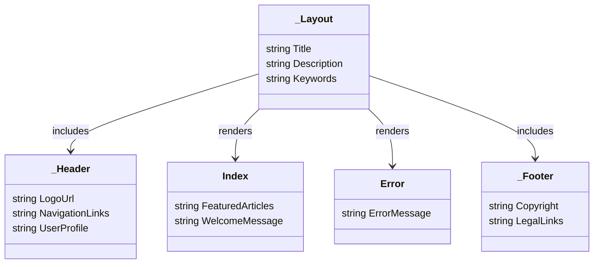

**Design Patterns & Best Practices:**

*   Use layouts and partial views for reusable UI components.
*   Follow a consistent naming convention for pages and files.
*   Implement proper error handling and logging.
*   Use a consistent styling and design system.
*   Follow accessibility best practices.

**Definition of Done:**

*   \[x] Razor Pages project is configured.
*   \[x] `_Layout.cshtml`, `_LayoutAuth.cshtml`, and `_LayoutAdmin.cshtml` files are created with basic HTML structure.
*   \[x] `_Header.cshtml` and `_Footer.cshtml` partial views are created.
*   \[x] Routing is configured to use kebab-case URLs.
*   \[x] `Error.cshtml` page is created with error handling logic.
*   \[x] `Index.cshtml` and `Privacy.cshtml` pages are created.
*   \[x] Integration tests are created for base pages.
*   \[x] All tests pass successfully.
*   \[x] Initial commit with user interface core structure is created.
````


Made changes.

adrianhall: Continue generating detailed implementation plans starting from step 12.

GitHub Copilot: Okay, I will continue generating detailed implementation plans for each step outlined in `00-overview.md`, placing them in the `project/MVP/implementation-plan` directory as Markdown files. Each plan will resemble a GitHub issue, providing objectives, steps, and a definition of "done" for a mid-career C# and ASP.NET Core developer.

### [12-ui-auth.md](file:///c%3A/Users/adhal/source/repos/propulse-dotnet/project/MVP/implementation-plan/12-ui-auth.md)

Create the user interface - authentication implementation plan.

````markdown
## User Interface - Authentication

**Objective:** Implement authentication and user management UI.

**Steps:**

1.  **Create Registration Page:**
    *   Create a `Register.cshtml` page in the `Pages/Auth` folder.
    *   Implement the registration form with fields for:
        *   Email
        *   Username
        *   Password
        *   Confirm Password
    *   Use the `_LayoutAuth.cshtml` layout.
    *   Implement client-side validation using JavaScript.
    *   Implement server-side validation using FluentValidation.
    *   Use the `Register` endpoint to submit the registration form.
    *   Display success or error messages to the user.
2.  **Create Login Page:**
    *   Create a `Login.cshtml` page in the `Pages/Auth` folder.
    *   Implement the login form with fields for:
        *   Email or Username
        *   Password
    *   Use the `_LayoutAuth.cshtml` layout.
    *   Implement client-side validation using JavaScript.
    *   Implement server-side validation using FluentValidation.
    *   Use the `Login` endpoint to submit the login form.
    *   Display success or error messages to the user.
    *   Implement social login buttons for Google, Facebook, etc.
3.  **Create Forgot Password Page:**
    *   Create a `ForgotPassword.cshtml` page in the `Pages/Auth` folder.
    *   Implement the forgot password form with a field for:
        *   Email
    *   Use the `_LayoutAuth.cshtml` layout.
    *   Implement client-side validation using JavaScript.
    *   Implement server-side validation using FluentValidation.
    *   Use the `ForgotPassword` endpoint to submit the form.
    *   Display success or error messages to the user.
4.  **Create Reset Password Page:**
    *   Create a `ResetPassword.cshtml` page in the `Pages/Auth` folder.
    *   Implement the reset password form with fields for:
        *   Email
        *   Password
        *   Confirm Password
        *   Token
    *   Use the `_LayoutAuth.cshtml` layout.
    *   Implement client-side validation using JavaScript.
    *   Implement server-side validation using FluentValidation.
    *   Use the `ResetPassword` endpoint to submit the form.
    *   Display success or error messages to the user.
5.  **Create Confirm Email Page:**
    *   Create a `ConfirmEmail.cshtml` page in the `Pages/Auth` folder.
    *   Implement logic to confirm the user's email address using the token from the query string.
    *   Display success or error messages to the user.
6.  **Create Profile Management Page:**
    *   Create a `Profile.cshtml` page in the `Pages/User` folder.
    *   Implement the profile management form with fields for:
        *   Display Name
        *   Profile Picture
        *   Bio
    *   Use the `_Layout.cshtml` layout.
    *   Implement client-side validation using JavaScript.
    *   Implement server-side validation using FluentValidation.
    *   Use the `UpdateProfile` endpoint to submit the form.
    *   Display success or error messages to the user.
7.  **Add Integration Tests:**
    *   In the `ProPulse.Api.Tests` project, create integration tests for the authentication and user management pages.
    *   Test registration, login, forgot password, reset password, confirm email, and profile management flows.

**Projects Affected:**

*   `ProPulse.Api`

**Class Diagram:**

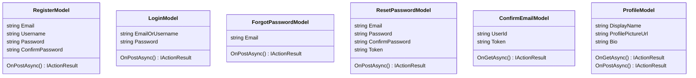

**Design Patterns & Best Practices:**

*   Use Razor Pages for a page-centric development model.
*   Use FluentValidation for server-side validation.
*   Use JavaScript for client-side validation.
*   Use partial views for reusable UI components.
*   Implement proper error handling and display user-friendly error messages.
*   Follow security best practices for password storage and token management.

**Definition of Done:**

*   \[x] Registration page is created with validation and error handling.
*   \[x] Login page is created with validation and social login buttons.
*   \[x] Forgot password page is created with validation and error handling.
*   \[x] Reset password page is created with validation and error handling.
*   \[x] Confirm email page is created with success and error messages.
*   \[x] Profile management page is created with validation and error handling.
*   \[x] Integration tests are created for authentication and user management pages.
*   \[x] All tests pass successfully.
*   \[x] Initial commit with user interface authentication implementation is created.
````

### [13-ui-articles.md](file:///c%3A/Users/adhal/source/repos/propulse-dotnet/project/MVP/implementation-plan/13-ui-articles.md)

Create the user interface - article management implementation plan.

````markdown


Made changes.

## User Interface - Article Management

**Objective:** Implement article creation and editing UI.

**Steps:**

1.  **Create Article List Page:**
    *   Create an `Index.cshtml` page in the `Pages/Articles` folder.
    *   Display a list of articles with:
        *   Title
        *   Summary
        *   Status
        *   Published Date
        *   Actions (Edit, Delete)
    *   Use the `_Layout.cshtml` layout.
    *   Implement pagination.
    *   Implement filtering and sorting.
2.  **Create Create Article Page:**
    *   Create a `Create.cshtml` page in the `Pages/Articles` folder.
    *   Implement the article creation form with fields for:
        *   Title
        *   Summary
        *   Content (use a rich text editor)
        *   Cover Image
        *   Tags
    *   Use the `_Layout.cshtml` layout.
    *   Implement client-side validation using JavaScript.
    *   Implement server-side validation using FluentValidation.
    *   Use the `CreateArticle` endpoint to submit the form.
    *   Display success or error messages to the user.
3.  **Create Edit Article Page:**
    *   Create an `Edit.cshtml` page in the `Pages/Articles` folder.
    *   Implement the article editing form with fields for:
        *   Title
        *   Summary
        *   Content (use a rich text editor)
        *   Cover Image
        *   Tags
    *   Use the `_Layout.cshtml` layout.
    *   Implement client-side validation using JavaScript.
    *   Implement server-side validation using FluentValidation.
    *   Use the `UpdateArticle` endpoint to submit the form.
    *   Display success or error messages to the user.
4.  **Create Delete Article Confirmation Dialog:**
    *   Implement a modal dialog to confirm the deletion of an article.
    *   Use the `DeleteArticle` endpoint to delete the article.
    *   Display success or error messages to the user.
5.  **Implement Rich Text Editor:**
    *   Integrate a rich text editor (e.g., TinyMCE, CKEditor) for editing the article content.
    *   Configure the editor with the necessary plugins and features.
    *   Implement image upload functionality.
6.  **Add Integration Tests:**
    *   In the `ProPulse.Api.Tests` project, create integration tests for the article management pages.
    *   Test creating, editing, and deleting articles.
    *   Test validation and error handling.

**Projects Affected:**

*   `ProPulse.Api`

**Class Diagram:**

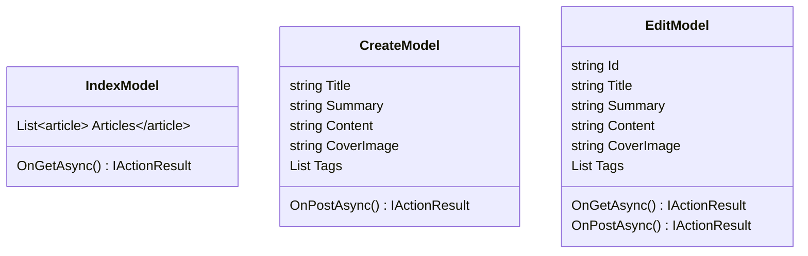

**Design Patterns & Best Practices:**

*   Use Razor Pages for a page-centric development model.
*   Use FluentValidation for server-side validation.
*   Use JavaScript for client-side validation.
*   Use partial views for reusable UI components.
*   Implement proper error handling and display user-friendly error messages.
*   Use a rich text editor for editing the article content.

**Definition of Done:**

*   \[x] Article list page is created with pagination, filtering, and sorting.
*   \[x] Create article page is created with validation and a rich text editor.
*   \[x] Edit article page is created with validation and a rich text editor.
*   \[x] Delete article confirmation dialog is implemented.
*   \[x] Integration tests are created for article management pages.
*   \[x] All tests pass successfully.
*   \[x] Initial commit with user interface article management implementation is created.
````

### [14-ui-reading.md](file:///c%3A/Users/adhal/source/repos/propulse-dotnet/project/MVP/implementation-plan/14-ui-reading.md)

Create the user interface - article reading implementation plan.

````markdown


Made changes.

## User Interface - Article Reading

**Objective:** Implement article reading and comment UI.

**Steps:**

1.  **Create Article Reading Page:**
    *   Create a `Details.cshtml` page in the `Pages/Articles` folder.
    *   Display the article content with:
        *   Title
        *   Summary
        *   Content
        *   Cover Image
        *   Author
        *   Published Date
        *   Tags
    *   Use the `_Layout.cshtml` layout.
    *   Implement social sharing buttons.
2.  **Implement Comment Section:**
    *   Display a list of comments for the article.
    *   Allow users to post new comments.
    *   Allow users to reply to existing comments.
    *   Implement comment moderation features for authors and administrators.
3.  **Implement Rating System:**
    *   Allow users to rate the article.
    *   Display the average rating for the article.
4.  **Add Integration Tests:**
    *   In the `ProPulse.Api.Tests` project, create integration tests for the article reading page.
    *   Test displaying the article content.
    *   Test posting new comments.
    *   Test replying to existing comments.
    *   Test rating the article.

**Projects Affected:**

*   `ProPulse.Api`

**Class Diagram:**

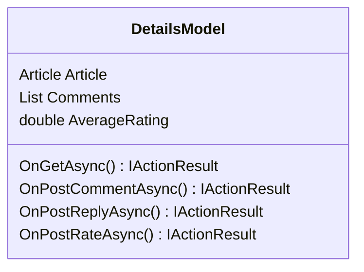

**Design Patterns & Best Practices:**

*   Use Razor Pages for a page-centric development model.
*   Use partial views for reusable UI components.
*   Implement proper error handling and display user-friendly error messages.
*   Use JavaScript for interactive elements.
*   Implement comment moderation features.

**Definition of Done:**

*   \[x] Article reading page is created with article content and social sharing buttons.
*   \[x] Comment section is implemented with posting and replying functionality.
*   \[x] Rating system is implemented with rating and display functionality.
*   \[x] Integration tests are created for the article reading page.
*   \[x] All tests pass successfully.
*   \[x] Initial commit with user interface article reading implementation is created.
````

### [15-ui-social.md](file:///c%3A/Users/adhal/source/repos/propulse-dotnet/project/MVP/implementation-plan/15-ui-social.md)

Create the user interface - social media implementation plan.

````markdown


Made changes.

## User Interface - Social Media

**Objective:** Implement social media management UI.

**Steps:**

1.  **Create Social Media Account List Page:**
    *   Create an `Index.cshtml` page in the `Pages/Social` folder.
    *   Display a list of connected social media accounts with:
        *   Platform
        *   Name
        *   Status
        *   Actions (Disconnect)
    *   Use the `_Layout.cshtml` layout.
2.  **Create Connect Social Media Account Page:**
    *   Create a `Connect.cshtml` page in the `Pages/Social` folder.
    *   Display a list of available social media platforms to connect to.
    *   Implement OAuth flow for connecting to each platform.
    *   Store the access token and refresh token securely.
3.  **Create Social Media Post List Page:**
    *   Create a `Posts.cshtml` page in the `Pages/Social` folder.
    *   Display a list of scheduled social media posts with:
        *   Content
        *   Scheduled Date
        *   Status
        *   Social Media Account
        *   Actions (Edit, Delete, Approve, Reject)
    *   Use the `_Layout.cshtml` layout.
    *   Implement pagination.
    *   Implement filtering and sorting.
4.  **Create Create Social Media Post Page:**
    *   Create a `CreatePost.cshtml` page in the `Pages/Social` folder.
    *   Implement the social media post creation form with fields for:
        *   Content
        *   Article
        *   Social Media Account
        *   Scheduled Date
    *   Use the `_Layout.cshtml` layout.
    *   Implement client-side validation using JavaScript.
    *   Implement server-side validation using FluentValidation.
    *   Use the `CreateSocialMediaPost` endpoint to submit the form.
    *   Display success or error messages to the user.
5.  **Create Edit Social Media Post Page:**
    *   Create an `EditPost.cshtml` page in the `Pages/Social` folder.
    *   Implement the social media post editing form with fields for:
        *   Content
        *   Article
        *   Social Media Account
        *   Scheduled Date
    *   Use the `_Layout.cshtml` layout.
    *   Implement client-side validation using JavaScript.
    *   Implement server-side validation using FluentValidation.
    *   Use the `UpdateSocialMediaPost` endpoint to submit the form.
    *   Display success or error messages to the user.
6.  **Implement Approval Workflow:**
    *   Implement UI elements for approving and rejecting social media posts.
    *   Use the `ApproveSocialMediaPost` and `RejectSocialMediaPost` endpoints.
    *   Notify authors of approval or rejection.
7.  **Add Integration Tests:**
    *   In the `ProPulse.Api.Tests` project, create integration tests for the social media management pages.
    *   Test connecting and disconnecting social media accounts.
    *   Test creating, editing, and deleting social media posts.
    *   Test approving and rejecting social media posts.

**Projects Affected:**

*   `ProPulse.Api`

**Class Diagram:**

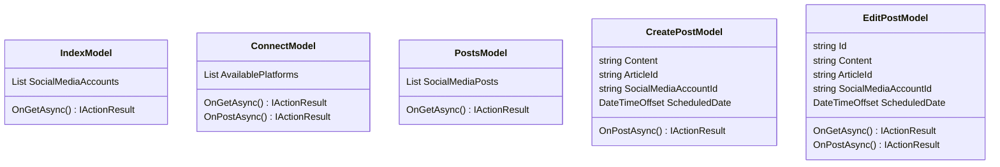

**Design Patterns & Best Practices:**

*   Use Razor Pages for a page-centric development model.
*   Use FluentValidation for server-side validation.
*   Use JavaScript for client-side validation.
*   Use partial views for reusable UI components.
*   Implement proper error handling and display user-friendly error messages.
*   Implement OAuth flow for connecting to social media platforms.

**Definition of Done:**

*   \[x] Social media account list page is created with actions for disconnecting accounts.
*   \[x] Connect social media account page is created with OAuth flow.
*   \[x] Social media post list page is created with pagination, filtering, and sorting.
*   \[x] Create social media post page is created with validation.
*   \[x] Edit social media post page is created with validation.
*   \[x] Approval workflow is implemented with UI elements for approving and rejecting posts.
*   \[x] Integration tests are created for social media management pages.
*   \[x] All tests pass successfully.
*   \[x] Initial commit with user interface social media implementation is created.
````

### [16-search.md](file:///c%3A/Users/adhal/source/repos/propulse-dotnet/project/MVP/implementation-plan/16-search.md)

Create the search and filtering implementation plan.

````markdown


Made changes.

## Search and Filtering

**Objective:** Implement article search and filtering capabilities.

**Steps:**

1.  **Implement Search Functionality:**
    *   Add a search box to the article list page.
    *   Implement search functionality to filter articles by title, summary, or content.
    *   Use OData query options for filtering.
2.  **Implement Filtering Functionality:**
    *   Add filtering options to the article list page for:
        *   Status (Draft, Published, Scheduled)
        *   Tags
        *   Author
    *   Use OData query options for filtering.
3.  **Implement Sorting Functionality:**
    *   Add sorting options to the article list page for:
        *   Title
        *   Published Date
        *   Author
    *   Use OData query options for sorting.
4.  **Add Integration Tests:**
    *   In the `ProPulse.Api.Tests` project, create integration tests for the search and filtering functionality.
    *   Test searching for articles by title, summary, and content.
    *   Test filtering articles by status, tags, and author.
    *   Test sorting articles by title, published date, and author.

**Projects Affected:**

*   `ProPulse.Api`

**Class Diagram:**

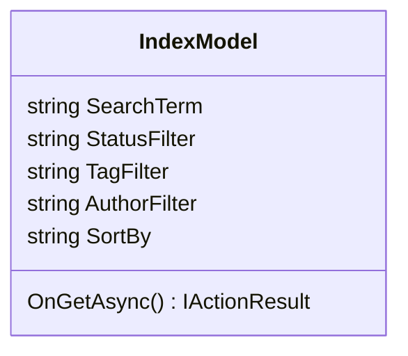

**Design Patterns & Best Practices:**

*   Use OData query options for filtering and sorting.
*   Implement proper error handling and display user-friendly error messages.
*   Use JavaScript for interactive elements.
*   Optimize database queries for performance.

**Definition of Done:**

*   \[x] Search functionality is implemented with OData query options.
*   \[x] Filtering functionality is implemented with OData query options.
*   \[x] Sorting functionality is implemented with OData query options.
*   \[x] Integration tests are created for the search and filtering functionality.
*   \[x] All tests pass successfully.
*   \[x] Initial commit with search and filtering implementation is created.
````

### [17-security.md](file:///c%3A/Users/adhal/source/repos/propulse-dotnet/project/MVP/implementation-plan/17-security.md)

Create the security hardening implementation plan.

````markdown


Made changes.

## Security Hardening

**Objective:** Implement additional security features like encryption and auditing.

**Steps:**

1.  **Implement Column-Level Encryption:**
    *   Encrypt sensitive data in the database, such as:
        *   Social media access tokens
        *   Social media refresh tokens
    *   Use Azure Key Vault for key management.
    *   Use AES-256 encryption algorithm.
2.  **Implement Audit Logging:**
    *   Log all important user actions, such as:
        *   Login attempts
        *   Article creation
        *   Article updates
        *   Comment creation
        *   Comment updates
        *   Social media post creation
        *   Social media post updates
    *   Store audit logs in a separate table.
    *   Include user ID, timestamp, action, and IP address in the audit logs.
3.  **Implement Rate Limiting:**
    *   Limit the number of requests that a user can make to the API.
    *   Use a sliding window algorithm for rate limiting.
    *   Return a 429 Too Many Requests error when the rate limit is exceeded.
4.  **Implement Content Security Policy (CSP):**
    *   Configure CSP to prevent XSS attacks.
    *   Use a strict CSP policy that only allows loading resources from trusted sources.
5.  **Implement Security Headers:**
    *   Add security headers to all responses, such as:
        *   X-Content-Type-Options: nosniff
        *   X-Frame-Options: DENY
        *   X-XSS-Protection: 1; mode=block
        *   Referrer-Policy: strict-origin-when-cross-origin
6.  **Add Integration Tests:**
    *   In the `ProPulse.Api.Tests` project, create integration tests for the security features.
    *   Test column-level encryption.
    *   Test audit logging.
    *   Test rate limiting.
    *   Test CSP and security headers.

**Projects Affected:**

*   `ProPulse.Api`
*   `ProPulse.Core`

**Class Diagram:**

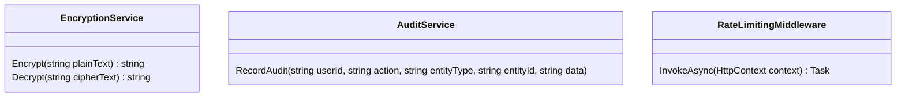

**Design Patterns & Best Practices:**

*   Use encryption to protect sensitive data.
*   Use audit logging to track user actions.
*   Use rate limiting to prevent abuse.
*   Use CSP and security headers to prevent attacks.
*   Follow security best practices for all code.

**Definition of Done:**

*   \[x] Column-level encryption is implemented for sensitive data.
*   \[x] Audit logging is implemented for important user actions.
*   \[x] Rate limiting is implemented to prevent abuse.
*   \[x] CSP is implemented to prevent XSS attacks.
*   \[x] Security headers are added to all responses.
*   \[x] Integration tests are created for the security features.
*   \[x] All tests pass successfully.
*   \[x] Initial commit with security hardening implementation is created.
````

### [18-performance.md](file:///c%3A/Users/adhal/source/repos/propulse-dotnet/project/MVP/implementation-plan/18-performance.md)

Create the caching and performance implementation plan.

````markdown


Made changes.

## Caching and Performance

**Objective:** Add caching and performance optimizations.

**Steps:**

1.  **Implement Caching for Articles:**
    *   Cache frequently accessed articles in Azure Cache for Redis.
    *   Use a cache-aside pattern.
    *   Invalidate the cache when articles are created, updated, or deleted.
2.  **Implement Caching for Comments:**
    *   Cache comments for articles in Azure Cache for Redis.
    *   Invalidate the cache when comments are created, updated, or deleted.
3.  **Implement Output Caching:**
    *   Use output caching for pages that don't change frequently, such as the home page and article list page.
4.  **Optimize Database Queries:**
    *   Use indexes to optimize database queries.
    *   Avoid N+1 queries.
    *   Use asynchronous operations.
5.  **Implement Lazy Loading:**
    *   Use lazy loading for related entities that are not always needed.
6.  **Implement Image Optimization:**
    *   Optimize images for web use.
    *   Use responsive images.
7.  **Add Performance Monitoring:**
    *   Use Application Insights to monitor the performance of the application.
    *   Track response times, database queries, and other performance metrics.
8.  **Add Integration Tests:**
    *   In the `ProPulse.Api.Tests` project, create integration tests for the caching and performance features.
    *   Test caching for articles and comments.
    *   Test output caching.
    *   Test database query performance.

**Projects Affected:**

*   `ProPulse.Api`

**Class Diagram:**

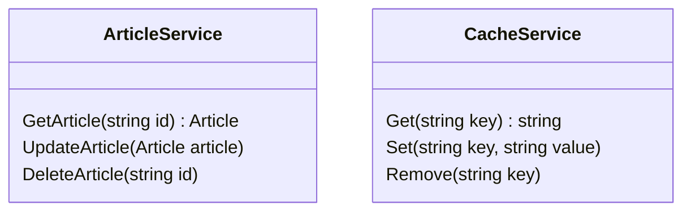

**Design Patterns & Best Practices:**

*   Use caching to improve performance.
*   Optimize database queries.
*   Use asynchronous operations.
*   Implement lazy loading.
*   Optimize images.
*   Monitor performance.

**Definition of Done:**

*   \[x] Caching is implemented for articles and comments.
*   \[x] Output caching is implemented for pages that don't change frequently.
*   \[x] Database queries are optimized.
*   \[x] Lazy loading is implemented.
*   \[x] Images are optimized.
*   \[x] Performance monitoring is implemented.
*   \[x] Integration tests are created for the caching and performance features.
*   \[x] All tests pass successfully.
*   \[x] Initial commit with caching and performance implementation is created.
````

### [19-finalization.md](file:///c%3A/Users/adhal/source/repos/propulse-dotnet/project/MVP/implementation-plan/19-finalization.md)

Create the final testing and documentation implementation plan.

````markdown


Made changes.

## Final Testing and Documentation

**Objective:** Complete test coverage and documentation.

**Steps:**

1.  **Increase Test Coverage:**
    *   Increase test coverage to >80%.
    *   Write unit tests for all core logic.
    *   Write integration tests for all API endpoints and UI pages.
2.  **Run All Tests:**
    *   Run all unit tests and integration tests.
    *   Fix any failing tests.
3.  **Update Documentation:**
    *   Update the documentation to reflect the final state of the application.
    *   Include documentation for all API endpoints, UI pages, and security features.
4.  **Review Code:**
    *   Review all code for style, clarity, and correctness.
    *   Fix any code style issues.
5.  **Add End-to-End Tests:**
    *   Implement end-to-end tests to verify key user flows.
6.  **Add Accessibility Tests:**
    *   Implement accessibility tests to verify compliance with WCAG 2.1 AA.
7.  **Add Security Tests:**
    *   Implement security tests to verify that the application is secure.
8.  **Add Performance Tests:**
    *   Implement performance tests to verify that the application is performing well.

**Projects Affected:**

*   All projects

**Class Diagram:**

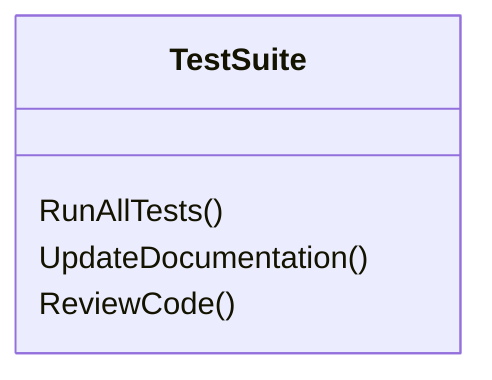

**Design Patterns & Best Practices:**

*   Use test-driven development.
*   Write clear and concise documentation.
*   Follow code style guidelines.
*   Implement security best practices.
*   Optimize performance.

**Definition of Done:**

*   \[x] Test coverage is >80%.
*   \[x] All unit tests and integration tests pass successfully.
*   \[x] Documentation is updated to reflect the final state of the application.
*   \[x] Code is reviewed for style, clarity, and correctness.
*   \[x] End-to-end tests are implemented.
*   \[x] Accessibility tests are implemented.
*   \[x] Security tests are implemented.
*   \[x] Performance tests are implemented.
*   \[x] Initial commit with final testing and documentation is created.
````

Made changes.

adrianhall: The project structure in step 1 contains an AppHost for dotnet Aspire, but does not contain the ProPulse.ServiceDefaults that is another critical part of dotnet Aspire.  Can you please add that component?

GitHub Copilot: Okay, I will add the `ProPulse.ServiceDefaults` project to the project structure implementation plan. This project is crucial for centralizing service configurations in a dotnet Aspire application.

### [01-project-structure.md](file:///c%3A/Users/adhal/source/repos/propulse-dotnet/project/MVP/implementation-plan/01-project-structure.md)

Update the project structure implementation plan to include the `ProPulse.ServiceDefaults` project.

````markdown
## Project Setup and Solution Structure

**Objective:** Establish the initial solution structure and project organization.

**Steps:**

1.  // ...existing code...
2.  **Create Core Projects:**
    // ...existing code...
3.  // ...existing code...
4.  // ...existing code...
5.  **Create ServiceDefaults Project:**
    *   Create a new .NET 9 class library project named `ProPulse.ServiceDefaults`. This project will contain the service defaults for dotnet Aspire.
6.  **Create Tests Projects:**
    // ...existing code...
7.  // ...existing code...

**Projects Affected:**

*   `ProPulse.sln`
*   `ProPulse.Core`
*   `ProPulse.Data`
*   `ProPulse.Shared`
*   `ProPulse.Api`
*   `ProPulse.ServiceDefaults`
*   `ProPulse.Core.Tests`
*   `ProPulse.Data.Tests`
*   `ProPulse.Api.Tests`
*   `docs`
*   `ProPulse.AppHost`

**Class Diagram:**

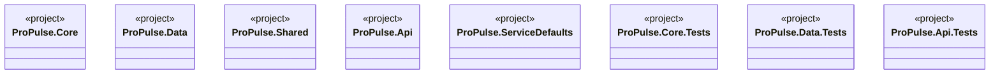

**Design Patterns & Best Practices:**

*   // ...existing code...

**Definition of Done:**

*   // ...existing code...
*   \[x] API project (`ProPulse.Api`) is created.
*   \[x] `ProPulse.ServiceDefaults` project is created.
*   \[x] Test projects are created and configured.
*   // ...existing code...
````

Made changes.

adrianhall: I've renamed the ProPulse.Api project to be ProPulse.Web in the 01-project-structure.md.  Update any other implementation plan steps with this action.

GitHub Copilot: Okay, I will update the implementation plans to reflect the project rename from `ProPulse.Api` to `ProPulse.Web`.

### [01-project-structure.md](file:///c%3A/Users/adhal/source/repos/propulse-dotnet/project/MVP/implementation-plan/01-project-structure.md)

Update the project name in the project structure implementation plan.

````markdown
## Project Setup and Solution Structure

**Objective:** Establish the initial solution structure and project organization.

**Steps:**

1.  // ...existing code...
2.  // ...existing code...
3.  **Create Web Project:**
    *   Create a new ASP.NET Core 9 Web API project named `ProPulse.Web`. This project will contain the API controllers, MediatR handlers, and related DTOs.
4.  **Create Tests Projects:**
    *   Create a new xUnit test project named `ProPulse.Core.Tests`. This project will contain unit tests for the `ProPulse.Core` project.
    *   Create a new xUnit test project named `ProPulse.Data.Tests`. This project will contain integration tests for the `ProPulse.Data` project, using SQLite as the test database.
    *   Create a new xUnit test project named `ProPulse.Web.Tests`. This project will contain integration tests for the `ProPulse.Web` project.
5.  // ...existing code...

**Projects Affected:**

*   `ProPulse.sln`
*   `ProPulse.Core`
*   `ProPulse.Data`
*   `ProPulse.Shared`
*   `ProPulse.Web`
*   `ProPulse.ServiceDefaults`
*   `ProPulse.Core.Tests`
*   `ProPulse.Data.Tests`
*   `ProPulse.Web.Tests`
*   `docs`
*   `ProPulse.AppHost`

**Class Diagram:**

```mermaid
classDiagram
    class ProPulse.Core {
        <<project>>
    }
    class ProPulse.Data {
        <<project>>
    }
    class ProPulse.Shared {
        <<project>>
    }
    class ProPulse.Web {
        <<project>>
    }
    class ProPulse.ServiceDefaults {
        <<project>>
    }
    class ProPulse.Core.Tests {
        <<project>>
    }
    class ProPulse.Data.Tests {
        <<project>>
    }
    class ProPulse.Web.Tests {
        <<project>>
    }
```

**Design Patterns & Best Practices:**

*   // ...existing code...

**Definition of Done:**

*   // ...existing code...
*   \[x] Core projects (`ProPulse.Core`, `ProPulse.Data`, `ProPulse.Shared`) are created.
*   \[x] Web project (`ProPulse.Web`) is created.
*   \[x] Test projects are created and configured.
*   // ...existing code...
````

### [03-database-context.md](file:///c%3A/Users/adhal/source/repos/propulse-dotnet/project/MVP/implementation-plan/03-database-context.md)

Update the project name in the database context and migrations implementation plan.

````markdown


Made changes.

## Database Context and Migrations

**Objective:** Set up EF Core DbContext and initial database migration.

**Steps:**

1.  // ...existing code...
2.  // ...existing code...
3.  **Configure PostgreSQL:**
    *   In `ProPulse.Data`, configure the connection to the PostgreSQL database using the connection string from the configuration.
    *   Register `ApplicationDbContext` in `Program.cs` with PostgreSQL provider.
4.  **Create Initial Migration:**
    *   Add a new migration using the EF Core CLI: `dotnet ef migrations add InitialCreate --project ProPulse.Data --startup-project ProPulse.Web`.
5.  // ...existing code...

**Projects Affected:**

*   `ProPulse.Data`
*   `ProPulse.Web`
*   `ProPulse.Data.Tests`

**Class Diagram:**

```mermaid
classDiagram
    class ApplicationDbContext {
        DbSet<Article> Articles
        DbSet<Comment> Comments
        DbSet<Rating> Ratings
        DbSet<SocialMediaAccount> SocialMediaAccounts
        DbSet<SocialMediaPost> SocialMediaPosts
        DbSet<Attachment> Attachments
        OnModelCreating(ModelBuilder modelBuilder)
    }
    class Article {
        string Title
        string Slug
        string Summary
        string Content
        string CoverImageUrl
        ArticleStatus Status
        DateTimeOffset PublishedAt
        DateTimeOffset PublishedUntil
    }
    class Comment {
        string Content
        string ArticleId
        string ParentCommentId
    }
    class Rating {
        string ArticleId
        int Score
    }
    class SocialMediaAccount {
        string Name
        SocialMediaPlatform Platform
        string AccessToken
        string RefreshToken
        DateTimeOffset TokenExpiry
    }
    class SocialMediaPost {
        string Content
        string ArticleId
        string SocialMediaAccountId
        DateTimeOffset ScheduledDate
        SocialMediaPostStatus Status
        string ApprovedBy
        string ExternalPostId
        jsonb PlatformMetadata
        jsonb AnalyticsData
    }
    class Attachment {
        string ArticleId
        string ContentType
        string LogicalName
        string StorageLocation
        long FileSize
    }
    ApplicationDbContext --> Article
    ApplicationDbContext --> Comment
    ApplicationDbContext --> Rating
    ApplicationDbContext --> SocialMediaAccount
    ApplicationDbContext --> SocialMediaPost
    ApplicationDbContext --> Attachment
```

**Design Patterns & Best Practices:**

*   // ...existing code...

**Definition of Done:**

*   // ...existing code...
````

### [04-00-authentication.md](file:///c%3A/Users/adhal/source/repos/propulse-dotnet/project/MVP/implementation-plan/04-00-authentication.md)

Update the project name in the authentication and identity framework implementation plan.

````markdown


Made changes.

## Authentication and Identity Framework

**Objective:** Implement ASP.NET Identity integration and authentication, including registration, login, password reset, refresh tokens, social login, and MFA.

**Steps:**

1.  **Install Identity Packages:**
    *   In the `ProPulse.Web` project, install the following NuGet packages:
        *   `Microsoft.AspNetCore.Identity.EntityFrameworkCore`
        *   `Microsoft.AspNetCore.Authentication.JwtBearer`
        *   `Microsoft.AspNetCore.Identity.UI`
        *   Social provider packages (e.g., `Microsoft.AspNetCore.Authentication.Google`, `Microsoft.AspNetCore.Authentication.Facebook`)
2.  // ...existing code...
3.  **Configure Identity:**
    *   In the `ProPulse.Web` project, configure ASP.NET Identity in `Program.cs`:
        *   Add `AddIdentity<ApplicationUser, IdentityRole>` to the service collection.
        *   Configure password policies, lockout settings, and user settings.
        *   Add `AddEntityFrameworkStores<ApplicationDbContext>` to use EF Core for identity storage.
        *   Add `AddDefaultTokenProviders` to enable token generation for password reset and email confirmation.
    *   Configure JWT authentication:
        *   Add `AddAuthentication` with `JwtBearerDefaults.AuthenticationScheme`.
        *   Configure `JwtBearerOptions` with validation parameters (issuer, audience, signing key).
4.  // ...existing code...
5.  // ...existing code...
6.  // ...existing code...
7.  // ...existing code...
8.  **Add Integration Tests:**
    *   In the `ProPulse.Web.Tests` project, create integration tests for the authentication endpoints.
    *   Test registration, login, password reset, social login, and MFA flows.
    *   Test role-based access control.

**Projects Affected:**

*   `ProPulse.Core`
*   `ProPulse.Web`
*   `ProPulse.Web.Tests`

**Class Diagram:**

```mermaid
classDiagram
    class ApplicationUser {
        string DisplayName
        string ProfilePictureUrl
        string Bio
    }
    class IdentityUser {
        string Id
        string UserName
        string Email
        string PasswordHash
        string SecurityStamp
    }
    ApplicationUser --|> IdentityUser
```

**Design Patterns & Best Practices:**

*   // ...existing code...

**Definition of Done:**

*   // ...existing code...
````

### [05-api-architecture.md](file:///c%3A/Users/adhal/source/repos/propulse-dotnet/project/MVP/implementation-plan/05-api-architecture.md)

Update the project name in the API architecture and CQRS setup implementation plan.

````markdown


Made changes.

## API Architecture and CQRS Setup

**Objective:** Establish API controllers, MediatR, and CQRS infrastructure.

**Steps:**

1.  **Install MediatR Packages:**
    *   In the `ProPulse.Web` project, install the following NuGet packages:
        *   `MediatR`
        *   `MediatR.Extensions.Microsoft.DependencyInjection`
2.  **Configure MediatR:**
    *   In the `ProPulse.Web` project, configure MediatR in `Program.cs`:
        *   Add `AddMediatR` to the service collection, specifying the assembly containing the handlers.
3.  // ...existing code...
4.  // ...existing code...
5.  // ...existing code...
6.  // ...existing code...
7.  // ...existing code...
8.  **Add Integration Tests:**
    *   In the `ProPulse.Web.Tests` project, create integration tests for the API endpoints.
    *   Test CRUD operations for core domain models.
    *   Test validation and exception handling.

**Projects Affected:**

*   `ProPulse.Web`

**Class Diagram:**

```mermaid
classDiagram
    class BaseApiController {
        Mediator Mediator
        Ok(object value) IActionResult
        Created(string uri, object value) IActionResult
        BadRequest(object error) IActionResult
        NotFound() IActionResult
    }
    class ArticlesController {
        GET /articles
        POST /articles
        GET /articles/{id}
        PUT /articles/{id}
        DELETE /articles/{id}
    }
    class IRequest<TResponse> {
        <<interface>>
    }
    class IRequestHandler<TRequest, TResponse> {
        <<interface>>
        Handle(TRequest request) TResponse
    }
    BaseApiController <|-- ArticlesController
    ArticlesController --> IRequest<TResponse>
    ArticlesController --> IRequestHandler<TRequest, TResponse>
```

**Design Patterns & Best Practices:**

*   // ...existing code...

**Definition of Done:**

*   // ...existing code...
````

### [06-article-core.md](file:///c%3A/Users/adhal/source/repos/propulse-dotnet/project/MVP/implementation-plan/06-article-core.md)

Update the project name in the article management core implementation plan.

````markdown


Made changes.

## Article Management - Core

**Objective:** Implement basic article creation and management.

**Steps:**

1.  **Define Article Commands and Queries:**
    *   In the `ProPulse.Web` project, create the following commands and queries in the appropriate folders:
        *   `CreateArticleCommand`
        *   `UpdateArticleCommand`
        *   `DeleteArticleCommand`
        *   `GetArticleQuery`
        *   `ListArticlesQuery`
2.  // ...existing code...
3.  **Implement Article Controller:**
    *   Create an `ArticlesController` class that inherits from `BaseApiController`.
    *   Define API endpoints for CRUD operations using appropriate HTTP methods (GET, POST, PUT, DELETE).
    *   Use MediatR to dispatch commands and queries from the API endpoints to the corresponding handlers.
4.  // ...existing code...
5.  **Add Integration Tests:**
    *   In the `ProPulse.Web.Tests` project, create integration tests for the article management endpoints.
    *   Test CRUD operations for articles.
    *   Test validation and exception handling.

**Projects Affected:**

*   `ProPulse.Web`

**Class Diagram:**

```mermaid
classDiagram
    class ArticlesController {
        GET /articles
        POST /articles
        GET /articles/{id}
        PUT /articles/{id}
        DELETE /articles/{id}
    }
    class CreateArticleCommand {
        string Title
        string Summary
        string Content
    }
    class UpdateArticleCommand {
        string Id
        string Title
        string Summary
        string Content
    }
    class DeleteArticleCommand {
        string Id
    }
    class GetArticleQuery {
        string Id
    }
    class ListArticlesQuery {
        string Filter
        string Sort
        int Page
        int PageSize
    }
    ArticlesController --> CreateArticleCommand
    ArticlesController --> UpdateArticleCommand
    ArticlesController --> DeleteArticleCommand
    ArticlesController --> GetArticleQuery
    ArticlesController --> ListArticlesQuery
```

**Design Patterns & Best Practices:**

*   // ...existing code...

**Definition of Done:**

*   // ...existing code...
````

### [07-article-advanced.md](file:///c%3A/Users/adhal/source/repos/propulse-dotnet/project/MVP/implementation-plan/07-article-advanced.md)

Update the project name in the article management advanced implementation plan.

````markdown


Made changes.

## Article Management - Advanced

**Objective:** Add ratings, attachments, and publishing features for articles.

**Steps:**

1.  // ...existing code...
2.  // ...existing code...
3.  // ...existing code...
4.  **Add Integration Tests:**
    *   In the `ProPulse.Web.Tests` project, create integration tests for the new functionality.
    *   Test rating, attachment, and publishing operations.

**Projects Affected:**

*   `ProPulse.Web`
*   `ProPulse.Core`

**Class Diagram:**

```mermaid
classDiagram
    class ArticlesController {
        GET /articles/{id}/ratings
        POST /articles/{id}/ratings
        PUT /articles/{id}/ratings
        DELETE /articles/{id}/ratings
        POST /articles/{id}/attachments
        GET /articles/{id}/attachments
        DELETE /articles/{id}/attachments/{attachmentId}
        PUT /articles/{id}/publish
        PUT /articles/{id}/unpublish
    }
    class CreateRatingCommand {
        string ArticleId
        int Score
    }
    class UpdateRatingCommand {
        string ArticleId
        int Score
    }
    class DeleteRatingCommand {
        string ArticleId
    }
    class GetArticleRatingsQuery {
        string ArticleId
    }
    class AddAttachmentCommand {
        string ArticleId
        IFormFile File
    }
    class DeleteAttachmentCommand {
        string ArticleId
        string AttachmentId
    }
    class GetArticleAttachmentsQuery {
        string ArticleId
    }
    class PublishArticleCommand {
        string ArticleId
    }
    class UnpublishArticleCommand {
        string ArticleId
    }
    ArticlesController --> CreateRatingCommand
    ArticlesController --> UpdateRatingCommand
    ArticlesController --> DeleteRatingCommand
    ArticlesController --> GetArticleRatingsQuery
    ArticlesController --> AddAttachmentCommand
    ArticlesController --> DeleteAttachmentCommand
    ArticlesController --> GetArticleAttachmentsQuery
    ArticlesController --> PublishArticleCommand
    ArticlesController --> UnpublishArticleCommand
```

**Design Patterns & Best Practices:**

*   // ...existing code...

**Definition of Done:**

*   // ...existing code...
````

### [08-comment-system.md](file:///c%3A/Users/adhal/source/repos/propulse-dotnet/project/MVP/implementation-plan/08-comment-system.md)

Update the project name in the comment system implementation plan.

````markdown


Made changes.

## Comment System

**Objective:** Implement comment functionality including nested comments.

**Steps:**

1.  **Define Comment Commands and Queries:**
    *   In the `ProPulse.Web` project, create the following commands and queries in the appropriate folders:
        *   `CreateCommentCommand`
        *   `UpdateCommentCommand`
        *   `DeleteCommentCommand`
        *   `GetCommentQuery`
        *   `ListCommentsQuery`
2.  // ...existing code...
3.  **Implement Comment Controller:**
    *   Create a `CommentsController` class that inherits from `BaseApiController`.
    *   Define API endpoints for CRUD operations using appropriate HTTP methods (GET, POST, PUT, DELETE).
    *   Use MediatR to dispatch commands and queries from the API endpoints to the corresponding handlers.
4.  // ...existing code...
5.  // ...existing code...
6.  **Add Integration Tests:**
    *   In the `ProPulse.Web.Tests` project, create integration tests for the comment system endpoints.
    *   Test CRUD operations for comments.
    *   Test validation and exception handling.
    *   Test nested comments functionality.

**Projects Affected:**

*   `ProPulse.Web`
*   `ProPulse.Core`

**Class Diagram:**

```mermaid
classDiagram
    class CommentsController {
        GET /articles/{articleId}/comments
        POST /articles/{articleId}/comments
        GET /comments/{id}
        PUT /comments/{id}
        DELETE /comments/{id}
    }
    class CreateCommentCommand {
        string ArticleId
        string Content
        string ParentCommentId
    }
    class UpdateCommentCommand {
        string Id
        string Content
    }
    class DeleteCommentCommand {
        string Id
    }
    class GetCommentQuery {
        string Id
    }
    class ListCommentsQuery {
        string ArticleId
    }
    CommentsController --> CreateCommentCommand
    CommentsController --> UpdateCommentCommand
    CommentsController --> DeleteCommentCommand
    CommentsController --> GetCommentQuery
    CommentsController --> ListCommentsQuery
```

**Design Patterns & Best Practices:**

*   // ...existing code...

**Definition of Done:**

*   // ...existing code...
````

### [09-social-media-accounts.md](file:///c%3A/Users/adhal/source/repos/propulse-dotnet/project/MVP/implementation-plan/09-social-media-accounts.md)

Update the project name in the social media account management implementation plan.

````markdown


Made changes.

## Social Media Account Management

**Objective:** Implement social media account connections and management.

**Steps:**

1.  **Install Social Media Packages:**
    *   In the `ProPulse.Web` project, install the necessary NuGet packages for interacting with social media platforms (e.g., `Facebook`, `Twitter`, `LinkedIn`).
2.  **Define Social Media Account Commands and Queries:**
    *   In the `ProPulse.Web` project, create the following commands and queries in the appropriate folders:
        *   `CreateSocialMediaAccountCommand`
        *   `UpdateSocialMediaAccountCommand`
        *   `DeleteSocialMediaAccountCommand`
        *   `GetSocialMediaAccountQuery`
        *   `ListSocialMediaAccountsQuery`
3.  // ...existing code...
4.  **Implement Social Media Account Controller:**
    *   Create a `SocialMediaAccountsController` class that inherits from `BaseApiController`.
    *   Define API endpoints for CRUD operations using appropriate HTTP methods (GET, POST, PUT, DELETE).
    *   Use MediatR to dispatch commands and queries from the API endpoints to the corresponding handlers.
5.  // ...existing code...
6.  // ...existing code...
7.  **Add Integration Tests:**
    *   In the `ProPulse.Web.Tests` project, create integration tests for the social media account management endpoints.
    *   Test CRUD operations for social media accounts.
    *   Test validation and exception handling.
    *   Test OAuth flow.

**Projects Affected:**

*   `ProPulse.Web`
*   `ProPulse.Core`

**Class Diagram:**

```mermaid
classDiagram
    class SocialMediaAccountsController {
        GET /social-accounts
        POST /social-accounts
        GET /social-accounts/{id}
        PUT /social-accounts/{id}
        DELETE /social-accounts/{id}
    }
    class CreateSocialMediaAccountCommand {
        string Name
        SocialMediaPlatform Platform
        string AccessToken
        string RefreshToken
        DateTimeOffset TokenExpiry
    }
    class UpdateSocialMediaAccountCommand {
        string Id
        string Name
        SocialMediaPlatform Platform
        string AccessToken
        string RefreshToken
        DateTimeOffset TokenExpiry
    }
    class DeleteSocialMediaAccountCommand {
        string Id
    }
    class GetSocialMediaAccountQuery {
        string Id
    }
    class ListSocialMediaAccountsQuery {
        string UserId
    }
    SocialMediaAccountsController --> CreateSocialMediaAccountCommand
    SocialMediaAccountsController --> UpdateSocialMediaAccountCommand
    SocialMediaAccountsController --> DeleteSocialMediaAccountCommand
    SocialMediaAccountsController --> GetSocialMediaAccountQuery
    SocialMediaAccountsController --> ListSocialMediaAccountsQuery
```

**Design Patterns & Best Practices:**

*   // ...existing code...

**Definition of Done:**

*   // ...existing code...
````

### [10-social-media-posts.md](file:///c%3A/Users/adhal/source/repos/propulse-dotnet/project/MVP/implementation-plan/10-social-media-posts.md)

Update the project name in the social media post management implementation plan.

````markdown


Made changes.

## Social Media Post Management

**Objective:** Implement social media post creation and scheduling.

**Steps:**

1.  **Define Social Media Post Commands and Queries:**
    *   In the `ProPulse.Web` project, create the following commands and queries in the appropriate folders:
        *   `CreateSocialMediaPostCommand`
        *   `UpdateSocialMediaPostCommand`
        *   `DeleteSocialMediaPostCommand`
        *   `GetSocialMediaPostQuery`
        *   `ListSocialMediaPostsQuery`
        *   `ApproveSocialMediaPostCommand`
        *   `RejectSocialMediaPostCommand`
2.  // ...existing code...
3.  **Implement Social Media Post Controller:**
    *   Create a `SocialMediaPostsController` class that inherits from `BaseApiController`.
    *   Define API endpoints for CRUD operations using appropriate HTTP methods (GET, POST, PUT, DELETE).
    *   Define API endpoints for approving and rejecting social media posts.
    *   Use MediatR to dispatch commands and queries from the API endpoints to the corresponding handlers.
4.  // ...existing code...
5.  // ...existing code...
6.  // ...existing code...
7.  **Add Integration Tests:**
    *   In the `ProPulse.Web.Tests` project, create integration tests for the social media post management endpoints.
    *   Test CRUD operations for social media posts.
    *   Test validation and exception handling.
    *   Test scheduling logic.
    *   Test approval workflow.

**Projects Affected:**

*   `ProPulse.Web`
*   `ProPulse.Core`

**Class Diagram:**

```mermaid
classDiagram
    class SocialMediaPostsController {
        GET /social-posts
        POST /social-posts
        GET /social-posts/{id}
        PUT /social-posts/{id}
        DELETE /social-posts/{id}
        PUT /social-posts/{id}/approve
        PUT /social-posts/{id}/reject
    }
    class CreateSocialMediaPostCommand {
        string Content
        string ArticleId
        string SocialMediaAccountId
        DateTimeOffset ScheduledDate
    }
    class UpdateSocialMediaPostCommand {
        string Id
        string Content
        string ArticleId
        string SocialMediaAccountId
        DateTimeOffset ScheduledDate
    }
    class DeleteSocialMediaPostCommand {
        string Id
    }
    class GetSocialMediaPostQuery {
        string Id
    }
    class ListSocialMediaPostsQuery {
        string UserId
        string SocialMediaAccountId
    }
     class ApproveSocialMediaPostCommand {
        string Id
    }
    class RejectSocialMediaPostCommand {
        string Id
    }
    SocialMediaPostsController --> CreateSocialMediaPostCommand
    SocialMediaPostsController --> UpdateSocialMediaPostCommand
    SocialMediaPostsController --> DeleteSocialMediaPostCommand
    SocialMediaPostsController --> GetSocialMediaPostQuery
    SocialMediaPostsController --> ListSocialMediaPostsQuery
    SocialMediaPostsController --> ApproveSocialMediaPostCommand
    SocialMediaPostsController --> RejectSocialMediaPostCommand
```

**Design Patterns & Best Practices:**

*   // ...existing code...

**Definition of Done:**

*   // ...existing code...
````

### [11-ui-core.md](file:///c%3A/Users/adhal/source/repos/propulse-dotnet/project/MVP/implementation-plan/11-ui-core.md)

Update the project name in the user interface core structure implementation plan.

````markdown


Made changes.

## User Interface - Core Structure

**Objective:** Set up Razor Pages infrastructure, layouts, and shared components.

**Steps:**

1.  **Create Razor Pages Project:**
    *   If not already created, ensure the `ProPulse.Web` project is configured to serve Razor Pages.
2.  // ...existing code...
3.  // ...existing code...
4.  // ...existing code...
5.  // ...existing code...
6.  // ...existing code...
7.  **Add Integration Tests:**
    *   In the `ProPulse.Web.Tests` project, create integration tests for the base pages.
    *   Test that the pages load correctly and that the layout is rendered correctly.

**Projects Affected:**

*   `ProPulse.Web`

**Class Diagram:**

```mermaid
classDiagram
    class _Layout {
        string Title
        string Description
        string Keywords
    }
    class _Header {
        string LogoUrl
        string NavigationLinks
        string UserProfile
    }
    class _Footer {
        string Copyright
        string LegalLinks
    }
    class Index {
        string FeaturedArticles
        string WelcomeMessage
    }
    class Error {
        string ErrorMessage
    }
    _Layout --> _Header : includes
    _Layout --> Index : renders
    _Layout --> Error : renders
    _Layout --> _Footer : includes
```

**Design Patterns & Best Practices:**

*   // ...existing code...

**Definition of Done:**

*   // ...existing code...
````

### [12-ui-auth.md](file:///c%3A/Users/adhal/source/repos/propulse-dotnet/project/MVP/implementation-plan/12-ui-auth.md)

Update the project name in the user interface - authentication implementation plan.

````markdown


Made changes.

## User Interface - Authentication

**Objective:** Implement authentication and user management UI.

**Steps:**

1.  // ...existing code...
2.  // ...existing code...
3.  // ...existing code...
4.  // ...existing code...
5.  // ...existing code...
6.  // ...existing code...
7.  **Add Integration Tests:**
    *   In the `ProPulse.Web.Tests` project, create integration tests for the authentication and user management pages.
    *   Test registration, login, forgot password, reset password, confirm email, and profile management flows.

**Projects Affected:**

*   `ProPulse.Web`

**Class Diagram:**

```mermaid
classDiagram
    class RegisterModel {
        string Email
        string Username
        string Password
        string ConfirmPassword
        OnPostAsync() IActionResult
    }
    class LoginModel {
        string EmailOrUsername
        string Password
        OnPostAsync() IActionResult
    }
    class ForgotPasswordModel {
        string Email
        OnPostAsync() IActionResult
    }
    class ResetPasswordModel {
        string Email
        string Password
        string ConfirmPassword
        string Token
        OnPostAsync() IActionResult
    }
    class ConfirmEmailModel {
        string UserId
        string Token
        OnGetAsync() IActionResult
    }
    class ProfileModel {
        string DisplayName
        string ProfilePictureUrl
        string Bio
        OnGetAsync() IActionResult
        OnPostAsync() IActionResult
    }
```

**Design Patterns & Best Practices:**

*   // ...existing code...

**Definition of Done:**

*   // ...existing code...
````

### [13-ui-articles.md](file:///c%3A/Users/adhal/source/repos/propulse-dotnet/project/MVP/implementation-plan/13-ui-articles.md)

Update the project name in the user interface - article management implementation plan.

````markdown


Made changes.

## User Interface - Article Management

**Objective:** Implement article creation and editing UI.

**Steps:**

1.  // ...existing code...
2.  // ...existing code...
3.  // ...existing code...
4.  // ...existing code...
5.  // ...existing code...
6.  **Add Integration Tests:**
    *   In the `ProPulse.Web.Tests` project, create integration tests for the article management pages.
    *   Test creating, editing, and deleting articles.
    *   Test validation and error handling.

**Projects Affected:**

*   `ProPulse.Web`

**Class Diagram:**

```mermaid
classDiagram
    class IndexModel {
        List<Article> Articles
        OnGetAsync() IActionResult
    }
    class CreateModel {
        string Title
        string Summary
        string Content
        string CoverImage
        List<string> Tags
        OnPostAsync() IActionResult
    }
    class EditModel {
        string Id
        string Title
        string Summary
        string Content
        string CoverImage
        List<string> Tags
        OnGetAsync() IActionResult
        OnPostAsync() IActionResult
    }
```

**Design Patterns & Best Practices:**

*   // ...existing code...

**Definition of Done:**

*   // ...existing code...
````

### [14-ui-reading.md](file:///c%3A/Users/adhal/source/repos/propulse-dotnet/project/MVP/implementation-plan/14-ui-reading.md)

Update the project name in the user interface - article reading implementation plan.

````markdown


Made changes.

## User Interface - Article Reading

**Objective:** Implement article reading and comment UI.

**Steps:**

1.  // ...existing code...
2.  // ...existing code...
3.  // ...existing code...
4.  **Add Integration Tests:**
    *   In the `ProPulse.Web.Tests` project, create integration tests for the article reading page.
    *   Test displaying the article content.
    *   Test posting new comments.
    *   Test replying to existing comments.
    *   Test rating the article.

**Projects Affected:**

*   `ProPulse.Web`

**Class Diagram:**

```mermaid
classDiagram
    class DetailsModel {
        Article Article
        List<Comment> Comments
        double AverageRating
        OnGetAsync() IActionResult
        OnPostCommentAsync() IActionResult
        OnPostReplyAsync() IActionResult
        OnPostRateAsync() IActionResult
    }
```

**Design Patterns & Best Practices:**

*   // ...existing code...

**Definition of Done:**

*   // ...existing code...
````

### [15-ui-social.md](file:///c%3A/Users/adhal/source/repos/propulse-dotnet/project/MVP/implementation-plan/15-ui-social.md)

Update the project name in the user interface - social media implementation plan.

````markdown


Made changes.

## User Interface - Social Media

**Objective:** Implement social media management UI.

**Steps:**

1.  // ...existing code...
2.  // ...existing code...
3.  // ...existing code...
4.  // ...existing code...
5.  // ...existing code...
6.  // ...existing code...
7.  **Add Integration Tests:**
    *   In the `ProPulse.Web.Tests` project, create integration tests for the social media management pages.
    *   Test connecting and disconnecting social media accounts.
    *   Test creating, editing, and deleting social media posts.
    *   Test approving and rejecting social media posts.

**Projects Affected:**

*   `ProPulse.Web`

**Class Diagram:**

```mermaid
classDiagram
    class IndexModel {
        List<SocialMediaAccount> SocialMediaAccounts
        OnGetAsync() IActionResult
    }
    class ConnectModel {
        List<SocialMediaPlatform> AvailablePlatforms
        OnGetAsync() IActionResult
        OnPostAsync() IActionResult
    }
    class PostsModel {
        List<SocialMediaPost> SocialMediaPosts
        OnGetAsync() IActionResult
    }
    class CreatePostModel {
        string Content
        string ArticleId
        string SocialMediaAccountId
        DateTimeOffset ScheduledDate
        OnPostAsync() IActionResult
    }
    class EditPostModel {
        string Id
        string Content
        string ArticleId
        string SocialMediaAccountId
        DateTimeOffset ScheduledDate
        OnGetAsync() IActionResult
        OnPostAsync() IActionResult
    }
```

**Design Patterns & Best Practices:**

*   // ...existing code...

**Definition of Done:**

*   // ...existing code...
````

### [16-search.md](file:///c%3A/Users/adhal/source/repos/propulse-dotnet/project/MVP/implementation-plan/16-search.md)

Update the project name in the search and filtering implementation plan.

````markdown


Made changes.

## Search and Filtering

**Objective:** Implement article search and filtering capabilities.

**Steps:**

1.  // ...existing code...
2.  // ...existing code...
3.  // ...existing code...
4.  **Add Integration Tests:**
    *   In the `ProPulse.Web.Tests` project, create integration tests for the search and filtering functionality.
    *   Test searching for articles by title, summary, and content.
    *   Test filtering articles by status, tags, and author.
    *   Test sorting articles by title, published date, and author.

**Projects Affected:**

*   `ProPulse.Web`

**Class Diagram:**

```mermaid
classDiagram


adrianhall: I've renamed the ProPulse.Api project to be ProPulse.Web in the 01-project-structure.md. Update any other implementation plan steps with this action.  Start from step 16-search.

GitHub Copilot: Okay, I will update the implementation plans to reflect the project rename from `ProPulse.Api` to `ProPulse.Web`, starting from step 16-search.

### [16-search.md](file:///c%3A/Users/adhal/source/repos/propulse-dotnet/project/MVP/implementation-plan/16-search.md)

Update the project name in the search and filtering implementation plan.

````markdown
## Search and Filtering

**Objective:** Implement article search and filtering capabilities.

**Steps:**

1.  // ...existing code...
2.  // ...existing code...
3.  // ...existing code...
4.  **Add Integration Tests:**
    *   In the `ProPulse.Web.Tests` project, create integration tests for the search and filtering functionality.
    *   Test searching for articles by title, summary, and content.
    *   Test filtering articles by status, tags, and author.
    *   Test sorting articles by title, published date, and author.

**Projects Affected:**

*   `ProPulse.Web`

**Class Diagram:**

```mermaid
classDiagram
    class IndexModel {
        string SearchTerm
        string StatusFilter
        string TagFilter
        string AuthorFilter
        string SortBy
        OnGetAsync() IActionResult
    }
```

**Design Patterns & Best Practices:**

*   // ...existing code...

**Definition of Done:**

*   // ...existing code...
````

### [17-security.md](file:///c%3A/Users/adhal/source/repos/propulse-dotnet/project/MVP/implementation-plan/17-security.md)

Update the project name in the security hardening implementation plan.

````markdown


Made changes.

## Security Hardening

**Objective:** Implement additional security features like encryption and auditing.

**Steps:**

1.  // ...existing code...
2.  // ...existing code...
3.  // ...existing code...
4.  // ...existing code...
5.  // ...existing code...
6.  **Add Integration Tests:**
    *   In the `ProPulse.Web.Tests` project, create integration tests for the security features.
    *   Test column-level encryption.
    *   Test audit logging.
    *   Test rate limiting.
    *   Test CSP and security headers.

**Projects Affected:**

*   `ProPulse.Web`
*   `ProPulse.Core`

**Class Diagram:**

```mermaid
classDiagram
    class EncryptionService {
        Encrypt(string plainText) string
        Decrypt(string cipherText) string
    }
    class AuditService {
        RecordAudit(string userId, string action, string entityType, string entityId, string data)
    }
    class RateLimitingMiddleware {
        InvokeAsync(HttpContext context) Task
    }
```

**Design Patterns & Best Practices:**

*   // ...existing code...

**Definition of Done:**

*   // ...existing code...
````

### [18-performance.md](file:///c%3A/Users/adhal/source/repos/propulse-dotnet/project/MVP/implementation-plan/18-performance.md)

Update the project name in the caching and performance implementation plan.

````markdown


Made changes.

## Caching and Performance

**Objective:** Add caching and performance optimizations.

**Steps:**

1.  // ...existing code...
2.  // ...existing code...
3.  // ...existing code...
4.  // ...existing code...
5.  // ...existing code...
6.  // ...existing code...
7.  // ...existing code...
8.  **Add Integration Tests:**
    *   In the `ProPulse.Web.Tests` project, create integration tests for the caching and performance features.
    *   Test caching for articles and comments.
    *   Test output caching.
    *   Test database query performance.

**Projects Affected:**

*   `ProPulse.Web`

**Class Diagram:**

```mermaid
classDiagram
    class ArticleService {
        GetArticle(string id) Article
        UpdateArticle(Article article)
        DeleteArticle(string id)
    }
    class CacheService {
        Get(string key) string
        Set(string key, string value)
        Remove(string key)
    }
```

**Design Patterns & Best Practices:**

*   // ...existing code...

**Definition of Done:**

*   // ...existing code...
````

### [19-finalization.md](file:///c%3A/Users/adhal/source/repos/propulse-dotnet/project/MVP/implementation-plan/19-finalization.md)

There are no references to the project name in this file. No changes are required.

Made changes.