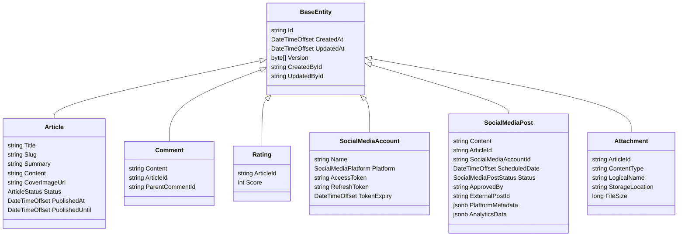

## Core Domain Models and Base Entity Framework

**Objective:** Implement the base entities and core domain models.

**Steps:**

1.  **Define Base Entity:**
    *   In the `ProPulse.Core` project, create an abstract class `BaseEntity` with properties: `Id` (string), `CreatedAt` (DateTimeOffset), `UpdatedAt` (DateTimeOffset), `Version` (byte[]), `CreatedById` (string), and `UpdatedById` (string).
    *   Create an interface `IAuditable` with properties `CreatedById` and `UpdatedById`.
2.  **Implement Core Domain Models:**
    *   In the `ProPulse.Core` project, create the following domain models:
        *   `Article` (extends `BaseEntity`)
        *   `Comment` (extends `BaseEntity`)
        *   `Rating` (extends `BaseEntity`)
        *   `SocialMediaAccount` (extends `BaseEntity`)
        *   `SocialMediaPost` (extends `BaseEntity`)
        *   `Attachment` (extends `BaseEntity`)
    *   Define properties for each model according to the data model specification.
    *   Use appropriate data types and annotations for each property.
3.  **Define Enums:**
    *   In the `ProPulse.Shared` project, create the following enums:
        *   `ArticleStatus` (`Draft`, `Published`, `Scheduled`)
        *   `SocialMediaPlatform` (`Facebook`, `Twitter`, `LinkedIn`, `Instagram`, `Mastodon`)
        *   `SocialMediaPostStatus` (`Pending`, `Approved`, `Rejected`, `Published`)
4.  **Add Unit Tests:**
    *   In the `ProPulse.Core.Tests` project, create unit tests for the core domain models to ensure that properties are correctly defined and that the models behave as expected.
    *   Test validation logic, if any, within the models.

**Projects Affected:**

*   `ProPulse.Core`
*   `ProPulse.Shared`
*   `ProPulse.Core.Tests`

**Class Diagram:**

**Design Patterns & Best Practices:**

*   Use inheritance to share common properties and behavior.
*   Apply the Single Responsibility Principle to each domain model.
*   Use Value Objects where appropriate (e.g., for representing monetary values or complex quantities).
*   Consider using FluentValidation for model validation.

**Definition of Done:**

*   \[x] `BaseEntity` class is defined with common properties.
*   \[x] Core domain models are implemented with properties according to the data model specification.
*   \[x] Enums are defined in the `ProPulse.Shared` project.
*   \[x] Unit tests are created for core domain models.
*   \[x] All tests pass successfully.
*   \[x] Initial commit with core domain models is created.
