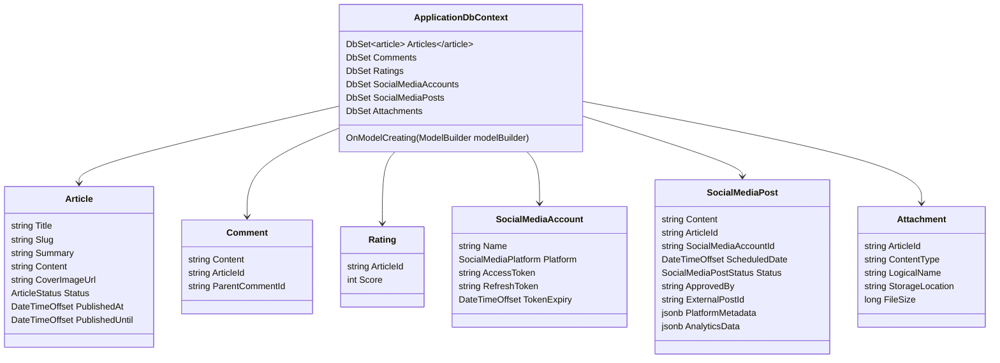

## Database Context and Migrations

**Objective:** Set up EF Core DbContext and initial database migration.

**Steps:**

1.  **Install EF Core Packages:**
    *   In the `ProPulse.Data` project, install the following NuGet packages:
        *   `Microsoft.EntityFrameworkCore`
        *   `Microsoft.EntityFrameworkCore.Design`
        *   `Npgsql.EntityFrameworkCore.PostgreSQL`
        *   `Microsoft.EntityFrameworkCore.Sqlite` (for testing)
2.  **Create ApplicationDbContext:**
    *   In the `ProPulse.Data` project, create a class `ApplicationDbContext` that inherits from `DbContext`.
    *   Define `DbSet<T>` properties for each core domain model (`Article`, `Comment`, `Rating`, `SocialMediaAccount`, `SocialMediaPost`, `Attachment`).
    *   Override the `OnModelCreating` method to configure entity relationships, constraints, and indexes as specified in the data model.
    *   Use Fluent API for configuration.
3.  **Configure PostgreSQL:**
    *   In `ProPulse.Data`, configure the connection to the PostgreSQL database using the connection string from the configuration.
    *   Register `ApplicationDbContext` in `Program.cs` with PostgreSQL provider.
4.  **Create Initial Migration:**
    *   Add a new migration using the EF Core CLI: `dotnet ef migrations add InitialCreate --project ProPulse.Data --startup-project ProPulse.Web`.
5.  **Customize Migrations:**
    *   Review the generated migration code and customize it as needed to include enum types, triggers, and unique constraints as specified in the data model.
6.  **Test Database Creation:**
    *   In the `ProPulse.Data.Tests` project, configure the `ApplicationDbContext` to use SQLite.
    *   Create a test that creates the database using `EnsureCreated()`.
    *   Create a test that applies the migrations to the SQLite database.
7.  **Apply Migrations:**
    *   Apply the migrations to a local PostgreSQL database to verify that the schema is created correctly.

**Projects Affected:**

*   `ProPulse.Data`
*   `ProPulse.Web`
*   `ProPulse.Data.Tests`

**Class Diagram:**

**Design Patterns & Best Practices:**

*   Use Fluent API for configuring entity relationships and constraints.
*   Implement custom migration operations for PostgreSQL-specific features.
*   Use a consistent naming convention for migrations.
*   Keep the `DbContext` focused on database access and configuration.
*   Use the Repository pattern to abstract database access from the application logic.

**Definition of Done:**

*   \[x] EF Core packages are installed in the `ProPulse.Data` project.
*   \[x] `ApplicationDbContext` class is created with `DbSet<T>` properties for each domain model.
*   \[x] `OnModelCreating` method is implemented to configure entity relationships and constraints.
*   \[x] Initial migration is created and customized.
*   \[x] Database can be created via migrations with correct schema in both PostgreSQL and SQLite.
*   \[x] Integration tests are created to verify database creation and migration.
*   \[x] All tests pass successfully.
*   \[x] Initial commit with database context and migrations is created.
