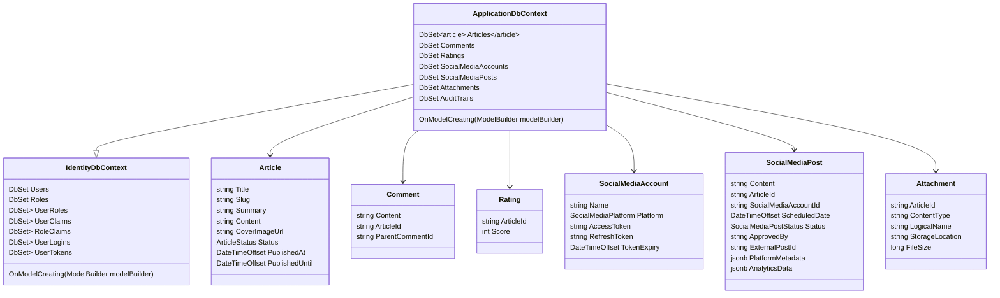

## Database Context and Migrations

**Objective:** Set up EF Core DbContext and initial database migration.

**Steps:**

1.  **Install EF Core Packages:**
    *   In the `ProPulse.Data` project, install the following NuGet packages:
        *   `Microsoft.EntityFrameworkCore`
        *   `Microsoft.EntityFrameworkCore.Design`
        *   `Npgsql.EntityFrameworkCore.PostgreSQL`
        *   `Microsoft.EntityFrameworkCore.Sqlite` (for testing)
        *   `Microsoft.AspNetCore.Identity.EntityFrameworkCore`
2.  **Create ApplicationDbContext:**
    *   In the `ProPulse.Data` project, create a class `ApplicationDbContext` that inherits from `IdentityDbContext<ApplicationUser, IdentityRole, string>`.
    *   Define `DbSet<T>` properties for each core domain model (`Article`, `Comment`, `Rating`, `SocialMediaAccount`, `SocialMediaPost`, `Attachment`, `AuditTrail`).
    *   Override the `OnModelCreating` method to configure entity relationships, constraints, and indexes as specified in the data model.
    *   Call `base.OnModelCreating(modelBuilder)` to set up the Identity tables.
    *   Use IEntityTypeConfiguration<T> for configuring the models.
    *   Configure the relationships between Identity models and domain models.
    *   Create indices on all applicable columns in the data model so that OData works efficiently.
3.  **Configure PostgreSQL:**
    *   In `ProPulse.Data`, configure the connection to the PostgreSQL database using the connection string from the configuration.
    *   Register `ApplicationDbContext` in `Program.cs` with PostgreSQL provider.
4.  **Create DbUp Migration**
    *   Create a DbUp compatible migration script within the ProPulse.Data/Scripts folder.
    *   Create a DatabaseMigrator.cs static class that takes a connection string and applies the scripts in the Scripts folder to the given database using DbUp.
    *   Create a new console project called `ProPulse.DbUp` that uses the DatabaseMigrator to apply the migrations to the given connection string, provided as a reference.
    *   Update the `Program.cs` in `ProPulse.AppHost` to apply the DbUp schema when it is run.  You can find an example of this here: https://github.com/Azure-Samples/azure-sql-db-aspire/blob/main/hostedss%20-%20dbup/AspireApp1.AppHost/Program.cs
5.  **Customize Migrations:**
    *   Review the generated migration code and customize it as needed to include enum types, triggers, and unique constraints as specified in the data model.
    *   Add indices for all columns that may be used within an API call.  If in doubt, add an index.

**Projects Affected:**

*   `ProPulse.Data`
*   `ProPulse.DbUp`
*   `ProPulse.Web`
*   `ProPulse.Data.Tests`

**Class Diagram:**

**Design Patterns & Best Practices:**

*   Use Fluent API and `IEntityTypeConfiguration<T>` for configuring entity relationships and constraints.
*   Implement custom migration operations using DbUp for PostgreSQL-specific features.
*   Use a consistent naming convention for migrations.
*   Keep the `DbContext` focused on database access and configuration.
*   Use the Repository pattern to abstract database access from the application logic.

**Definition of Done:**

*   \[x] EF Core packages are installed in the `ProPulse.Data` project.
*   \[x] `ApplicationDbContext` class is created with `DbSet<T>` properties for each domain model.
*   \[x] `OnModelCreating` method is implemented to configure entity relationships and constraints.
*   \[x] Initial migration is created and customized.
*   \[x] Database can be created via DbUp with correct schema in PostgreSQL.
*   \[x] Integration tests are created to verify database creation and migration.
*   \[x] All tests pass successfully.
*   \[x] Initial commit with database context and migrations is created.
