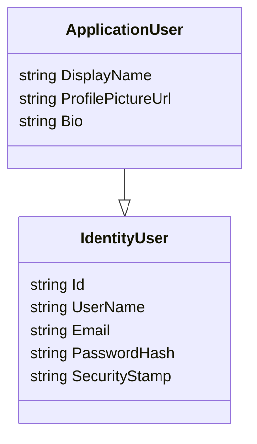

## Authentication and Identity Framework

**Objective:** Implement ASP.NET Identity integration and authentication, including registration, login, password reset, refresh tokens, social login, and MFA.

**Steps:**

1.  **Install Identity Packages:**
    *   In the `ProPulse.Web` project, install the following NuGet packages:
        *   `Microsoft.AspNetCore.Identity.EntityFrameworkCore`
        *   `Microsoft.AspNetCore.Authentication.JwtBearer`
        *   `Microsoft.AspNetCore.Identity.UI`
        *   Social provider packages (e.g., `Microsoft.AspNetCore.Authentication.Google`, `Microsoft.AspNetCore.Authentication.Facebook`)
2.  **Create Identity Models:**
    *   In the `ProPulse.Core` project, create an `ApplicationUser` class that extends `IdentityUser`.
    *   Add custom properties to `ApplicationUser`:
        *   `DisplayName` (string)
        *   `ProfilePictureUrl` (string)
        *   `Bio` (string)
3.  **Configure Identity:**
    *   In the `ProPulse.Web` project, configure ASP.NET Identity in `Program.cs`:
        *   Add `AddIdentity<ApplicationUser, IdentityRole>` to the service collection.
        *   Configure password policies, lockout settings, and user settings.
        *   Add `AddEntityFrameworkStores<ApplicationDbContext>` to use EF Core for identity storage.
        *   Add `AddDefaultTokenProviders` to enable token generation for password reset and email confirmation.
    *   Configure JWT authentication:
        *   Add `AddAuthentication` with `JwtBearerDefaults.AuthenticationScheme`.
        *   Configure `JwtBearerOptions` with validation parameters (issuer, audience, signing key).
4.  **Implement Authentication Endpoints:**
    *   In the `ProPulse.Web` project, create a new controller `AuthController`.
    *   Add endpoints for:
        *   Registration (`POST /auth/register`)
        *   Login (`POST /auth/login`)
        *   Password reset (`POST /auth/reset-password`)
        *   Email confirmation (`POST /auth/confirm-email`)
        *   Refresh tokens (`POST /auth/refresh`)
        *   Social login (`POST /auth/social-login`)
5.  **Implement MFA:**
    *   In the `ProPulse.Web` project, create a service `MfaService` to handle multi-factor authentication.
    *   Add methods for enabling MFA, generating QR codes, and verifying codes.
    *   Integrate MFA into the authentication flow.
6.  **Add Role-Based Authorization:**
    *   In the `ProPulse.Web` project, configure role-based authorization in `Program.cs`.
    *   Add roles (`Author`, `Social Media Manager`, `Reader`) to the database.
    *   Use `[Authorize(Roles = "RoleName")]` attributes on controllers and actions.
7.  **Add Integration Tests:**
    *   In the `ProPulse.Web.Tests` project, create integration tests for the authentication endpoints.
    *   Test registration, login, password reset, social login, and MFA flows.
    *   Test role-based access control.

**Projects Affected:**

*   `ProPulse.Core`
*   `ProPulse.Web`
*   `ProPulse.Web.Tests`

**Class Diagram:**

**Design Patterns & Best Practices:**

*   Use the Repository pattern for managing identity-related data.
*   Apply the Single Responsibility Principle to the `AuthController` and `MfaService`.
*   Use Dependency Injection to manage services and configurations.
*   Implement proper exception handling and logging in authentication flows.

**Definition of Done:**

*   [x] Identity packages are installed in the `ProPulse.Web` project.
*   [x] `ApplicationUser` class is created with custom properties.
*   [x] Identity is configured in `Program.cs`.
*   [x] Authentication endpoints are implemented in `AuthController`.
*   [x] MFA is implemented and integrated into the authentication flow.
*   [x] Role-based authorization is configured and tested.
*   [x] Integration tests are created and pass successfully.
*   [x] Documentation is updated to include authentication and identity framework details.