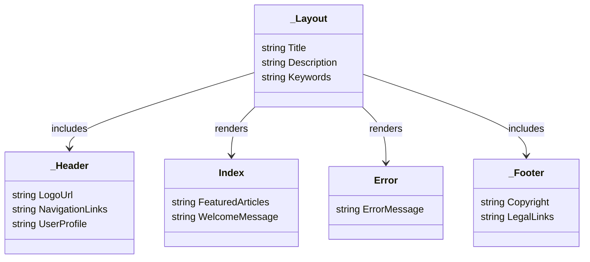

## User Interface - Core Structure

**Objective:** Set up Razor Pages infrastructure, layouts, and shared components.

**Steps:**

1.  **Create Razor Pages Project:**
    *   If not already created, ensure the `ProPulse.Web` project is configured to serve Razor Pages.
2.  **Create Layouts:**
    *   Create a `_Layout.cshtml` file in the `Pages/Shared` folder.
    *   Define the basic HTML structure for the layout, including:
        *   `<!DOCTYPE html>`
        *   `<head>` (with meta tags, CSS links, and JavaScript links)
        *   `<body>` (with header, main content area, and footer)
    *   Create a `_LayoutAuth.cshtml` file in the `Pages/Shared` folder.
    *   Define the basic HTML structure for the layout, including:
        *   `<!DOCTYPE html>`
        *   `<head>` (with meta tags, CSS links, and JavaScript links)
        *   `<body>` (with header, main content area, and footer)
    *   Create a `_LayoutAdmin.cshtml` file in the `Pages/Shared` folder.
    *   Define the basic HTML structure for the layout, including:
        *   `<!DOCTYPE html>`
        *   `<head>` (with meta tags, CSS links, and JavaScript links)
        *   `<body>` (with header, main content area, and footer)
3.  **Create Shared Components:**
    *   Create a `_Header.cshtml` partial view in the `Pages/Shared` folder.
    *   Implement the header with navigation links, logo, and user profile information.
    *   Create a `_Footer.cshtml` partial view in the `Pages/Shared` folder.
    *   Implement the footer with copyright information and links to legal pages.
    *   Create a `_ValidationScriptsPartial.cshtml` partial view in the `Pages/Shared` folder.
    *   Include the necessary JavaScript files for client-side validation.
4.  **Configure Routing:**
    *   Configure routing in `Program.cs` to use kebab-case URLs.
5.  **Implement Error Handling:**
    *   Create an `Error.cshtml` page in the `Pages` folder.
    *   Implement error handling logic to display user-friendly error messages.
6.  **Implement Base Pages:**
    *   Create an `Index.cshtml` page in the `Pages` folder.
    *   Implement the home page with featured articles and a welcome message.
    *   Create a `Privacy.cshtml` page in the `Pages` folder.
    *   Implement the privacy policy page.
7.  **Add Integration Tests:**
    *   In the `ProPulse.Web.Tests` project, create integration tests for the base pages.
    *   Test that the pages load correctly and that the layout is rendered correctly.

**Projects Affected:**

*   `ProPulse.Web`

**Class Diagram:**

**Design Patterns & Best Practices:**

*   Use layouts and partial views for reusable UI components.
*   Follow a consistent naming convention for pages and files.
*   Implement proper error handling and logging.
*   Use a consistent styling and design system.
*   Follow accessibility best practices.

**Definition of Done:**

*   \[x] Razor Pages project is configured.
*   \[x] `_Layout.cshtml`, `_LayoutAuth.cshtml`, and `_LayoutAdmin.cshtml` files are created with basic HTML structure.
*   \[x] `_Header.cshtml` and `_Footer.cshtml` partial views are created.
*   \[x] Routing is configured to use kebab-case URLs.
*   \[x] `Error.cshtml` page is created with error handling logic.
*   \[x] `Index.cshtml` and `Privacy.cshtml` pages are created.
*   \[x] Integration tests are created for base pages.
*   \[x] All tests pass successfully.
*   \[x] Initial commit with user interface core structure is created.
