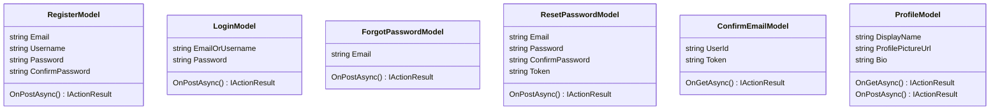

## User Interface - Authentication

**Objective:** Implement authentication and user management UI.

**Steps:**

1.  **Create Registration Page:**
    *   Create a `Register.cshtml` page in the `Pages/Auth` folder.
    *   Implement the registration form with fields for:
        *   Email
        *   Username
        *   Password
        *   Confirm Password
    *   Use the `_LayoutAuth.cshtml` layout.
    *   Implement client-side validation using JavaScript.
    *   Implement server-side validation using FluentValidation.
    *   Use the `Register` endpoint to submit the registration form.
    *   Display success or error messages to the user.
2.  **Create Login Page:**
    *   Create a `Login.cshtml` page in the `Pages/Auth` folder.
    *   Implement the login form with fields for:
        *   Email or Username
        *   Password
    *   Use the `_LayoutAuth.cshtml` layout.
    *   Implement client-side validation using JavaScript.
    *   Implement server-side validation using FluentValidation.
    *   Use the `Login` endpoint to submit the login form.
    *   Display success or error messages to the user.
    *   Implement social login buttons for Google, Facebook, etc.
3.  **Create Forgot Password Page:**
    *   Create a `ForgotPassword.cshtml` page in the `Pages/Auth` folder.
    *   Implement the forgot password form with a field for:
        *   Email
    *   Use the `_LayoutAuth.cshtml` layout.
    *   Implement client-side validation using JavaScript.
    *   Implement server-side validation using FluentValidation.
    *   Use the `ForgotPassword` endpoint to submit the form.
    *   Display success or error messages to the user.
4.  **Create Reset Password Page:**
    *   Create a `ResetPassword.cshtml` page in the `Pages/Auth` folder.
    *   Implement the reset password form with fields for:
        *   Email
        *   Password
        *   Confirm Password
        *   Token
    *   Use the `_LayoutAuth.cshtml` layout.
    *   Implement client-side validation using JavaScript.
    *   Implement server-side validation using FluentValidation.
    *   Use the `ResetPassword` endpoint to submit the form.
    *   Display success or error messages to the user.
5.  **Create Confirm Email Page:**
    *   Create a `ConfirmEmail.cshtml` page in the `Pages/Auth` folder.
    *   Implement logic to confirm the user's email address using the token from the query string.
    *   Display success or error messages to the user.
6.  **Create Profile Management Page:**
    *   Create a `Profile.cshtml` page in the `Pages/User` folder.
    *   Implement the profile management form with fields for:
        *   Display Name
        *   Profile Picture
        *   Bio
    *   Use the `_Layout.cshtml` layout.
    *   Implement client-side validation using JavaScript.
    *   Implement server-side validation using FluentValidation.
    *   Use the `UpdateProfile` endpoint to submit the form.
    *   Display success or error messages to the user.
7.  **Add Integration Tests:**
    *   In the `ProPulse.Web.Tests` project, create integration tests for the authentication and user management pages.
    *   Test registration, login, forgot password, reset password, confirm email, and profile management flows.

**Projects Affected:**

*   `ProPulse.Web`

**Class Diagram:**

**Design Patterns & Best Practices:**

*   Use Razor Pages for a page-centric development model.
*   Use FluentValidation for server-side validation.
*   Use JavaScript for client-side validation.
*   Use partial views for reusable UI components.
*   Implement proper error handling and display user-friendly error messages.
*   Follow security best practices for password storage and token management.

**Definition of Done:**

*   \[x] Registration page is created with validation and error handling.
*   \[x] Login page is created with validation and social login buttons.
*   \[x] Forgot password page is created with validation and error handling.
*   \[x] Reset password page is created with validation and error handling.
*   \[x] Confirm email page is created with success and error messages.
*   \[x] Profile management page is created with validation and error handling.
*   \[x] Integration tests are created for authentication and user management pages.
*   \[x] All tests pass successfully.
*   \[x] Initial commit with user interface authentication implementation is created.
