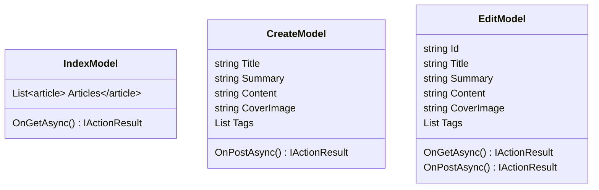

## User Interface - Article Management

**Objective:** Implement article creation and editing UI.

**Steps:**

1.  **Create Article List Page:**
    *   Create an `Index.cshtml` page in the `Pages/Articles` folder.
    *   Display a list of articles with:
        *   Title
        *   Summary
        *   Status
        *   Published Date
        *   Actions (Edit, Delete)
    *   Use the `_Layout.cshtml` layout.
    *   Implement pagination.
    *   Implement filtering and sorting.
2.  **Create Create Article Page:**
    *   Create a `Create.cshtml` page in the `Pages/Articles` folder.
    *   Implement the article creation form with fields for:
        *   Title
        *   Summary
        *   Content (use a rich text editor)
        *   Cover Image
        *   Tags
    *   Use the `_Layout.cshtml` layout.
    *   Implement client-side validation using JavaScript.
    *   Implement server-side validation using FluentValidation.
    *   Use the `CreateArticle` endpoint to submit the form.
    *   Display success or error messages to the user.
3.  **Create Edit Article Page:**
    *   Create an `Edit.cshtml` page in the `Pages/Articles` folder.
    *   Implement the article editing form with fields for:
        *   Title
        *   Summary
        *   Content (use a rich text editor)
        *   Cover Image
        *   Tags
    *   Use the `_Layout.cshtml` layout.
    *   Implement client-side validation using JavaScript.
    *   Implement server-side validation using FluentValidation.
    *   Use the `UpdateArticle` endpoint to submit the form.
    *   Display success or error messages to the user.
4.  **Create Delete Article Confirmation Dialog:**
    *   Implement a modal dialog to confirm the deletion of an article.
    *   Use the `DeleteArticle` endpoint to delete the article.
    *   Display success or error messages to the user.
5.  **Implement Rich Text Editor:**
    *   Integrate a rich text editor (e.g., TinyMCE, CKEditor) for editing the article content.
    *   Configure the editor with the necessary plugins and features.
    *   Implement image upload functionality.
6.  **Add Integration Tests:**
    *   In the `ProPulse.Web.Tests` project, create integration tests for the article management pages.
    *   Test creating, editing, and deleting articles.
    *   Test validation and error handling.

**Projects Affected:**

*   `ProPulse.Web`

**Class Diagram:**

**Design Patterns & Best Practices:**

*   Use Razor Pages for a page-centric development model.
*   Use FluentValidation for server-side validation.
*   Use JavaScript for client-side validation.
*   Use partial views for reusable UI components.
*   Implement proper error handling and display user-friendly error messages.
*   Use a rich text editor for editing the article content.

**Definition of Done:**

*   \[x] Article list page is created with pagination, filtering, and sorting.
*   \[x] Create article page is created with validation and a rich text editor.
*   \[x] Edit article page is created with validation and a rich text editor.
*   \[x] Delete article confirmation dialog is implemented.
*   \[x] Integration tests are created for article management pages.
*   \[x] All tests pass successfully.
*   \[x] Initial commit with user interface article management implementation is created.
