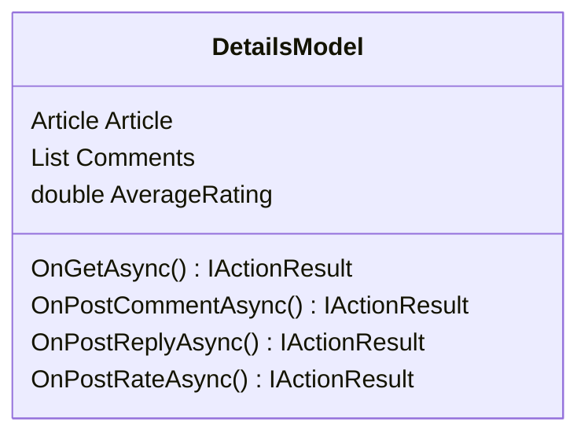

## User Interface - Article Reading

**Objective:** Implement article reading and comment UI.

**Steps:**

1.  **Create Article Reading Page:**
    *   Create a `Details.cshtml` page in the `Pages/Articles` folder.
    *   Display the article content with:
        *   Title
        *   Summary
        *   Content
        *   Cover Image
        *   Author
        *   Published Date
        *   Tags
    *   Use the `_Layout.cshtml` layout.
    *   Implement social sharing buttons.
2.  **Implement Comment Section:**
    *   Display a list of comments for the article.
    *   Allow users to post new comments.
    *   Allow users to reply to existing comments.
    *   Implement comment moderation features for authors and administrators.
3.  **Implement Rating System:**
    *   Allow users to rate the article.
    *   Display the average rating for the article.
4.  **Add Integration Tests:**
    *   In the `ProPulse.Web.Tests` project, create integration tests for the article reading page.
    *   Test displaying the article content.
    *   Test posting new comments.
    *   Test replying to existing comments.
    *   Test rating the article.

**Projects Affected:**

*   `ProPulse.Web`

**Class Diagram:**

**Design Patterns & Best Practices:**

*   Use Razor Pages for a page-centric development model.
*   Use partial views for reusable UI components.
*   Implement proper error handling and display user-friendly error messages.
*   Use JavaScript for interactive elements.
*   Implement comment moderation features.

**Definition of Done:**

*   \[x] Article reading page is created with article content and social sharing buttons.
*   \[x] Comment section is implemented with posting and replying functionality.
*   \[x] Rating system is implemented with rating and display functionality.
*   \[x] Integration tests are created for the article reading page.
*   \[x] All tests pass successfully.
*   \[x] Initial commit with user interface article reading implementation is created.
