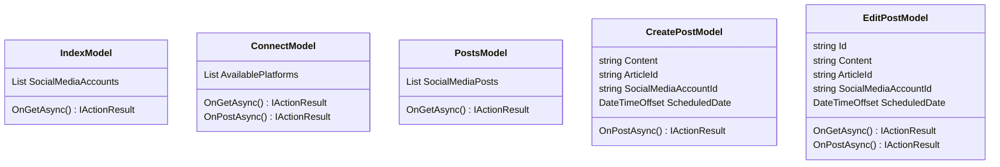

## User Interface - Social Media

**Objective:** Implement social media management UI.

**Steps:**

1.  **Create Social Media Account List Page:**
    *   Create an `Index.cshtml` page in the `Pages/Social` folder.
    *   Display a list of connected social media accounts with:
        *   Platform
        *   Name
        *   Status
        *   Actions (Disconnect)
    *   Use the `_Layout.cshtml` layout.
2.  **Create Connect Social Media Account Page:**
    *   Create a `Connect.cshtml` page in the `Pages/Social` folder.
    *   Display a list of available social media platforms to connect to.
    *   Implement OAuth flow for connecting to each platform.
    *   Store the access token and refresh token securely.
3.  **Create Social Media Post List Page:**
    *   Create a `Posts.cshtml` page in the `Pages/Social` folder.
    *   Display a list of scheduled social media posts with:
        *   Content
        *   Scheduled Date
        *   Status
        *   Social Media Account
        *   Actions (Edit, Delete, Approve, Reject)
    *   Use the `_Layout.cshtml` layout.
    *   Implement pagination.
    *   Implement filtering and sorting.
4.  **Create Create Social Media Post Page:**
    *   Create a `CreatePost.cshtml` page in the `Pages/Social` folder.
    *   Implement the social media post creation form with fields for:
        *   Content
        *   Article
        *   Social Media Account
        *   Scheduled Date
    *   Use the `_Layout.cshtml` layout.
    *   Implement client-side validation using JavaScript.
    *   Implement server-side validation using FluentValidation.
    *   Use the `CreateSocialMediaPost` endpoint to submit the form.
    *   Display success or error messages to the user.
5.  **Create Edit Social Media Post Page:**
    *   Create an `EditPost.cshtml` page in the `Pages/Social` folder.
    *   Implement the social media post editing form with fields for:
        *   Content
        *   Article
        *   Social Media Account
        *   Scheduled Date
    *   Use the `_Layout.cshtml` layout.
    *   Implement client-side validation using JavaScript.
    *   Implement server-side validation using FluentValidation.
    *   Use the `UpdateSocialMediaPost` endpoint to submit the form.
    *   Display success or error messages to the user.
6.  **Implement Approval Workflow:**
    *   Implement UI elements for approving and rejecting social media posts.
    *   Use the `ApproveSocialMediaPost` and `RejectSocialMediaPost` endpoints.
    *   Notify authors of approval or rejection.
7.  **Add Integration Tests:**
    *   In the `ProPulse.Web.Tests` project, create integration tests for the social media management pages.
    *   Test connecting and disconnecting social media accounts.
    *   Test creating, editing, and deleting social media posts.
    *   Test approving and rejecting social media posts.

**Projects Affected:**

*   `ProPulse.Web`

**Class Diagram:**

**Design Patterns & Best Practices:**

*   Use Razor Pages for a page-centric development model.
*   Use FluentValidation for server-side validation.
*   Use JavaScript for client-side validation.
*   Use partial views for reusable UI components.
*   Implement proper error handling and display user-friendly error messages.
*   Implement OAuth flow for connecting to social media platforms.

**Definition of Done:**

*   \[x] Social media account list page is created with actions for disconnecting accounts.
*   \[x] Connect social media account page is created with OAuth flow.
*   \[x] Social media post list page is created with pagination, filtering, and sorting.
*   \[x] Create social media post page is created with validation.
*   \[x] Edit social media post page is created with validation.
*   \[x] Approval workflow is implemented with UI elements for approving and rejecting posts.
*   \[x] Integration tests are created for social media management pages.
*   \[x] All tests pass successfully.
*   \[x] Initial commit with user interface social media implementation is created.
