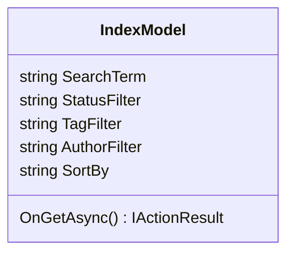

## Search and Filtering

**Objective:** Implement article search and filtering capabilities.

**Steps:**

1.  **Implement Search Functionality:**
    *   Add a search box to the article list page.
    *   Implement search functionality to filter articles by title, summary, or content.
    *   Use OData query options for filtering.
2.  **Implement Filtering Functionality:**
    *   Add filtering options to the article list page for:
        *   Status (Draft, Published, Scheduled)
        *   Tags
        *   Author
    *   Use OData query options for filtering.
3.  **Implement Sorting Functionality:**
    *   Add sorting options to the article list page for:
        *   Title
        *   Published Date
        *   Author
    *   Use OData query options for sorting.
4.  **Add Integration Tests:**
    *   In the `ProPulse.Web.Tests` project, create integration tests for the search and filtering functionality.
    *   Test searching for articles by title, summary, and content.
    *   Test filtering articles by status, tags, and author.
    *   Test sorting articles by title, published date, and author.

**Projects Affected:**

*   `ProPulse.Web`

**Class Diagram:**

**Design Patterns & Best Practices:**

*   Use OData query options for filtering and sorting.
*   Implement proper error handling and display user-friendly error messages.
*   Use JavaScript for interactive elements.
*   Optimize database queries for performance.

**Definition of Done:**

*   \[x] Search functionality is implemented with OData query options.
*   \[x] Filtering functionality is implemented with OData query options.
*   \[x] Sorting functionality is implemented with OData query options.
*   \[x] Integration tests are created for the search and filtering functionality.
*   \[x] All tests pass successfully.
*   \[x] Initial commit with search and filtering implementation is created.
