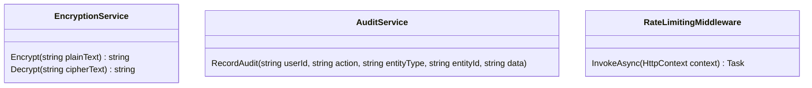

## Security Hardening

**Objective:** Implement additional security features like encryption and auditing.

**Steps:**

1.  **Implement Column-Level Encryption:**
    *   Encrypt sensitive data in the database, such as:
        *   Social media access tokens
        *   Social media refresh tokens
    *   Use Azure Key Vault for key management.
    *   Use AES-256 encryption algorithm.
2.  **Implement Audit Logging:**
    *   Log all important user actions, such as:
        *   Login attempts
        *   Article creation
        *   Article updates
        *   Comment creation
        *   Comment updates
        *   Social media post creation
        *   Social media post updates
    *   Store audit logs in a separate table.
    *   Include user ID, timestamp, action, and IP address in the audit logs.
3.  **Implement Rate Limiting:**
    *   Limit the number of requests that a user can make to the API.
    *   Use a sliding window algorithm for rate limiting.
    *   Return a 429 Too Many Requests error when the rate limit is exceeded.
4.  **Implement Content Security Policy (CSP):**
    *   Configure CSP to prevent XSS attacks.
    *   Use a strict CSP policy that only allows loading resources from trusted sources.
5.  **Implement Security Headers:**
    *   Add security headers to all responses, such as:
        *   X-Content-Type-Options: nosniff
        *   X-Frame-Options: DENY
        *   X-XSS-Protection: 1; mode=block
        *   Referrer-Policy: strict-origin-when-cross-origin
6.  **Add Integration Tests:**
    *   In the `ProPulse.Web.Tests` project, create integration tests for the security features.
    *   Test column-level encryption.
    *   Test audit logging.
    *   Test rate limiting.
    *   Test CSP and security headers.

**Projects Affected:**

*   `ProPulse.Web`
*   `ProPulse.Core`

**Class Diagram:**

**Design Patterns & Best Practices:**

*   Use encryption to protect sensitive data.
*   Use audit logging to track user actions.
*   Use rate limiting to prevent abuse.
*   Use CSP and security headers to prevent attacks.
*   Follow security best practices for all code.

**Definition of Done:**

*   \[x] Column-level encryption is implemented for sensitive data.
*   \[x] Audit logging is implemented for important user actions.
*   \[x] Rate limiting is implemented to prevent abuse.
*   \[x] CSP is implemented to prevent XSS attacks.
*   \[x] Security headers are added to all responses.
*   \[x] Integration tests are created for the security features.
*   \[x] All tests pass successfully.
*   \[x] Initial commit with security hardening implementation is created.
