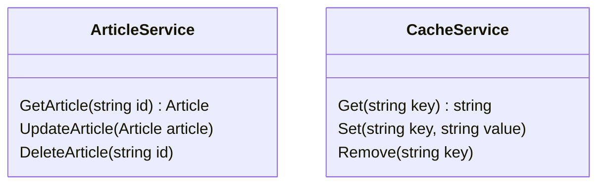

## Caching and Performance

**Objective:** Add caching and performance optimizations.

**Steps:**

1.  **Implement Caching for Articles:**
    *   Cache frequently accessed articles in Azure Cache for Redis.
    *   Use a cache-aside pattern.
    *   Invalidate the cache when articles are created, updated, or deleted.
2.  **Implement Caching for Comments:**
    *   Cache comments for articles in Azure Cache for Redis.
    *   Invalidate the cache when comments are created, updated, or deleted.
3.  **Implement Output Caching:**
    *   Use output caching for pages that don't change frequently, such as the home page and article list page.
4.  **Optimize Database Queries:**
    *   Use indexes to optimize database queries.
    *   Avoid N+1 queries.
    *   Use asynchronous operations.
5.  **Implement Lazy Loading:**
    *   Use lazy loading for related entities that are not always needed.
6.  **Implement Image Optimization:**
    *   Optimize images for web use.
    *   Use responsive images.
7.  **Add Performance Monitoring:**
    *   Use Application Insights to monitor the performance of the application.
    *   Track response times, database queries, and other performance metrics.
8.  **Add Integration Tests:**
    *   In the `ProPulse.Web.Tests` project, create integration tests for the caching and performance features.
    *   Test caching for articles and comments.
    *   Test output caching.
    *   Test database query performance.

**Projects Affected:**

*   `ProPulse.Web`

**Class Diagram:**

**Design Patterns & Best Practices:**

*   Use caching to improve performance.
*   Optimize database queries.
*   Use asynchronous operations.
*   Implement lazy loading.
*   Optimize images.
*   Monitor performance.

**Definition of Done:**

*   \[x] Caching is implemented for articles and comments.
*   \[x] Output caching is implemented for pages that don't change frequently.
*   \[x] Database queries are optimized.
*   \[x] Lazy loading is implemented.
*   \[x] Images are optimized.
*   \[x] Performance monitoring is implemented.
*   \[x] Integration tests are created for the caching and performance features.
*   \[x] All tests pass successfully.
*   \[x] Initial commit with caching and performance implementation is created.
