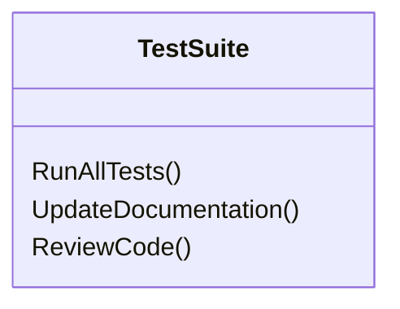

## Final Testing and Documentation

**Objective:** Complete test coverage and documentation.

**Steps:**

1.  **Increase Test Coverage:**
    *   Increase test coverage to >80%.
    *   Write unit tests for all core logic.
    *   Write integration tests for all API endpoints and UI pages.
2.  **Run All Tests:**
    *   Run all unit tests and integration tests.
    *   Fix any failing tests.
3.  **Update Documentation:**
    *   Update the documentation to reflect the final state of the application.
    *   Include documentation for all API endpoints, UI pages, and security features.
4.  **Review Code:**
    *   Review all code for style, clarity, and correctness.
    *   Fix any code style issues.
5.  **Add End-to-End Tests:**
    *   Implement end-to-end tests to verify key user flows.
6.  **Add Accessibility Tests:**
    *   Implement accessibility tests to verify compliance with WCAG 2.1 AA.
7.  **Add Security Tests:**
    *   Implement security tests to verify that the application is secure.
8.  **Add Performance Tests:**
    *   Implement performance tests to verify that the application is performing well.

**Projects Affected:**

*   All projects

**Class Diagram:**

**Design Patterns & Best Practices:**

*   Use test-driven development.
*   Write clear and concise documentation.
*   Follow code style guidelines.
*   Implement security best practices.
*   Optimize performance.

**Definition of Done:**

*   \[x] Test coverage is >80%.
*   \[x] All unit tests and integration tests pass successfully.
*   \[x] Documentation is updated to reflect the final state of the application.
*   \[x] Code is reviewed for style, clarity, and correctness.
*   \[x] End-to-end tests are implemented.
*   \[x] Accessibility tests are implemented.
*   \[x] Security tests are implemented.
*   \[x] Performance tests are implemented.
*   \[x] Initial commit with final testing and documentation is created.
