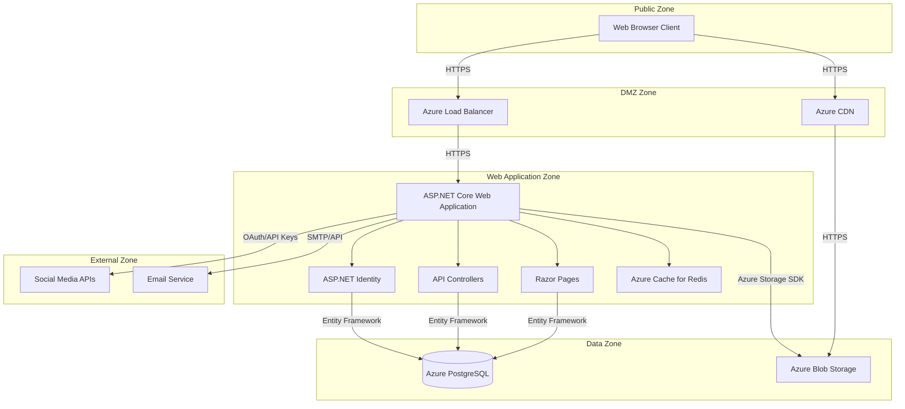

# Security and Privacy Review

## 1. Security Review

### 1.1. Component Decomposition and Trust Zones

The ProPulse application can be decomposed into several key components that handle different aspects of the system. The diagram below illustrates the main components and data flows between them, with trust zones identified to highlight security boundaries.

**Trust Zones:**

1. **Public Zone**: Untrusted area where users' browsers operate. All input from this zone must be treated as potentially malicious.

2. **DMZ Zone**: Semi-trusted zone containing Azure services that interface directly with the public internet.

3. **Web Application Zone**: Trusted internal zone where the application logic resides, protected by Azure App Service security.

4. **Data Zone**: Highly secured zone containing databases and storage, with no direct access from the public internet.

5. **External Zone**: Semi-trusted zone comprising third-party services with varying security models.

### 1.2. Threat Model (STRIDE per Element)

#### Web Application (ASP.NET Core Service)

| Threat Type | Threats | Mitigations |
|-------------|---------|-------------|
| **Spoofing** | - User impersonation - Session hijacking | - JWT with proper signing and expiry - ASP.NET Identity with secure practices - HTTPS with HSTS - Anti-CSRF tokens |
| **Tampering** | - Request/response tampering - Client-side script injection | - Server-side validation - Content Security Policy - Response integrity checks - Input sanitization |
| **Repudiation** | - Denying performed actions - Unauthorized content changes | - Comprehensive audit logging - Entity history tracking - Non-repudiable actions with auth tokens |
| **Information Disclosure** | - Sensitive data exposure - Error message leakage - Metadata leakage | - Proper error handling - Data classification - HTTPS everywhere - Minimal data in logs |
| **Denial of Service** | - API flooding - Resource exhaustion | - Rate limiting - Resource quotas - Azure DDOS protection - Request validation |
| **Elevation of Privilege** | - Privilege escalation - Role bypass | - Role-based access control - Least privilege principle - Permission verification on all actions |

#### Authentication Module

| Threat Type | Threats | Mitigations |
|-------------|---------|-------------|
| **Spoofing** | - Credential theft - Social login abuse - Session fixation | - Secure password hashing (ASP.NET Identity) - MFA for admin accounts - Email verification - Secure session management |
| **Tampering** | - Auth token manipulation - Cookie tampering | - Signed, encrypted JWTs - Secure, HTTP-only auth cookies - Short token validity periods |
| **Repudiation** | - Denying authentication attempts - Password reset abuse | - Auth attempt logging - IP tracking for suspicious activity - Audit trail for password resets |
| **Information Disclosure** | - Leaking auth status - User enumeration | - Generic error messages - Timing attack prevention - No username/email leakage in responses |
| **Denial of Service** | - Login flooding - Account lockout abuse | - Progressive rate limiting - CAPTCHA for suspicious activity - Account lockout with secure recovery |
| **Elevation of Privilege** | - Role manipulation - Forced browsing | - Server-side role verification - Role checks in all protected actions - No client-side role storage |

#### Database (PostgreSQL)

| Threat Type | Threats | Mitigations |
|-------------|---------|-------------|
| **Spoofing** | - Connection string theft - DB credential compromise | - Azure managed identities - Encrypted connection strings - Network isolation |
| **Tampering** | - SQL injection - Unauthorized schema changes | - Parameterized queries via EF Core - Database schema migrations - Least privilege accounts |
| **Repudiation** | - Unauthorized data changes - Data deletion | - Row versioning - Audit columns (CreatedBy, UpdatedBy) - Entity history |
| **Information Disclosure** | - Sensitive data leaks - Metadata exposure | - Encrypted sensitive fields - Column-level encryption - TLS for connections - Network security groups |
| **Denial of Service** | - Connection pool exhaustion - Resource-intensive queries | - Connection pooling - Query timeouts - Resource governance - Query optimization |
| **Elevation of Privilege** | - Excessive DB permissions | - Least privilege principle - Role separation - No admin accounts for application access |

#### Blob Storage (Media Content)

| Threat Type | Threats | Mitigations |
|-------------|---------|-------------|
| **Spoofing** | - Unauthorized content access - URL guessing | - Signed URLs with expiry - Access control on containers - Private containers with app-controlled access |
| **Tampering** | - Content modification - Metadata tampering | - Immutable storage policies - Hash verification - Secure upload flows |
| **Repudiation** | - Unauthorized uploads - Content deletion | - Blob auditing - Access logs - Soft delete policies |
| **Information Disclosure** | - Unintended file access - Metadata leakage | - Proper access controls - No sensitive data in metadata - Content scanning before storage |
| **Denial of Service** | - Storage capacity exhaustion - Upload flooding | - Upload size limits - Rate limiting on uploads - Content quotas per user |
| **Elevation of Privilege** | - Storage account key exposure - SAS token misuse | - Managed identities - Short-lived SAS tokens - Minimal scope for access tokens |

#### Social Media Integration

| Threat Type | Threats | Mitigations |
|-------------|---------|-------------|
| **Spoofing** | - OAuth token theft - Account impersonation | - Secure OAuth implementation - Token storage encryption - Regular token rotation |
| **Tampering** | - Manipulated social posts - API request tampering | - Content approval workflow - Request signing - Response validation |
| **Repudiation** | - Unauthorized posts - Content changes | - Approval audit trail - Post versioning - Multi-party approval for sensitive accounts |
| **Information Disclosure** | - Token leakage - Unintended sharing | - Encrypted token storage - Content preview before posting - Clear posting permissions |
| **Denial of Service** | - API rate limit exhaustion - Token invalidation | - Rate limit tracking - Queued posting - Multiple account support |
| **Elevation of Privilege** | - Excessive social permissions - Permission scope creep | - Minimal OAuth scopes - Permission review process - Regular scope validation |

### 1.3. Encryption Technologies

The ProPulse platform implements several encryption mechanisms to protect data at rest and in transit:

#### Data in Transit
- **TLS 1.3**: All connections to the application use TLS 1.3 with modern cipher suites.
- **HSTS (HTTP Strict Transport Security)**: Enforced to prevent downgrade attacks.
- **Secure Cookies**: All cookies set with Secure and HTTP-Only flags.
- **Content Security Policy**: Implemented to prevent various injection attacks and secure content loading.

#### Data at Rest
- **Transparent Data Encryption**: Azure Database for PostgreSQL utilizes TDE to encrypt all database files.
- **Column-level Encryption**: Sensitive fields like social media tokens are encrypted at the application level before storage.
- **Key Hierarchy**: Azure Key Vault manages encryption keys with regular rotation policies.
- **Storage Encryption**: Azure Blob Storage implements server-side encryption for all media content.

#### Cryptographic Implementations
- **Password Storage**: ASP.NET Identity's PBKDF2 implementation for password hashing.
- **Token Signing**: JWT tokens signed with strong asymmetric algorithms.
- **Social Media Tokens**: Encrypted with application-level encryption before storage in the database.
- **Secure Random**: Cryptographically secure random number generation for all security-critical operations.

### 1.4. Service Authentication and Communication

The ProPulse platform implements several authentication mechanisms for secure service-to-service communication:

1. **Internal Component Authentication**:
   - **Azure Managed Identities**: Used for authenticating the application to Azure services like PostgreSQL, Blob Storage, and Redis Cache.
   - **Connection Security**: All internal service connections use TLS 1.3 with mutual authentication where supported.

2. **API Authentication**:
   - **JWT Bearer Tokens**: JSON Web Tokens for API authentication with properly signed claims.
   - **OAuth 2.0**: For authentication with social media platforms.
   - **API Keys**: For services that don't support OAuth (stored securely in Azure Key Vault).

3. **Service Communication Patterns**:
   - **Request-level Authentication**: Every service request contains authentication information.
   - **Security Token Service Pattern**: Central authentication service issues and validates tokens.
   - **Least Privilege Access**: Services operate with minimal needed permissions.

4. **Token Management**:
   - **Short-lived Tokens**: Access tokens have limited lifetimes.
   - **Secure Storage**: Refresh tokens stored encrypted in the database.
   - **Token Revocation**: Ability to revoke tokens during security events.

### 1.5. OWASP Top 10 Mitigation

| Vulnerability | Mitigation Approach |
|---------------|---------------------|
| **A01:2021-Broken Access Control** | - Role-based access control - Server-side authorization checks - Resource ownership validation - Deny-by-default access policy |
| **A02:2021-Cryptographic Failures** | - Modern encryption algorithms - Proper key management - Encrypted connections - No sensitive data in logs or URLs |
| **A03:2021-Injection** | - Entity Framework Core parameterized queries - Input validation and sanitization - Content Security Policy - Safe rendering of user content (Markdown) |
| **A04:2021-Insecure Design** | - Threat modeling during design - Defense in depth approach - Secure defaults - Fail secure principle |
| **A05:2021-Security Misconfiguration** | - Minimal attack surface - Automated configuration validation - Environment-specific configuration - Removal of debug features in production |
| **A06:2021-Vulnerable Components** | - Regular dependency updates - Vulnerability scanning in CI/CD - Dependency minimization - Security patches application |
| **A07:2021-Auth Failures** | - ASP.NET Identity with secure defaults - Multi-factor authentication for admin roles - Account lockout policies - Strong password requirements |
| **A08:2021-Software and Data Integrity Failures** | - Signed deployment packages - Integrity verification - Secure CI/CD pipeline - Deployment approval process |
| **A09:2021-Security Logging Failures** | - Comprehensive audit logging - Centralized log management - Alerting for suspicious activity - Proper log sanitization |
| **A10:2021-Server-Side Request Forgery** | - URL validation for external requests - Allowlist approach for external services - No direct user input for internal requests - Network segmentation |

### 1.6. Auditing Requirements

To meet security goals, ProPulse implements the following auditing mechanisms:

1. **User Activity Auditing**:
   - Login attempts (successful and failed)
   - Account creation and modification
   - Role changes
   - Password resets and email changes

2. **Content Management Auditing**:
   - Article creation, modification, and publication
   - Content approval workflows
   - Comment moderation actions
   - Social media post approvals

3. **System Auditing**:
   - Configuration changes
   - Service startups and shutdowns
   - Database schema changes
   - Backup and restore operations

4. **Security Event Auditing**:
   - Authentication failures
   - Authorization failures
   - Rate limit violations
   - Suspicious activity patterns

5. **Audit Record Content**:
   - Timestamp with timezone
   - User identity (where applicable)
   - IP address and user agent
   - Action performed
   - Resource affected
   - Result of action

6. **Audit Implementation**:
   - Application-level auditing via MediatR behaviors
   - Database auditing through CreatedBy/UpdatedBy fields and triggers
   - Infrastructure auditing via Azure Diagnostics
   - Centralized log aggregation in Application Insights

7. **Audit Protection**:
   - Immutable audit logs
   - Separate storage for security-critical audit records
   - Log access control and monitoring

### 1.7. Third-Party Component Risk Analysis

| Component | Purpose | Risk Level | Risks | Mitigations |
|-----------|---------|------------|-------|-------------|
| **Azure App Service** | Application hosting | Low | - Configuration exposure - Service vulnerabilities | - Security Center monitoring - Regular updates - Secure configuration |
| **Azure Database for PostgreSQL** | Data storage | Medium | - Data breach - Performance issues | - Network isolation - Encrypted connections - Data encryption at rest |
| **Azure Blob Storage** | Media content | Medium | - Unauthorized access - Data leakage | - Private containers - Secure access policies - Encryption at rest |
| **Azure Cache for Redis** | Caching | Low | - Cache poisoning - Data exposure | - No sensitive data in cache - Short TTLs - Network isolation |
| **ASP.NET Identity** | Authentication | Medium | - Implementation flaws - Default configurations | - Security review - Custom hardening - Regular updates |
| **Entity Framework Core** | Data access | Low | - SQL injection - Performance issues | - Parameterized queries - Query analysis - Secure practices |
| **Social Media APIs** | External integration | High | - Token theft - API changes - Rate limiting | - Abstraction layer - Minimal permissions - Token encryption - Monitoring |
| **MediatR** | CQRS implementation | Low | - Pipeline security - Request validation | - Security behaviors - Input validation - Authorization checks |

### 1.8. Security Design Flaws

1. **Social Media Token Storage**:
   - **Flaw**: Social media access tokens stored in the database could be exposed in case of a data breach.
   - **Impact**: Unauthorized access to connected social media accounts.
   - **Mitigation**: Implement application-level encryption for tokens with keys stored in Azure Key Vault.

2. **Article Content Security**:
   - **Flaw**: Markdown rendering could allow potentially unsafe content to be displayed to users.
   - **Impact**: XSS vulnerabilities through rendered content.
   - **Mitigation**: Use a secure Markdown renderer with HTML sanitization and Content Security Policy.

3. **Comment Moderation**:
   - **Flaw**: Comments are visible immediately without prior moderation, potentially allowing harmful content.
   - **Impact**: Reputation damage, legal liability, user experience harm.
   - **Mitigation**: Implement automated content scanning and/or approval workflow for comments.

4. **Authentication Session Management**:
   - **Flaw**: No explicit session termination policy or inactive session handling described.
   - **Impact**: Prolonged session validity increases risk of session hijacking.
   - **Mitigation**: Implement proper session timeout policies and forced re-authentication for sensitive actions.

5. **Rate Limiting Implementation**:
   - **Flaw**: Basic rate limiting described may not be sufficient for targeted attacks.
   - **Impact**: Potential for account enumeration and brute force attacks.
   - **Mitigation**: Implement progressive rate limiting with IP-based and account-based thresholds.

### 1.9. Security Mitigations

1. **Secure Code Practices**:
   - Implement secure coding guidelines for the development team
   - Regular security training for developers
   - Code reviews with security focus
   - Static application security testing (SAST) in CI pipeline

2. **Enhanced Authentication**:
   - Implement multi-factor authentication for all administrative accounts
   - Add adaptive authentication based on risk signals
   - Secure session management with proper timeout policies
   - Regular credential rotation for service accounts

3. **Content Security**:
   - Implement content security policy (CSP) headers
   - Secure file upload validation and scanning
   - HTML/Markdown sanitization for user-generated content
   - Media content validation and transformation pipeline

4. **API Security**:
   - Comprehensive input validation on all API endpoints
   - Advanced rate limiting with progressive thresholds
   - API scope restrictions based on user roles
   - API gateway with security filtering

5. **Data Protection**:
   - Implement column-level encryption for sensitive data
   - Data classification policy across the application
   - Secure data deletion workflows
   - Robust backup encryption and protection

6. **Infrastructure Security**:
   - Network segmentation with security groups
   - Web Application Firewall (WAF) implementation
   - Regular vulnerability scanning
   - Security monitoring and alerting

7. **Third-Party Security**:
   - Vendor security assessment process
   - Minimal permission principle for integrated services
   - Regular review of third-party dependencies
   - Contingency plans for vendor security incidents

## 2. Privacy Review

### 2.1. Data Model PII Classification

| Entity | Field | PII Type | Classification | Purpose | Retention |
|--------|-------|----------|---------------|---------|-----------|
| **AspNetUsers** | Id | Identifier | Internal | User identification | Account lifetime |
| **AspNetUsers** | UserName | Direct PII | Restricted | Login, display | Account lifetime |
| **AspNetUsers** | Email | Direct PII | Restricted | Communication, recovery | Account lifetime |
| **AspNetUsers** | PasswordHash | Authentication | Confidential | Authentication | Account lifetime |
| **AspNetUsers** | DisplayName | Direct PII | Public | Public attribution | Account lifetime |
| **AspNetUsers** | ProfilePictureUrl | Indirect PII | Public | Public display | Account lifetime |
| **AspNetUsers** | Bio | Indirect PII | Public | Public profile | Account lifetime |
| **BaseEntity** | CreatedById | Association | Internal | Audit trail | Record lifetime |
| **BaseEntity** | UpdatedById | Association | Internal | Audit trail | Record lifetime |
| **Article** | Content | User Content | Public | Publication | Record lifetime |
| **Comment** | Content | User Content | Public | Social interaction | Record lifetime |
| **SocialMediaAccount** | AccessToken | Credentials | Confidential | External API access | Until token expiry |
| **SocialMediaAccount** | RefreshToken | Credentials | Confidential | Token renewal | Until token expiry |

### 2.2. Privacy Regulations Compliance

#### GDPR Compliance
- **Lawful Basis for Processing**: Clearly identified in terms of service (ToS) and privacy policy
- **Data Minimization**: Only collect information necessary for the platform functionality
- **Purpose Limitation**: Data used only for stated purposes, with clear user communication
- **Storage Limitation**: Defined retention periods for each data category
- **User Rights Support**:
  - Right to access personal data
  - Right to rectification of inaccurate data
  - Right to erasure ("right to be forgotten")
  - Right to restrict processing
  - Right to data portability
  - Right to object to processing

#### UK-DPA Compliance
- All GDPR requirements plus:
- UK-specific data protection representative
- Addressing UK-specific requirements for international transfers
- Compliance with ICO guidance and regulations

#### CCPA/CPRA Compliance
- Clear disclosure of data collection and use
- Opt-out mechanisms for data sales/sharing
- "Do Not Sell My Personal Information" implementation
- Privacy rights portal for California residents
- Data deletion mechanisms

#### Technical Implementation
- **User Data Access**: Self-service data export functionality
- **Data Deletion**: Account deletion with cascading anonymization
- **Data Portability**: Standardized export formats
- **Consent Management**: Granular consent tracking
- **Privacy by Design**: Privacy impact assessments during feature development

### 2.3. Regional Data Boundaries

The ProPulse platform implements the following data boundary controls:

1. **Data Storage Localization**:
   - Primary data stored in Azure's West Europe region
   - Secondary backup in North Europe region
   - All EU/UK user data remains in European data centers

2. **Data Transfer Mechanisms**:
   - Standard contractual clauses for any necessary transfers
   - Privacy Shield assessment for US transfers
   - Technical measures to limit unnecessary transfers

3. **Regional Considerations**:
   - EU: Full GDPR compliance with DPO appointment
   - UK: UK-DPA compliance with UK representative
   - US: CCPA/CPRA compliance for California users
   - Other regions: Base privacy protection with regional adaptations

4. **Data Residency Controls**:
   - Azure geo-replicated storage with boundary enforcement
   - Tag-based data classification
   - Audit trail for cross-region transfers

### 2.4. Special Processing Considerations

1. **EU-Specific Requirements**:
   - Strict consent requirements for non-essential cookies
   - Data protection impact assessments (DPIAs)
   - DPO appointment and responsibilities
   - 72-hour breach notification process

2. **UK-Specific Requirements**:
   - UK GDPR and DPA 2018 compliance
   - ICO registration
   - UK-specific privacy notices

3. **US-Specific Requirements**:
   - State-specific privacy notices (CCPA, CPRA, VCDPA, etc.)
   - State-specific opt-out mechanisms
   - "Do Not Sell/Share" implementation where required

4. **Global Variations**:
   - Child protection measures where applicable
   - Local language privacy notices
   - Regional representative appointments

### 2.5. Data Controls and Consent Mechanisms

1. **User Consent Management**:
   - Granular consent options for data processing
   - Clear opt-in mechanisms for non-essential processing
   - Consent withdrawal mechanisms
   - Consent audit trail

2. **Cookie Management**:
   - First-party essential cookies for functionality
   - Opt-in consent for analytics cookies
   - Cookie preference center
   - Cookie lifetime limitations

3. **Marketing Controls**:
   - Explicit opt-in for marketing communications
   - Easy unsubscribe mechanisms
   - Marketing preference center
   - Compliant email delivery with preference links

4. **Data Sharing Controls**:
   - Clear disclosure of third-party sharing
   - Data sharing limitations
   - User controls for optional sharing
   - Privacy-enhancing technologies for sharing

5. **Technical Implementation**:
   - Consent storage in user profile
   - Preference center in user dashboard
   - Cookie consent banner with granular options
   - API consent endpoints for programmatic access
