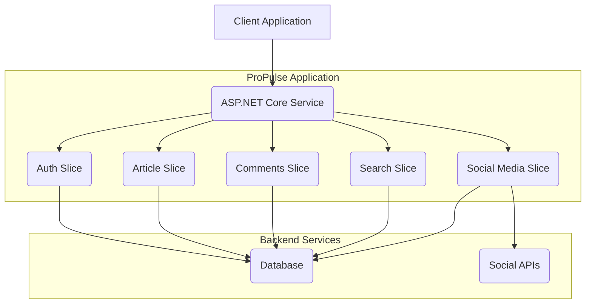

# 1. System Architecture

ProPulse will be built using a modular monolith architecture that emphasizes clean separation of concerns while maintaining the simplicity of a single deployable application. This approach provides a good balance of maintainability, development velocity, and operational simplicity for the MVP phase while still allowing for potential future decomposition into microservices if needed.

## 1.1. High-Level Architecture Diagram

# 1.2. Components

## 1.2.1. Web Application Core
- Entry point for all client requests
- Request routing
- Cross-cutting concerns (logging, error handling)
- API versioning
- Basic rate limiting

## 1.2.2. Authentication Module
- User registration with required email confirmation
- User login and session management
- Password reset and account recovery flows
- Integration with social identity providers
- Role-based access control (Author, Social Media Manager, Reader)
- Token-based authentication

## 1.2.3. Article Module
- Article creation, editing, and publishing
- Article retrieval and search
- Rating system
- Analytics tracking

## 1.2.4. Social Media Module
- Social media account management
- Post scheduling
- Post approval workflows
- Social analytics collection

## 1.2.5. Comments Module
- Comment creation and management
- Comment moderation
- Notification system for comment replies

## 1.2.6. Shared Infrastructure
- Caching of frequently accessed articles (Redis)
- User session management
- Rate limiting data
- Shared domain types and interfaces

# 1.3. Technical Challenges

1. **Social Media Integration**
   - Challenge: Integrating with multiple social media platforms, each with different APIs
   - Approach: Create abstraction layer with platform-specific implementations; use OAuth for authentication

2. **Content Moderation**
   - Challenge: Preventing inappropriate content in articles and comments
   - Approach: Implement reporting system for MVP; consider AI-based content moderation for follow-on phases

3. **Performance at Scale**
   - Challenge: Maintaining performance as content grows
   - Approach: Implement caching strategy and pagination; optimize database queries and indexes

4. **Authentication Security**
   - Challenge: Securely handling multiple authentication methods
   - Approach: Use ASP.NET Identity with proper token management; implement MFA for admin accounts

5. **Data Consistency**
   - Challenge: Ensuring data integrity across services
   - Approach: Use transactional operations where possible; implement eventual consistency patterns where needed