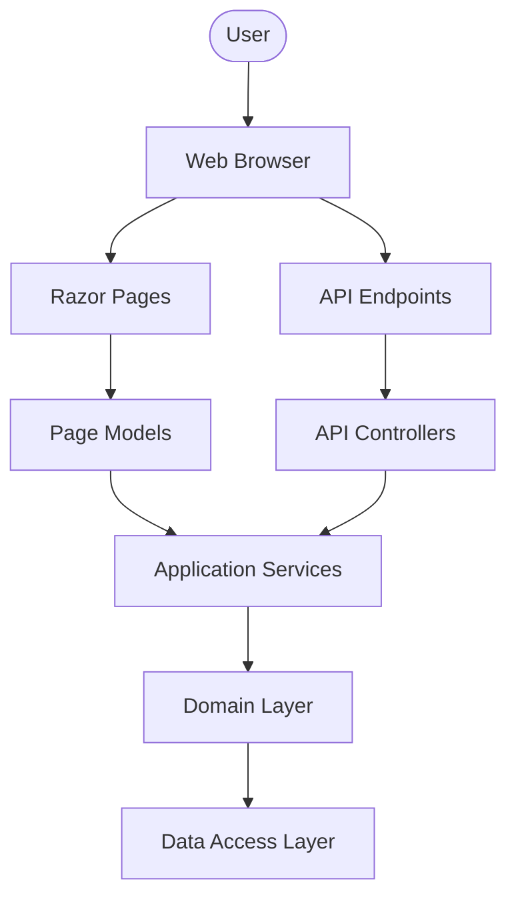
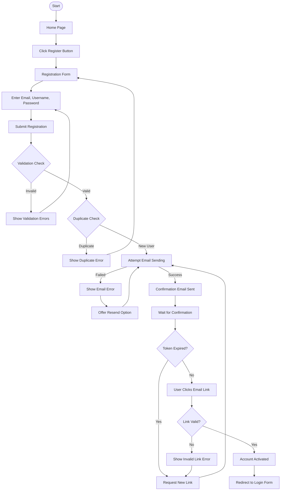
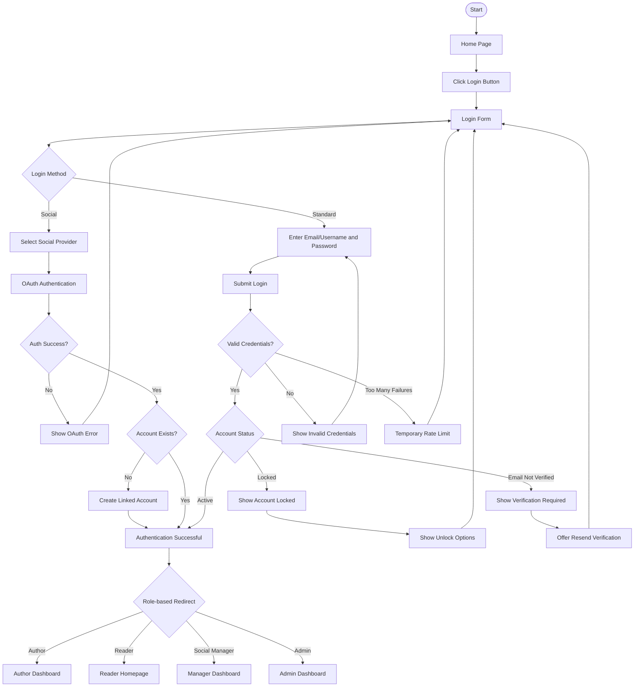
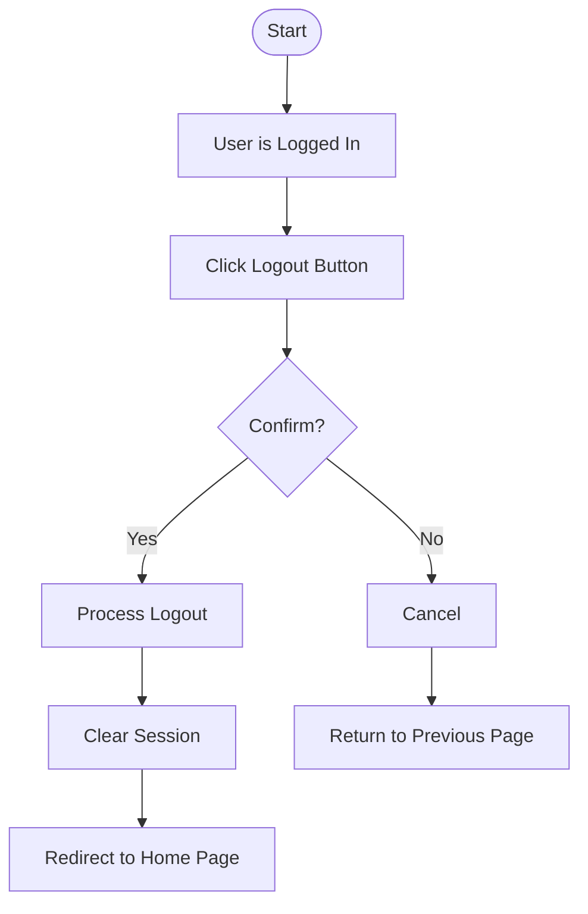
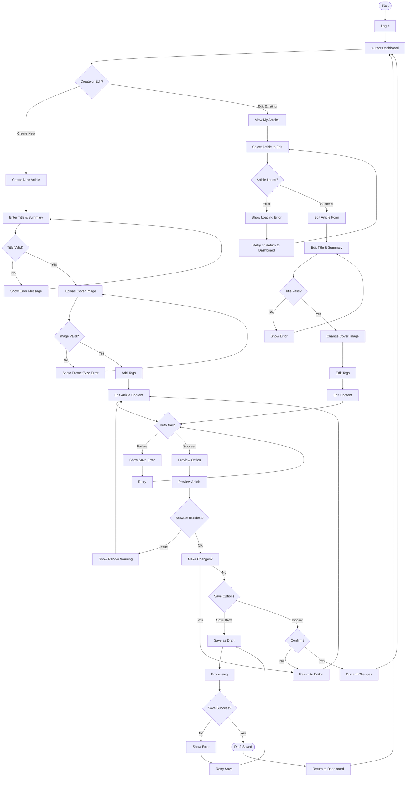
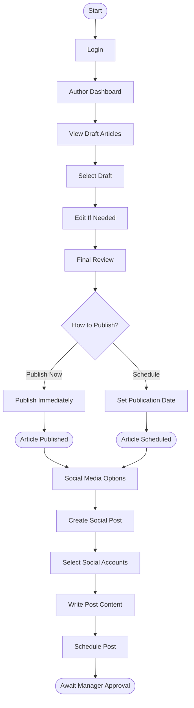
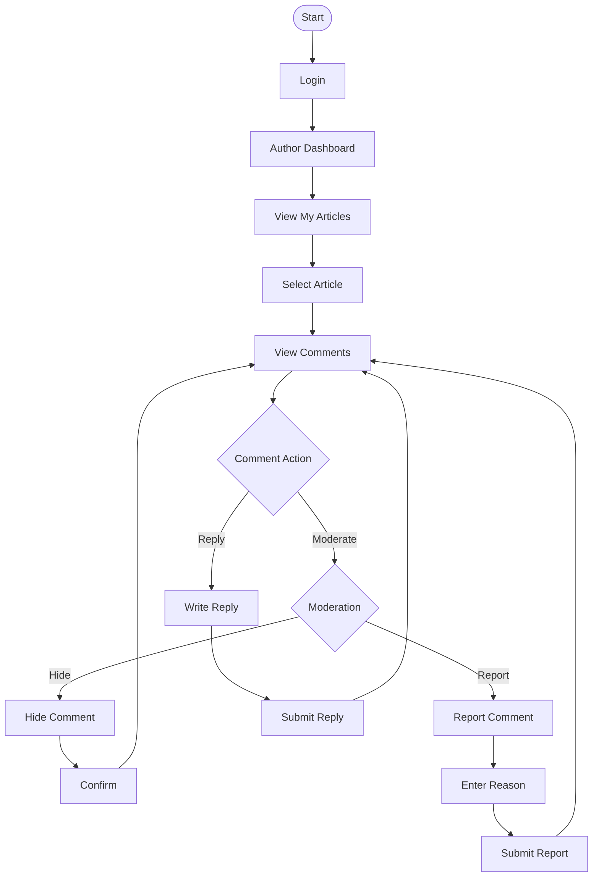
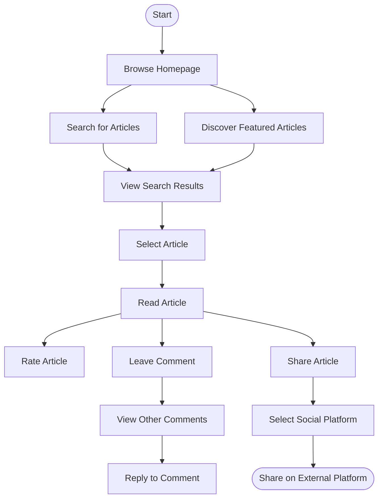
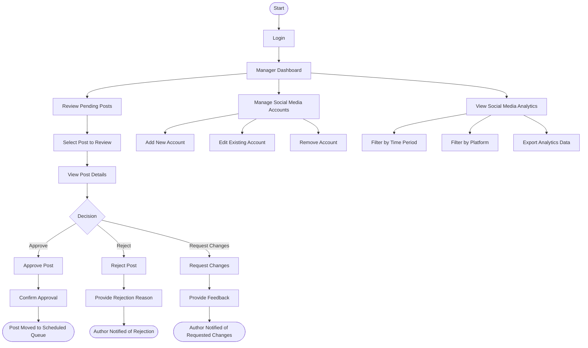
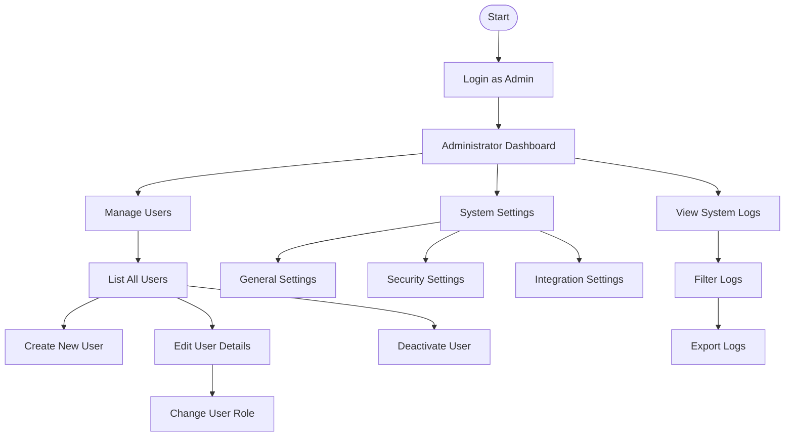

# 5. User Interface

## 5.1. UI Implementation Approach

Based on the technology comparison in section 3.4, the ProPulse platform will implement a Razor Pages-based architecture with strategic use of API endpoints for dynamic content. This section describes how this implementation choice will shape the user interface architecture and development workflow.

### UI Architecture Overview

The UI layer will be structured using the following pattern:



### Key Implementation Details

1. **Razor Pages Structure**
   - Pages will be organized by functional domain (Authentication, Article Management, Social Media, etc.)
   - Shared layouts will provide consistent UI elements across the platform
   - Partial views will be used for reusable UI components
   - Tag helpers will be developed for common UI patterns

2. **JavaScript Enhancement Strategy**
   - Core functionality will work without JavaScript (progressive enhancement)
   - Modern JavaScript modules will enhance the UI where appropriate:
     - Rich text editor for article authoring
     - Real-time comment notifications via SignalR
     - Interactive rating components
     - Social media preview generators
     - Analytics visualizations

3. **API Integration Pattern**
   - Initial page load will be server-rendered via Razor Pages
   - Dynamic content will be fetched using API endpoints
   - AJAX patterns will be used for in-page updates without full refreshes
   - Authentication will be handled using cookie-based auth for pages and token-based auth for APIs

4. **Styling and Design System**
   - CSS architecture using CSS modules and variables
   - Responsive design based on mobile-first principles
   - Design token system for consistent styling
   - Accessibility standards compliance (WCAG 2.1 AA)

5. **Performance Optimization**
   - Server-side caching for frequently accessed content
   - Client-side caching for static resources
   - Lazy loading of non-critical resources
   - Image optimization and responsive loading

This implementation approach provides several advantages:

- **Rapid Development**: The page-focused architecture maps naturally to content workflows
- **SEO Optimization**: Server-rendered content improves search engine indexing
- **Performance**: Initial load performance benefits from server rendering
- **Maintainability**: Clean separation between UI and business logic
- **Progressive Enhancement**: Core functionality works without JavaScript
- **Unified Technology Stack**: Developers can work across the full stack with C#

The combination of Razor Pages with API endpoints strikes an optimal balance for ProPulse, providing the benefits of server-rendered content while enabling rich interactivity where needed.

## 5.2. User Journey Flows

### Authentication Flows

ProPulse will support anonymous browsing for basic article reading, with a sign-in/register button in the top right of the page. Additional features like commenting and rating require authentication.

#### Registration Flow



#### Login Flow



#### Logout Flow



#### Password Reset Flow

```mermaid
flowchart TD
    Start([Start]) --> LoginForm[Login Form]
    LoginForm --> ForgotPassword[Click "Forgot Password"]
    ForgotPassword --> ResetForm[Password Reset Form]
    ResetForm --> EnterEmail[Enter Email Address]
    EnterEmail --> SubmitEmail[Submit]
    SubmitEmail --> EmailCheck{Email Exists?}
    EmailCheck -->|No| EmailNotFound[Show Generic Success]
    EmailCheck -->|Yes| AttemptSend[Attempt Email Send]
    AttemptSend -->|Failed| SendError[Handle Send Error]
    SendError --> ContactSupport[Show Contact Support]
    AttemptSend -->|Success| EmailSent[Reset Link Sent]
    EmailNotFound --> WaitPeriod[Security Wait Period]
    WaitPeriod --> LoginForm
    
    EmailSent --> ClickLink[User Clicks Reset Link]
    ClickLink --> ValidateToken{Token Valid?}
    ValidateToken -->|No| InvalidToken[Show Invalid/Expired Token]
    InvalidToken --> RequestNewLink[Request New Link]
    RequestNewLink --> ResetForm
    ValidateToken -->|Yes| NewPasswordForm[New Password Form]
    
    NewPasswordForm --> EnterNewPassword[Enter New Password]
    EnterNewPassword --> ConfirmNewPassword[Confirm New Password]
    ConfirmNewPassword --> SubmitNewPassword[Submit New Password]
    SubmitNewPassword --> PasswordValidation{Password Valid?}
    PasswordValidation -->|No| ValidationErrors[Show Validation Errors]
    ValidationErrors --> EnterNewPassword
    PasswordValidation -->|Yes| UpdatePassword[Update Password]
    UpdatePassword --> PasswordUpdated[Password Updated]
    PasswordUpdated --> LoginForm[Return to Login Form]
```

### Author Flows

#### Creating and Editing Articles



#### Publishing an Article



**Note:** This diagram represents the happy path flow. Comprehensive error handling is expected at each step, including validation errors, network failures, authorization issues, and database errors.

#### Managing Article Comments



**Note:** This diagram represents the happy path flow. Comprehensive error handling is expected at each step, including validation errors, network failures, authorization issues, and database errors.

### Reader: Browse, Rate, and Comment on Articles



**Note:** This diagram represents the happy path flow. Comprehensive error handling is expected at each step, including validation errors, network failures, authorization issues, and database errors.

### Social Media Manager: Review and Approve Posts



**Note:** This diagram represents the happy path flow. Comprehensive error handling is expected at each step, including validation errors, network failures, authorization issues, and database errors.

### Administrator: System Management



**Note:** This diagram represents the happy path flow. Comprehensive error handling is expected at each step, including validation errors, network failures, authorization issues, and database errors.
