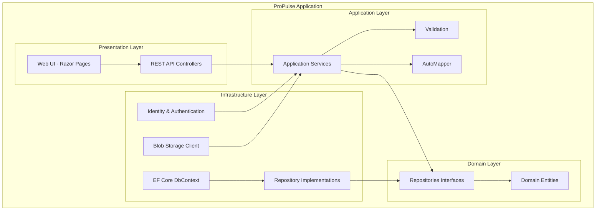
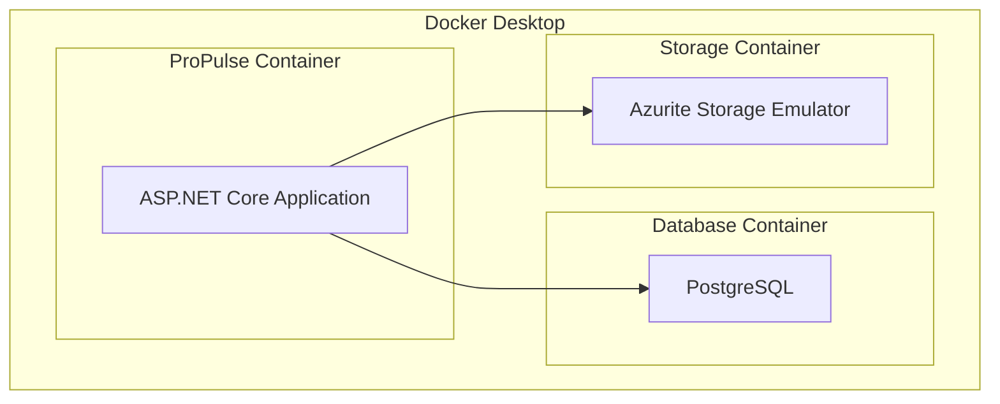
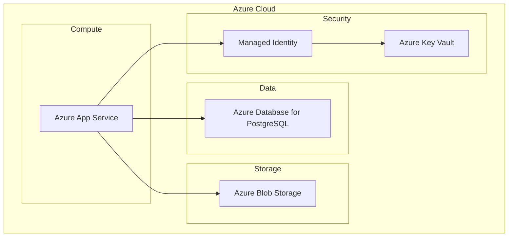
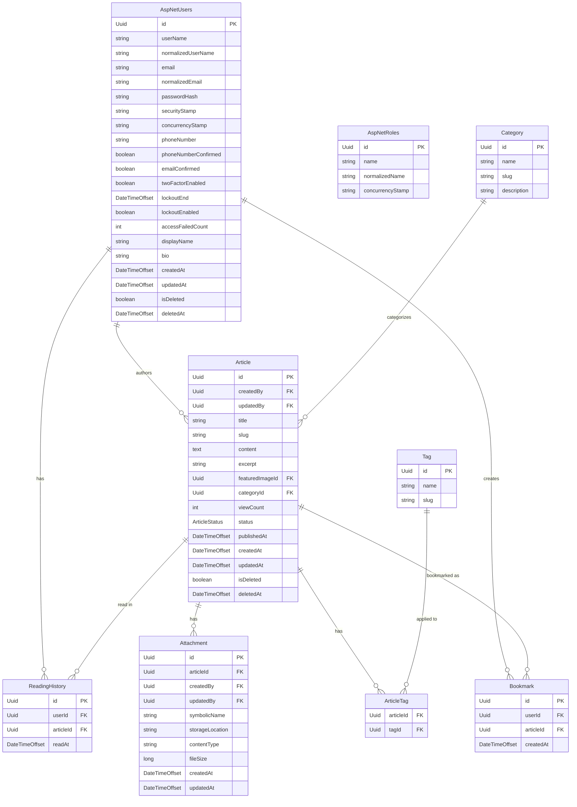

# ProPulse Technical Specification - MVP

## 1. System Overview

### 1.1. User Roles

The system will have the following user roles:

1. **Anonymous User** - Unauthenticated visitors who can:
   - View and read published articles
   - Search and filter content by categories and tags
   - Register for an account

2. **Reader** - Authenticated users who can:
   - All capabilities of Anonymous Users
   - View reading history
   - Bookmark articles for later reading
   - See estimated reading time

3. **Author** - Content creators who can:
   - All capabilities of Readers
   - Create, edit, and publish their own articles
   - Upload images for their content
   - View analytics on their published content
   - Save drafts and manage their publishing workflow

4. **Administrator** - System administrators who can:
   - All capabilities of Authors
   - Manage user accounts (create, deactivate, assign roles)
   - Moderate content across the platform
   - Configure system settings
   - Access all analytics data

### 1.2. Major Function Areas

The MVP will include the following major functional areas:

1. **User Management**
   - Registration and authentication
   - Profile management (basic user information, author bios)
   - Role-based access control

2. **Content Creation and Management**
   - Rich text editor with basic formatting
   - Draft saving and publishing workflow
   - Image upload and embedding
   - Article categorization and tagging

3. **Content Discovery and Consumption**
   - Homepage with featured and recent articles
   - Article listing with filtering options
   - Article detail view with responsive design
   - Search functionality by title, content, tags, and categories

4. **Analytics**
   - View counts for articles
   - Reading time estimation
   - Basic author dashboard with article performance metrics

5. **Platform Administration**
   - User management interface
   - Content moderation tools
   - Basic system configuration

### 1.3. Architectural Overview

Given the one-month timeframe for MVP delivery, we will implement a pragmatic architecture that balances development speed with maintainability:

* **Architecture Pattern**: Simplified Clean Architecture with clear separation of concerns
* **Application Structure**: Monolith with logical separation for potential future modularization
* **API-First Approach**: All functionality will be exposed via REST APIs first, with web UI consuming these APIs
* **Frontend/Backend Structure**: 
  * Backend: ASP.NET Core Web API
  * Frontend: ASP.NET Core MVC with Razor Pages for a rapid server-rendered UI

This architecture provides several benefits for our MVP timeline:
1. Faster development cycle with a monolithic approach
2. Clear separation of concerns for maintainability
3. API-first design allows for future extensions (mobile apps, integrations)
4. Leveraging .NET ecosystem for authentication, authorization, and data access

### 1.4. System Diagram

#### 1.4.1. Internals View



#### 1.4.2. Containers View (Docker Desktop)



#### 1.4.3. Azure Production View



## 2. Technical Decisions

This section contains technical decisions organized by architectural layers and cross-cutting concerns.

### 2.1. Cross-cutting Concerns

#### 2.1.1. Base Technical Stack
* **Programming Language**: C# 13 (latest preview)
* **Framework**: .NET 9
* **Web Framework**: ASP.NET Core 9
* **Development Environment**: Visual Studio 2025 or VS Code with C# Dev Kit
* **Package Management**: NuGet
* **Development Orchestration**: .NET Aspire

#### 2.1.2. Authentication and Authorization
* **Authentication Provider**: ASP.NET Core Identity
* **Token Generation**: JWT for API authentication
* **Authorization**: Policy-based authorization
* **External Authentication**: Consider adding in Phase 2 (Google, Microsoft, GitHub)
* **Password Requirements**: 
  * Minimum 8 characters with no complexity requirements (NIST 800-63B)
  * Check against common password lists
  * No password expiration policy
  * Secure password reset with email verification
* **Account Lockout Policy**:
  * 5 failed attempts triggers 15-minute lockout
  * Progressive delays for subsequent failed attempts
* **Refresh Token Security**:
  * Stored with one-way hash in database
  * Rotation on use with sliding expiration
  * Device fingerprinting for additional security

#### 2.1.3. Security
* **HTTPS**: Required for all environments
* **CSRF Protection**: Enabled via ASP.NET Core anti-forgery
* **XSS Protection**: 
  * Content Security Policy (CSP) headers
  * X-XSS-Protection header
  * X-Content-Type-Options: nosniff
  * X-Frame-Options: DENY
  * Referrer-Policy: strict-origin-when-cross-origin
* **Input Validation**: 
  * Server-side validation with FluentValidation
  * HTML sanitization for markdown rendering
  * File type validation for uploads
* **API Security**: 
  * Rate limiting with AspNetCoreRateLimit
  * Request size limits
  * API key rotation policies
* **Secrets Management**: Azure Key Vault for production, User Secrets for development
* **Network Protection**:
  * Azure Front Door for edge protection and global distribution
  * Azure Web Application Firewall (WAF) with OWASP ruleset
  * TLS 1.2+ enforcement with strong cipher suites
* **Secure Cookies**:
  * HttpOnly flag for authentication cookies
  * Secure flag enabled
  * SameSite=Lax policy
  * Anti-forgery tokens for state-changing operations

#### 2.1.4. Privacy
* **Data Protection**: Encrypt sensitive data at rest
* **Cookie Consent**: Implement banner for EU users (GDPR compliance)
* **Data Retention Policy**: Define data lifecycle based on user role

#### 2.1.5. Structured Logging
* **Logging Library**: Serilog with structured logging
* **Log Sinks**: Console + File for development, Application Insights for production
* **Log Levels**: Information in production, Debug in development
* **Request/Response Logging**: Log HTTP requests/responses with PII redaction
* **Correlation IDs**: Track requests across system components

#### 2.1.6. Background Services
* **Implementation**: IHostedService with BackgroundService base class
* **Scheduling**: Quartz.NET for configurable scheduling
* **Tasks**:
  * Purge unconfirmed registrations after 48 hours
  * Permanently delete soft-deleted records after 90 days
  * Automatic API key rotation on a configurable schedule
  * Reconcile view counts with reading history for consistency
  * Generate cached reports for admin dashboard
* **Reliability**:
  * Distributed locking to prevent duplicate execution in scaled environments
  * Circuit-breaking for external service dependencies
  * Comprehensive error handling with retry policies
  * Detailed logging of all maintenance operations

### 2.2. Environments

We will establish three distinct environments to support the development lifecycle.

#### 2.2.1. Development Environment

* **.NET Aspire**: Local orchestration of services for consistent developer experience
* **Services**:
  * PostgreSQL in Docker container with persistent volume
  * Azurite (Azure Storage Emulator) for image storage
  * SMTP4Dev for email testing
* **Configuration**:
  * User Secrets for sensitive configuration
  * Environment-specific appsettings.Development.json
* **Features**:
  * Hot reload enabled
  * Developer exception page
  * Swagger UI for API exploration
  * SQL query logging for performance debugging
  * Seed data for all user roles and sample content

#### 2.2.2. Test Environment

* **Hosting**: Azure App Service with staging slot
* **CI/CD**: GitHub Actions for build, test, and deployment
* **Testing Scope**:
  * Automated unit tests with xUnit
  * Integration tests using TestContainers
  * UI tests with Playwright
* **Data**: 
  * Isolated test database with sanitized production-like data
  * Test-specific blob storage container
* **Monitoring**:
  * Basic Application Insights for error tracking
  * Test coverage reporting

#### 2.2.3. Production Environment

* **Hosting**: Azure App Service (Standard tier)
* **Infrastructure as Code**: Bicep templates with Azure Developer CLI
* **Services**:
  * Azure Database for PostgreSQL (Basic tier)
  * Azure Blob Storage for media
  * Azure Key Vault for secrets
  * Application Insights for monitoring
* **Security**:
  * Managed Identity for secure service access
  * Web Application Firewall (WAF) for common attack protection
* **Deployment**:
  * Blue/Green deployment via staging slots
  * Automatic database backups
  * Regular security scans

### 2.3. Data Layer

The data layer provides persistent storage for the application and implements the domain model interfaces.

#### 2.3.1. Data Stores

The following services will be used:

| Requirement | Development | Test | Production |
|-------------|-------------|------|------------|
| Media Storage | Azurite | Azurite | Azure Blob Storage |
| Database | PostgreSQL | PostgreSQL | Azure Database for PostgreSQL |

#### 2.3.2. PostgreSQL Extensions

For optimal performance and functionality, we'll use the following PostgreSQL extensions:

* **citext**: Case-insensitive text type for username and email fields
* **pg_trgm**: Trigram support for efficient fuzzy text search
* **unaccent**: Remove accents for improved search
* **btree_gin**: GIN index support for efficient filtering
* **uuid-ossp**: UUID generation support

#### 2.3.3. Entity Deletion Strategy

For the MVP, we'll implement a simple and reliable deletion strategy:

* **Soft Delete Pattern**: Add `IsDeleted` flag and `DeletedAt` timestamp to entities
* **Cascade Delete**: Configure appropriate cascade delete rules in EF Core for related entities
* **Query Filters**: Global query filters to exclude soft-deleted entities
* **Archiving**: For content entities, archive rather than delete to preserve user data
* **Hard Delete**: Provide administrative functions for GDPR compliance to permanently remove user data

This approach:
1. Preserves data integrity
2. Allows for data recovery
3. Supports GDPR requirements
4. Can be extended for eventual microservice architecture if needed

### 2.4. API Layer

For the ProPulse MVP, we've made the following decisions for the API layer:

#### 2.4.1. API Style and Implementation

* **API Style**: REST for simplicity and broad compatibility
* **Implementation Pattern**: Controller-based APIs for the MVP phase
  * Familiar pattern with good tooling support
  * Clear organization aligned with domain entities
  * Strong integration with ASP.NET Core features
* **API Versioning**: Simple v1 prefix to support future evolution
* **Content Negotiation**: JSON as primary format with standard ProblemDetails for errors
* **Pagination**: Implement cursor-based pagination for all collection endpoints
* **Filtering**: OData semantics for filtering queries with potential to expand to fuller OData query capabilities in Phase 2+

#### 2.4.2. API Architecture Pattern

* **Pattern**: CRUD-based approach for MVP simplicity
  * Maps directly to UI operations
  * Faster to implement within one-month timeline
  * Simpler for team to understand and maintain
* **Future Consideration**: Evaluate CQRS for Phase 2+ as complexity grows

#### 2.4.3. Authentication and Authorization

* **Authentication**: JWT token-based auth for APIs
* **Authorization**: Policy-based authorization with roles
* **Documentation**: Automatically generate with Swagger/OpenAPI
* **Security Headers**: Standard security headers in all responses

### 2.5. Web Layer

For the ProPulse MVP with a one-month timeline, we've made the following decisions for the web layer:

#### 2.5.1. Frontend Architecture

* **Primary Technology**: ASP.NET Core MVC with Razor Pages
  * Server-rendered for simplicity and faster development
  * Built-in integration with ASP.NET Core Authentication
  * Less client-side complexity
  * SEO-friendly by default
  * Consistent with backend technology stack

* **JavaScript Approach**: Vanilla JavaScript with minimal libraries
  * Used only for essential interactivity
  * No TypeScript for MVP to reduce build complexity
  * Will add TypeScript in Phase 2 for more complex UI features

* **Component Strategy**:
  * Razor partial views for component reuse
  * Tag Helpers for consistent UI elements
  * ViewComponents for more complex widgets

#### 2.5.2. UI Framework and Styling

* **CSS Framework**: Bootstrap 5
  * Comprehensive component library
  * Responsive design out of the box
  * Familiar to most developers
  * Strong accessibility support

* **CSS Approach**: SCSS with minimal customization
  * Simple asset pipeline with WebOptimizer
  * Basic theming capabilities
  * Compiled during build process

* **Rich Text Editor**: TinyMCE (free tier)
  * Familiar interface for content creators
  * Good image embedding support
  * Minimal configuration needed for MVP

#### 2.5.3. Frontend Performance

* **Asset Optimization**:
  * Bundling and minification via WebOptimizer
  * Image optimization for uploaded content
  * Lazy loading for images and non-critical resources

* **Caching Strategy**:
  * Browser caching with appropriate cache headers
  * Output caching for public content
  * Memory caching for frequently accessed data

### 2.6. Testing Strategy

For the ProPulse MVP, we've adopted a pragmatic testing approach that balances coverage with development speed:

#### 2.6.1. Testing Framework and Tools

* **Unit Testing Framework**: xUnit
  * Modern features and extensibility
  * Parallel test execution
  * Clear separation of test setup and assertions

* **Assertion Library**: AwesomeAssertions
  * Highly readable assertions
  * Comprehensive assertion capabilities
  * Good error messages for faster debugging
  * More permissive license than alternatives

* **Mocking Framework**: NSubstitute
  * Simple, intuitive API
  * Good performance
  * Less verbose than alternatives

* **Integration Testing**: xUnit + TestContainers
  * Real PostgreSQL database for data access tests
  * Isolated test environment per test class
  * Clean test data between runs

* **UI Testing**: Playwright
  * Cross-browser testing
  * Modern API and good performance
  * Screenshot capabilities for visual regression

#### 2.6.2. Testing Strategy by Layer

* **Domain Layer**: High unit test coverage (90%+)
  * Focus on business rules and invariants
  * Test edge cases thoroughly

* **Application Layer**: Medium-high unit test coverage (80%+)
  * Mock repositories and external dependencies
  * Focus on business workflows

* **Infrastructure Layer**: Integration tests for repositories
  * Test with real database using TestContainers
  * Focus on query correctness and performance

* **API Layer**: Integration tests for endpoints
  * Test with WebApplicationFactory
  * Focus on request/response correctness

* **Web Layer**: UI tests for critical paths
  * Test primary user journeys
  * Focus on form submission and validation

#### 2.6.3. Test Data Management

* **Test Data Approach**: Builder pattern with AutoFixture
  * Consistent test entity creation
  * Random data where appropriate
  * Specific data for edge cases

* **Database Reset**: DbUp + TestContainers
  * Fresh database for each test class
  * Apply DbUp migration scripts for schema creation
  * Execute seed data scripts for reference data
  * Transaction rollback for performance where possible

### 2.7. Continuous Integration

For the ProPulse MVP, we'll implement a focused CI pipeline with manual deployment:

#### 2.7.1. GitHub Actions

* **Build Pipeline**:
  * Triggered on push to main branch and pull requests
  * Builds solution using .NET 9 SDK
  * Runs all unit and integration tests
  * Publishes code coverage reports
  * Validates code style with .NET format

* **Security Scanning**:
  * Dependency vulnerability scanning
  * Static code analysis for security issues
  * Secret detection to prevent credential leaks

#### 2.7.2. Manual Deployment Process

* **Production Deployment**:
  * Operations staff will manually deploy using Azure Developer CLI
  * One-time DNS and infrastructure setup during initial deployment
  * Environment provisioning and code deployment done simultaneously
  * Deployment to production scheduled during off-peak hours

* **Deployment Documentation**:
  * Detailed step-by-step deployment guide for operations team
  * Environment-specific configuration parameters documented
  * Rollback procedures defined for deployment failures

**Note**: A fully automated deployment pipeline will be implemented in Phase 2 after the infrastructure stabilizes.

#### 2.7.2. Local CI Execution

* **Nektos Act**:
  * Allows running GitHub Actions locally
  * Useful for debugging workflow issues
  * Ensures CI passes before pushing

* **Pre-commit Hooks**:
  * Format code using .NET format
  * Run unit tests affected by changes
  * Validate commit message format

## 3. Data Model

This section details the data model used by the application, including tables, columns, and relationships.

### 3.1. Entity Relationship Diagram



### 3.2. Table Definitions

**Note**: ASP.NET Identity will create additional required tables (AspNetUserClaims, AspNetUserLogins, AspNetUserTokens, AspNetRoleClaims, AspNetUserRoles) in the `identity` schema. These tables are managed automatically by the Identity framework and not directly modified by our application.

#### 3.2.1. AspNetUsers

The AspNetUsers table stores user account information and implements ASP.NET Core Identity's IdentityUser.

**Schema**: `identity`

| Column | PostgreSQL Type | .NET Type | Options | Notes |
|--------|----------------|-----------|---------|-------|
| Id | uuid | Guid | PK | Generated using uuid-ossp extension |
| UserName | varchar(256) | string | Unique, Not Null | User's login name |
| NormalizedUserName | varchar(256) | string | Unique, Not Null | Uppercase version for lookups |
| Email | citext | string | Unique, Not Null | Case-insensitive for lookups |
| NormalizedEmail | citext | string | Unique, Not Null | For Identity framework |
| EmailConfirmed | boolean | bool | Not Null | Whether email is confirmed |
| PasswordHash | text | string | Not Null | Hashed using Identity's hasher |
| SecurityStamp | text | string | Not Null | For Identity framework |
| ConcurrencyStamp | text | string | Not Null | For optimistic concurrency |
| PhoneNumber | varchar(50) | string | Nullable | User's phone number |
| PhoneNumberConfirmed | boolean | bool | Not Null | Whether phone is confirmed |
| TwoFactorEnabled | boolean | bool | Not Null | Whether 2FA is enabled |
| LockoutEnd | timestamptz | DateTimeOffset | Nullable | When lockout expires |
| LockoutEnabled | boolean | bool | Not Null | Whether lockout is enabled |
| AccessFailedCount | integer | int | Not Null | Failed login attempts |
| DisplayName | varchar(100) | string | Not Null | User's display name |
| Bio | text | string | Nullable | Author biography |
| CreatedAt | timestamptz | DateTimeOffset | Not Null | When user was created |
| UpdatedAt | timestamptz | DateTimeOffset | Not Null | When user was last updated |
| IsDeleted | boolean | bool | Not Null, Default: false | Soft delete flag |
| DeletedAt | timestamptz | DateTimeOffset | Nullable | When user was soft deleted |

#### 3.2.2. AspNetRoles

The AspNetRoles table stores available roles in the system and implements ASP.NET Core Identity's IdentityRole.

**Schema**: `identity`

| Column | PostgreSQL Type | .NET Type | Options | Notes |
|--------|----------------|-----------|---------|-------|
| Id | uuid | Guid | PK | Generated using uuid-ossp extension |
| Name | varchar(256) | string | Not Null | Role name (e.g., Reader, Author) |
| NormalizedName | varchar(256) | string | Not Null | Uppercase version for lookups |
| ConcurrencyStamp | text | string | Not Null | For optimistic concurrency |

#### 3.2.3. Article

The Article table stores all content articles.

**Schema**: `propulse`

| Column | PostgreSQL Type | .NET Type | Options | Notes |
|--------|----------------|-----------|---------|-------|
| Id | uuid | Guid | PK | Generated using uuid-ossp extension |
| CreatedBy | uuid | Guid | FK, Not Null | References AspNetUsers.Id, original author |
| UpdatedBy | uuid | Guid | FK, Nullable | References AspNetUsers.Id, last editor |
| Title | varchar(200) | string | Not Null | Article title |
| Slug | varchar(250) | string | Unique, Not Null | URL-friendly version of title |
| Content | text | string | Not Null | Article content in Markdown |
| Excerpt | varchar(500) | string | Nullable | Short summary for listings |
| FeaturedImageId | uuid | Guid | FK, Nullable | References Attachment.Id |
| ViewCount | int | int | Not Null, Default: 0 | Denormalized counter for performance |
| Status | varchar(20) | ArticleStatus | Not Null | Enum: Draft, Published, Archived |
| PublishedAt | timestamptz | DateTimeOffset | Nullable | When article was published |
| CreatedAt | timestamptz | DateTimeOffset | Not Null | When article was created |
| UpdatedAt | timestamptz | DateTimeOffset | Not Null | When article was last updated |
| IsDeleted | boolean | bool | Not Null, Default: false | Soft delete flag |
| DeletedAt | timestamptz | DateTimeOffset | Nullable | When article was soft deleted |

#### 3.2.4. Category

The Category table stores article categories.

**Schema**: `propulse`

| Column | PostgreSQL Type | .NET Type | Options | Notes |
|--------|----------------|-----------|---------|-------|
| Id | uuid | Guid | PK | Generated using uuid-ossp extension |
| Name | varchar(100) | string | Not Null, Unique | Category name |
| Slug | varchar(120) | string | Not Null, Unique | URL-friendly version of name |
| Description | varchar(500) | string | Nullable | Category description |

#### 3.2.5. Tag

The Tag table stores article tags.

**Schema**: `propulse`

| Column | PostgreSQL Type | .NET Type | Options | Notes |
|--------|----------------|-----------|---------|-------|
| Id | uuid | Guid | PK | Generated using uuid-ossp extension |
| Name | varchar(50) | string | Not Null, Unique | Tag name |
| Slug | varchar(60) | string | Not Null, Unique | URL-friendly version of name |

#### 3.2.6. ArticleTag

A joining table between Article and Tag, implementing a many-to-many relationship.

**Schema**: `propulse`

| Column | PostgreSQL Type | .NET Type | Options | Notes |
|--------|----------------|-----------|---------|-------|
| ArticleId | uuid | Guid | PK, FK | References Article.Id |
| TagId | uuid | Guid | PK, FK | References Tag.Id |

#### 3.2.8. Bookmark

The Bookmark table tracks which articles users have bookmarked.

**Schema**: `propulse`

| Column | PostgreSQL Type | .NET Type | Options | Notes |
|--------|----------------|-----------|---------|-------|
| Id | uuid | Guid | PK | Generated using uuid-ossp extension |
| UserId | uuid | Guid | FK, Not Null | References AspNetUsers.Id |
| ArticleId | uuid | Guid | FK, Not Null | References Article.Id |
| CreatedAt | timestamptz | DateTimeOffset | Not Null | When bookmark was created |

#### 3.2.9. ReadingHistory

The ReadingHistory table tracks which articles users have read.

**Schema**: `propulse`

| Column | PostgreSQL Type | .NET Type | Options | Notes |
|--------|----------------|-----------|---------|-------|
| Id | uuid | Guid | PK | Generated using uuid-ossp extension |
| UserId | uuid | Guid | FK, Not Null | References AspNetUsers.Id |
| ArticleId | uuid | Guid | FK, Not Null | References Article.Id |
| ReadAt | timestamptz | DateTimeOffset | Not Null | When article was read |

#### 3.2.10. Attachment

The Attachment table stores media attachments for articles, with references that can be used in markdown content.

**Schema**: `propulse`

| Column | PostgreSQL Type | .NET Type | Options | Notes |
|--------|----------------|-----------|---------|-------|
| Id | uuid | Guid | PK | Generated using uuid-ossp extension |
| ArticleId | uuid | Guid | FK, Not Null | References Article.Id |
| CreatedBy | uuid | Guid | FK, Not Null | References AspNetUsers.Id, original uploader |
| UpdatedBy | uuid | Guid | FK, Nullable | References AspNetUsers.Id, last modifier |
| SymbolicName | varchar(255) | string | Not Null | User-friendly name for markdown references |
| StorageLocation | varchar(1024) | string | Not Null | Internal path not exposed to users |
| ContentType | varchar(100) | string | Not Null | MIME type of the attachment |
| FileSize | bigint | long | Not Null | Size in bytes |
| CreatedAt | timestamptz | DateTimeOffset | Not Null | When attachment was created |
| UpdatedAt | timestamptz | DateTimeOffset | Not Null | When attachment was last updated |

### 3.3. Relationship Definitions

#### 3.3.1. One-to-Many Relationships

1. **User to Article**
   - A User can author many Articles
   - Each Article has exactly one User as its creator

2. **Category to Article**
   - A Category can have many Articles
   - Each Article belongs to exactly one Category

3. **User to Bookmark**
   - A User can create many Bookmarks
   - Each Bookmark belongs to exactly one User

4. **User to ReadingHistory**
   - A User can have many ReadingHistory entries
   - Each ReadingHistory entry belongs to exactly one User

4. **Article to Bookmark**
   - An Article can be bookmarked many times
   - Each Bookmark refers to exactly one Article

5. **Article to ReadingHistory**
   - An Article can appear in many ReadingHistory entries
   - Each ReadingHistory entry refers to exactly one Article

#### 3.3.2. Many-to-Many Relationships

1. **User to Role (via UserRole)**
   - A User can have many Roles
   - A Role can be assigned to many Users

2. **Article to Tag (via ArticleTag)**
   - An Article can have many Tags
   - A Tag can be applied to many Articles

### 3.4. Database Migrations

For the ProPulse MVP, we'll use DbUp for database schema management as it's better supported by .NET Aspire:

#### 3.4.1. Comparison of Options

| Approach | Pros | Cons | Decision |
|----------|------|------|----------|
| DbUp | - Simple SQL scripts<br>- Full control over SQL<br>- Built-in versioning<br>- Fast execution<br>- Well supported by .NET Aspire | - Manual script creation<br>- No automatic rollback<br>- Separate from code model | **Selected for MVP** |
| EF Core Migrations | - Integrated with code<br>- Auto-generated from model changes<br>- Schema and data in one place<br>- Supports rollback | - Less flexible for complex changes<br>- Poor support in .NET Aspire<br>- Version conflicts possible | Not suitable for Aspire integration |
| DACPAC | - Schema comparison<br>- Good for existing DBs<br>- Visual tooling | - SQL Server focused<br>- Harder with PostgreSQL<br>- Deployment complexity | Not suitable |

#### 3.4.2. Migration Strategy

* **Script Organization**:
  * Scripts in a dedicated `/migrations` folder
  * Organized by schema (`identity` and `propulse` subfolders)
  * Sequential versioning with timestamp prefixes (e.g., `202504091200_CreateArticleTable.sql`)

* **Migration Types**:
  * Schema scripts for table structure
  * Data scripts for reference data and seed data
  * Function scripts for PostgreSQL functions and triggers

* **Migration Application**:
  * Run as separate container via .NET Aspire before application startup
  * Execute migrations in transaction when possible
  * Log all migration executions for audit purposes

* **PostgreSQL Features**:
  * Use IF NOT EXISTS clauses for idempotent schema creation
  * CREATE EXTENSION statements for required PostgreSQL extensions
  * Schema separation with proper permissions

* **Deployment**:
  * Run migrations as a separate step in CI/CD pipeline
  * Validate migration success before application deployment
  * Script backups before migration runs in production

### 3.5. Implementation Notes

#### 3.5.1. Entity Framework Core

* **Schema Organization**:
  * Separate tables into two schemas:
    * `identity` schema for ASP.NET Identity tables
    * `propulse` schema for application-specific tables
  * Configure schema per entity in EF Core configurations
  * Apply different database permissions per schema

* **Identity Integration**:
  * Extend `IdentityUser<Guid>` for User entity
  * Extend `IdentityRole<int>` for Role entity
  * Use Identity's auth features while customizing the model

* **Entity Configuration**:
  * Implement `IEntityTypeConfiguration<T>` for each entity
  * Centralize all configuration in a dedicated folder
  * Configure soft delete filters globally

* **Date/Time Handling**:
  * Use `DateTimeOffset` for all timestamps
  * Store in UTC consistently
  * Configure value converters for proper serialization/deserialization

* **Query Performance**:
  * Configure appropriate indexes in entity configurations
  * Use eager loading with `Include()` for predictable queries
  * Add query-specific indexes based on performance testing

* **Reading Time Calculation**:
  * Calculate reading time dynamically based on article content
  * Implement as an extension method on the Article entity or view model
  * Use standard reading speed metric (e.g., 200-250 words per minute for average adults)
  * Consider content complexity when estimating (e.g., technical content reads slower)
  * Cache calculation results when appropriate to avoid recalculating on repeated views

* **View Count Implementation**:
  * Use atomic database operations to prevent race conditions
  * Implement with SQL: `UPDATE Article SET ViewCount = ViewCount + 1 WHERE Id = @id`
  * Use direct SQL execution for increment operations
  * Batch read/write operations in a single transaction
  * Consider distributed locks for high-traffic scenarios
  * Periodically reconcile with ReadingHistory for consistency

#### 3.5.2. PostgreSQL

* **Automatic Timestamp Columns**:
  * Use triggers for `CreatedAt` and `UpdatedAt` columns:
  ```sql
  CREATE OR REPLACE FUNCTION update_timestamp()
  RETURNS TRIGGER AS $$
  BEGIN
      NEW."UpdatedAt" = NOW();
      RETURN NEW;
  END;
  $$ LANGUAGE plpgsql;
  ```

* **Text Search**:
  * Utilize `pg_trgm` for efficient fuzzy search
  * Use `GIN` indexes on searchable text columns
  * Use `unaccent` for accent-insensitive searches

* **Type Mapping**:
  * Map .NET enums to PostgreSQL enum types
  * Use `citext` for case-insensitive fields
  * Use `TIMESTAMPTZ` with 6 digits precision for DateTimeOffset

#### 3.5.3. SQLite

* **Development/Testing Usage**:
  * Use SQLite for unit tests only
  * In-memory database for test isolation

* **Type Mapping Differences**:
  * Store DateTimeOffset as TEXT in ISO 8601 format
  * Store enums as TEXT rather than numeric
  * No citext equivalent - use case-insensitive queries

* **Function Differences**:
  * Implement custom SQLite functions for searches
  * Skip trigger-based timestamps for SQLite
  * Use EF's value generators instead

* **Test Database Reset**:
  * Use new connection string for each test class
  * Apply migrations for each test run

#### 3.5.4. Deletion Strategy

* **Soft Delete Implementation**:
  * Global query filters to exclude soft-deleted entities by default
  * Special repository methods to include deleted items when needed
  * Admin-only hard delete functionality with proper cascading

* **Cascade Configuration**:
  * Delete UserRole when User is deleted
  * Delete Bookmark when User or Article is deleted
  * Delete ReadingHistory when User or Article is deleted
  * Delete ArticleTag when Article is deleted

* **Orphan Prevention**:
  * Foreign key constraints with CASCADE for join tables
  * Application-level checks before deletion operations
  * Regular database integrity validation
  
* **Category Protection**:
  * Prevent category deletion (both soft and hard) if articles are associated
  * Database-level foreign key constraints with RESTRICT option
  * Application-level validation before deletion attempts
  * Clear error messages when deletion is prevented

## 4. API Layer

This section details the API architecture and implementation for the ProPulse MVP.

### 4.1. Implementation Notes

#### 4.1.1. Security

* **Authentication**:
  * JWT-based authentication for all API endpoints
  * Token issued upon successful login with 1-hour expiration
  * Refresh tokens with 7-day expiration for seamless re-authentication
  * HTTPS required for all API calls

* **Authorization**:
  * Policy-based authorization using roles
  * Claims-based permissions for granular control
  * Resource-based authorization for content ownership

* **Input Validation**:
  * Server-side validation using FluentValidation
  * Model binding validation at API entry points
  * Data sanitization to prevent XSS attacks
  * Markdown sanitization to strip unsafe HTML and scripts
  * Restricted set of allowed HTML tags in markdown output

#### 4.1.2. Rate Limiting

* **Implementation**: AspNetCoreRateLimit library
* **Global Limits**:
  * Anonymous users: 100 requests per IP per minute
  * Authenticated users: 300 requests per user per minute
* **Endpoint-specific Limits**:
  * Search endpoints: 30 requests per minute
  * Authentication endpoints: 10 requests per minute
* **Response Headers**:
  * Include rate limit information in response headers
  * Return 429 (Too Many Requests) when exceeded

#### 4.1.3. Caching

* **Response Caching**:
  * Use ASP.NET Core Response Caching for GETs
  * Cache-Control headers with appropriate max-age
  * Vary by Accept, Accept-Encoding, Authorization

* **Distributed Caching**:
  * Memory cache for development
  * Redis cache for production (Phase 2)

* **Cache Invalidation**:
  * Automatic invalidation on entity updates
  * Manual invalidation endpoints for admins

#### 4.1.4. API Responses

* **Standardization**:
  * Consistent response envelope format
  * Use ProblemDetails for error responses
  * HTTP status codes aligned with semantics
  * Support for ETags and conditional requests (RFC9110)

* **Concurrency Control**:
  * ETag generation for all resources
  * Support for If-Match/If-None-Match headers
  * Optimistic concurrency using 412 Precondition Failed
  * 304 Not Modified responses for unchanged resources

* **Pagination**:
  * Cursor-based pagination for collections
  * Include next/prev links in response
  * Default and max page sizes defined per endpoint

### 4.2. API Reference

The following core APIs will be implemented for the MVP:

#### 4.2.1. Authentication API

| Method | Endpoint | Description | Auth Required | Roles |
|--------|----------|-------------|--------------|-------|
| POST | /api/v1/auth/register | Register new user | No | - |
| POST | /api/v1/auth/login | Authenticate user | No | - |
| POST | /api/v1/auth/refresh | Refresh access token | No | - |
| POST | /api/v1/auth/logout | Invalidate tokens | Yes | Any |
| GET | /api/v1/auth/me | Get current user | Yes | Any |

#### 4.2.2. Users API

| Method | Endpoint | Description | Auth Required | Roles |
|--------|----------|-------------|--------------|-------|
| GET | /api/v1/users | List users | Yes | Admin |
| GET | /api/v1/users/me | Get current authenticated user | Yes | Any |
| GET | /api/v1/users/{id} | Get user by ID | Yes | Admin, Self |
| PUT | /api/v1/users/{id} | Update user | Yes | Admin, Self |
| DELETE | /api/v1/users/{id} | Delete user | Yes | Admin, Self |
| GET | /api/v1/users/{id}/articles | Get user's articles | Yes | Admin, Author, Self |
| GET | /api/v1/users/me/bookmarks | List current user's bookmarks | Yes | Any |
| POST | /api/v1/users/me/bookmarks | Create bookmark for current user | Yes | Any |
| DELETE | /api/v1/users/me/bookmarks/{id} | Delete current user's bookmark | Yes | Any |
| GET | /api/v1/users/me/history | Get current user's reading history | Yes | Any |
| POST | /api/v1/users/me/history | Record article read for current user | Yes | Any |
| DELETE | /api/v1/users/me/history/{id} | Delete history item for current user | Yes | Any |
| DELETE | /api/v1/users/me/history | Clear current user's reading history | Yes | Any |

#### 4.2.3. Articles API

| Method | Endpoint | Description | Auth Required | Roles |
|--------|----------|-------------|--------------|-------|
| GET | /api/v1/articles | List articles | No | - |
| GET | /api/v1/articles/{id} | Get article by ID | No | - |
| POST | /api/v1/articles | Create article | Yes | Author, Admin |
| PUT | /api/v1/articles/{id} | Update article | Yes | Author, Admin |
| DELETE | /api/v1/articles/{id} | Delete article | Yes | Author, Admin |
| POST | /api/v1/articles/{id}/publish | Publish article | Yes | Author, Admin |
| POST | /api/v1/articles/{id}/unpublish | Unpublish article | Yes | Author, Admin |

#### 4.2.4. Categories API

| Method | Endpoint | Description | Auth Required | Roles |
|--------|----------|-------------|--------------|-------|
| GET | /api/v1/categories | List categories | No | - |
| GET | /api/v1/categories/{id} | Get category by ID | No | - |
| POST | /api/v1/categories | Create category | Yes | Admin |
| PUT | /api/v1/categories/{id} | Update category | Yes | Admin |
| DELETE | /api/v1/categories/{id} | Delete category | Yes | Admin |
| GET | /api/v1/categories/{id}/articles | Get articles in category | No | - |

#### 4.2.5. Tags API

| Method | Endpoint | Description | Auth Required | Roles |
|--------|----------|-------------|--------------|-------|
| GET | /api/v1/tags | List tags | No | - |
| GET | /api/v1/tags/{id} | Get tag by ID | No | - |
| POST | /api/v1/tags | Create tag | Yes | Admin |
| PUT | /api/v1/tags/{id} | Update tag | Yes | Admin |
| DELETE | /api/v1/tags/{id} | Delete tag | Yes | Admin |
| GET | /api/v1/tags/{id}/articles | Get articles with tag | No | - |

#### 4.2.6. Search API

| Method | Endpoint | Description | Auth Required | Roles |
|--------|----------|-------------|--------------|-------|
| GET | /api/v1/search | Search content | No | - |

### 4.3. API Documentation

#### 4.3.1. Documentation Approach

* **Technology**: Swagger/OpenAPI using Swashbuckle
* **Documentation URL**: /swagger in development, /api-docs in production
* **Generation**: Automatic generation from XML comments and attributes

#### 4.3.2. Documentation Components

* **API Information**:
  * Version information
  * Contact information
  * License details

* **Security Schemes**:
  * JWT Bearer authentication
  * API key for specific integrations (Phase 2)

* **Schema Documentation**:
  * Request/response models
  * Example values
  * Property descriptions

#### 4.3.3. Environment-specific Configuration

* **Development**:
  * Full Swagger UI with try-it-now functionality using Scalar
  * Detailed error responses
  * OAuth integration for easy testing
  * Dynamic OpenAPI document generation

* **Production**:
  * Read-only API documentation
  * Reduced example data
  * No interactive testing capabilities
  * Pre-compiled OpenAPI document generated at build time
  * Static HTML documentation without Scalar

## 5. Web Layer

This section details the web frontend architecture and implementation for the ProPulse MVP.

### 5.1. Architecture

#### 5.1.1. MVC Pattern Implementation

For the ProPulse MVP, we'll use ASP.NET Core MVC with Razor Pages for a pragmatic and rapid development approach:

* **Controllers**: Handle HTTP requests and coordinate between views and services
  * Lean controllers focused on HTTP concerns
  * Services injected for business logic
  * ViewModels used for data transfer to views

* **Views**: Razor-based templates for rendering HTML
  * Strongly-typed views with ViewModels
  * Partial views for reusable components
  * Layout templates for consistent site structure

* **Models**: ViewModels specific to each view
  * Separate from domain models
  * Include display and validation metadata
  * Mapping handled in controllers/services

#### 5.1.2. Page Structure

* **Layouts**:
  * Main layout (`_Layout.cshtml`)
  * Admin layout (`_AdminLayout.cshtml`)
  * Authentication layout (`_AuthLayout.cshtml`)

* **Partial Views**:
  * Header and navigation
  * Footer
  * Sidebar components
  * Article cards
  * Comment sections
  * Pagination controls

* **View Components**:
  * Featured articles carousel
  * Tag cloud
  * Recent articles list
  * User profile summary
  * Reading history widget

#### 5.1.3. Client-side Interactivity

* **JavaScript Usage**:
  * Minimal vanilla JavaScript for essential interactivity
  * Form validation enhancements
  * Basic AJAX for non-critical operations
  * Client-side caching where appropriate

* **Progressive Enhancement**:
  * Core functionality works without JavaScript
  * Enhanced experience with JavaScript enabled
  * Accessibility maintained in all states

### 5.2. Components

#### 5.2.1. Navigation

* **Main Navigation**:
  * Responsive navbar with Bootstrap 5
  * Mobile-friendly hamburger menu
  * Role-specific menu items
  * Active state indicators

* **Secondary Navigation**:
  * Breadcrumbs for context
  * Section-specific sub-navigation
  * User dropdown menu

* **Admin Navigation**:
  * Dedicated admin menu structure
  * Dashboard quick-access tiles
  * Status indicators for system health

#### 5.2.2. User Management

* **Authentication Pages**:
  * Registration form with validation
  * Login page with remember-me
  * Password reset flow
  * Account confirmation

* **Profile Management**:
  * Profile editing form
  * Avatar upload and cropping
  * Bio and display name management
  * Role display for administrators

#### 5.2.3. Content Creation

* **Markdown Editor**:
  * Markdown as primary content format from the start
  * SimpleMDE or EasyMDE integration for user-friendly editing
  * Live preview of rendered content
  * Toolbar with common markdown formatting options
  * Syntax highlighting for markdown

* **Article Management**:
  * Draft saving with auto-save
  * Preview functionality showing rendered markdown
  * Publishing workflow UI
  * Metadata management:
    * Category selection from admin-created list (no author creation)
    * Tag selection from admin-created list (no author creation)
    * Clear separation of admin-only taxonomy management
    * Warning if trying to delete categories with articles

* **Media Management**:
  * Two-part media reference system:
    * User-provided friendly name for markdown reference
    * System-generated storage path (not exposed to users)
  * Image upload with drag-and-drop
  * Automatic image optimization for web
  * Gallery view of uploaded media with filtering
  * Usage tracking to identify orphaned media
  * Basic image editing (crop, resize) deferred to Phase 2

#### 5.2.4. Content Consumption

* **Article Listing**:
  * Grid and list view options
  * Filtering by category/tag
  * Sorting options
  * Responsive card design

* **Article Detail**:
  * Clean, readable typography
  * Responsive image handling
  * Author information
  * Reading time display calculated from content
  * Related articles
  * Sharing buttons

* **Search Interface**:
  * Type-ahead suggestions
  * Advanced filtering options
  * Result highlighting
  * "No results" state handling

#### 5.2.5. Admin Dashboard

* **Overview Dashboard**:
  * Key metrics visualization
  * Recent activity feed
  * Quick action buttons
  * System status indicators

* **User Management**:
  * User listing with filtering
  * Role assignment interface
  * Account actions (suspend, delete)
  * Bulk operations

* **Content Moderation**:
  * Content approval workflow
  * Flagged content review
  * Audit history
  * Moderation actions


