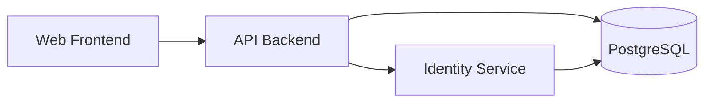

# 2. MVP System Components

## 2.1. Overview
- **Web Frontend**: An ASP.NET Core application serving UI pages and static assets.
- **API Backend**: Exposes REST endpoints, processes requests, and handles business logic.
- **Database**: PostgreSQL for persistent data storage.

## 2.2. System Diagram

## 2.3. Environments
- **Development**: Runs locally via .NET Aspire with full debug tools.
- **Test**: Automated tests using xUnit, NSubstitute, and AwesomeAssertions against a SQLite database.
- **Staging**: Mirrors production setup on Azure with lower capacity. Used for final QA checks.
- **Production**: Scaled Azure environment with high availability, real PostgreSQL instance, and monitoring in place.

## 2.4. Potential Azure Services

| Service                      | Function                                          |
| ---------------------------- | ------------------------------------------------- |
| Azure Container Apps         | Run containerized workloads                       |
| Azure Container Registry     | Provides a registry of container images to use    |
| Azure Database for PostgreSQL| Managed PostgreSQL database                       |
| Azure Storage                | Durable storage for static assets                 |
| Azure Monitor                | Collect, analyze, and act on telemetry data       |
| Azure Key Vault              | Securely store and manage application secrets     |
| Azure App Configuration      | Stores application configuration; feature flags   |
| Azure Cache for Redis        | Provides managed redis cache for performance      |
| Azure Service Bus            | Provides message queue services for IPC           |